# SuperCool Finances

[](https://github.com/torsello/supercool-finances/actions/workflows/ci.yml)
[](.nvmrc)
[](tsconfig.json)

A balance service for SuperCool Finances. It provides customer accounts in five currencies, a double-entry ledger, deposits, withdrawals, transfers and reversals, behind a versioned HTTP API. It is a modular monolith in TypeScript on Fastify. PostgreSQL is its only source of truth and Redis is used for rate limiting. It runs as several replicas behind a load balancer and stays correct under concurrent and repeated requests. Every behaviour is specified before it is built, and every acceptance criterion is proven by a test that names it. It was built for the take-home challenge in [docs/challenge.md](docs/challenge.md).

## Why a modular monolith

The challenge advises a microservice; this service is one deployable with strict modules instead. Money has one consistency boundary: a transfer debits one account, credits another and writes the ledger entries, the idempotency key and the audit record, and in one deployable all of that is a single ACID transaction in PostgreSQL, with no saga, outbox or compensation for a half-done movement. It still scales horizontally, as identical stateless replicas whose only shared state is in PostgreSQL. Modules reach each other only through their ports and `index.ts`, enforced by ESLint, so a module can be split out later. A split would be justified when a module needs its own deploys or scaling, or the one database becomes the write bottleneck, and the follow-up of ADR-0002 requires a new ADR first, saying how the split module's writes stay atomic with the ledger. The options are in [ADR-0002](docs/adr/0002-modular-monolith.md) and the modules in [docs/architecture.md](docs/architecture.md).

## Thinking process and trade-offs

I started from what can go wrong with customer money, and each risk set a decision: concurrent requests (ordered row locks in PostgreSQL, never in a process), retries (an idempotency key that commits with the movement), precision (integer minor units, never floats), auditability (an append-only double-entry ledger) and access (a role check on every route, and 404 for another customer's resources). Each decision names the alternative it rejected in [Design decisions](#design-decisions). I chose TypeScript because it is the language I know best, so I catch subtle mistakes in the code the AI writes faster, and its strict typing keeps money as `bigint`. My thinking process is in [docs/ai/00-planning.md](docs/ai/00-planning.md): what makes the problem hard, the decisions, what I rejected and where I steered.

## Contents

The full documentation is indexed in [docs/README.md](docs/README.md).

- [Why a modular monolith](#why-a-modular-monolith)
- [Thinking process and trade-offs](#thinking-process-and-trade-offs)
- [Reviewer's guide](#reviewers-guide)
- [Highlights](#highlights)
- [Quickstart](#quickstart)
- [How it works](#how-it-works)
- [API overview](#api-overview)
- [Configuration](#configuration)
- [Testing](#testing)
- [CI and quality gates](#ci-and-quality-gates)
- [Observability and operations](#observability-and-operations)
- [Security](#security)
- [Deployment to AWS](#deployment-to-aws)
- [Design decisions](#design-decisions)
- [Project structure](#project-structure)
- [Development workflow](#development-workflow)
- [Limitations and roadmap](#limitations-and-roadmap)
- [How this was built](#how-this-was-built)
- [Troubleshooting](#troubleshooting)

## Reviewer's guide

A 15-minute path through the repository.

1. **Run it** (2 min, Docker only): `docker compose up --build --wait`, then follow the [Quickstart](#quickstart).
2. **Check the five money guarantees** (5 min): each has one test that proves it.

   | Guarantee                    | Proven by                                                                                                                                                                                                       |
   | ---------------------------- | --------------------------------------------------------------------------------------------------------------------------------------------------------------------------------------------------------------- |
   | No lost or duplicated money  | `DEP-AC11` in [test/e2e/replica-loss.test.ts](test/e2e/replica-loss.test.ts): a replica is killed during traffic and the ledger still reconciles                                                                |
   | No negative customer balance | `MOV-AC13` in [test/integration/movements/concurrency.test.ts](test/integration/movements/concurrency.test.ts): 100 concurrent withdrawals                                                                      |
   | Safe retries                 | `IDM-AC10` in [test/integration/idempotency/concurrent-keys.test.ts](test/integration/idempotency/concurrent-keys.test.ts): one key, two replicas                                                               |
   | Safe concurrency             | `MOV-AC14` in [test/integration/movements/concurrency.test.ts](test/integration/movements/concurrency.test.ts): crossed and circular transfers                                                                  |
   | Full audit trail             | `MOV-AC16` in [test/integration/movements/audit.test.ts](test/integration/movements/audit.test.ts) and `LED-AC11` in [test/integration/ledger/append-only.test.ts](test/integration/ledger/append-only.test.ts) |

3. **Read the reasoning** (5 min): [Thinking process and trade-offs](#thinking-process-and-trade-offs), then three ADRs: [ADR-0002 Modular monolith](docs/adr/0002-modular-monolith.md), [ADR-0008 Concurrency control](docs/adr/0008-read-committed-with-ordered-pessimistic-row-locks.md) and [ADR-0009 Idempotency](docs/adr/0009-idempotency-inside-the-movements-transaction.md).
4. **Skim the proof** (2 min): [docs/traceability.md](docs/traceability.md) lists every acceptance criterion with the test that proves it. CI regenerates it from the test reports and fails when the committed copy is stale.
5. **See how AI was used** (1 min): [docs/ai/](docs/ai/README.md) has every session transcript. [docs/ai/00-planning.md](docs/ai/00-planning.md) holds my planning and key decisions, and the "Open questions" tables of the [specs](specs/README.md) record each decision I made, with its date.

## Highlights

| Guarantee                            | How it is enforced                                                                                                                                                                                                                             | Proof                                                                                                                                                                |
| ------------------------------------ | ---------------------------------------------------------------------------------------------------------------------------------------------------------------------------------------------------------------------------------------------- | -------------------------------------------------------------------------------------------------------------------------------------------------------------------- |
| **No lost or duplicated money**      | Each movement is one database transaction: ledger entries, balance changes, audit record and stored response commit together or not at all. A deferred trigger refuses any transaction whose entries do not sum to zero.                       | [DEP-AC11](test/e2e/replica-loss.test.ts), [MOV-AC17](test/integration/movements/atomicity.test.ts), [SYS-AC11](test/integration/overview/ledger-invariants.test.ts) |
| **No negative customer balance**     | Funds are checked only after the account row is locked with `SELECT ... FOR UPDATE`, and the column has `CHECK (balance >= 0)` as a last line of defence.                                                                                      | [MOV-AC13](test/integration/movements/concurrency.test.ts), [LED-AC08](test/integration/ledger/database-checks.test.ts)                                              |
| **Safe retries**                     | Every money-moving `POST` requires an `Idempotency-Key`. The key row is the first write of the movement's transaction, so a repeat on any replica waits for the first request, then gets its stored response with `Idempotent-Replayed: true`. | [IDM-AC10](test/integration/idempotency/concurrent-keys.test.ts), [SYS-AC14](test/e2e/replicas.test.ts)                                                              |
| **Safe concurrency across replicas** | READ COMMITTED with customer accounts locked one by one in ascending id order, so crossed transfers queue instead of deadlocking. A deadlock or serialization failure is retried, up to 3 attempts in all. No state lives in a process.        | [MOV-AC14](test/integration/movements/concurrency.test.ts), [SYS-AC14](test/e2e/replicas.test.ts)                                                                    |
| **Full audit trail**                 | The ledger is append-only, enforced by triggers for both database roles, so mistakes are corrected only by reversals. Every committed movement and status change writes one audit record with the actor, the role and the correlation id.      | [MOV-AC16](test/integration/movements/audit.test.ts), [LED-AC11](test/integration/ledger/append-only.test.ts)                                                        |

## Quickstart

You need only Docker (Docker Engine 24 or later with Compose v2.20 or later) and `make`. There is no `.env` to create, because [compose.yaml](compose.yaml) holds visibly fake demo secrets, which the service refuses when `NODE_ENV` is `production`. The `make` targets wrap `docker compose`; the equivalent commands are in [AGENTS.md](AGENTS.md#5-commands).

```sh
git clone https://github.com/torsello/supercool-finances.git
cd supercool-finances

# Postgres, Redis, the migrations, two API replicas and nginx on http://localhost:8080.
# Returns once every service is healthy.
docker compose up --build --wait

# The demo users' accounts and deposits, created through the API. Running it again changes nothing.
make seed
```

The seed prints the demo users and their accounts: demo-customer-1 has 2500.00 EUR and 1000.00 USD, demo-customer-2 has 500.00 EUR, and demo-customer-3 has 150000 JPY. Amounts are strings of minor units, and account ids differ on every fresh stack.

<details>
<summary>Output of <code>make seed</code></summary>

```json
{
  "users": [
    {
      "name": "demo-operator",
      "id": "0192f0a0-0000-7000-8000-00000000d0f1",
      "role": "operator",
      "accounts": []
    },
    {
      "name": "demo-customer-1",
      "id": "0192f0a0-0000-7000-8000-00000000d0c1",
      "role": "customer",
      "accounts": [
        {
          "id": "01a120ff-8ba9-746f-a63f-7f993c1ca95f",
          "currency": "EUR",
          "balance": "250000"
        },
        {
          "id": "01a120ff-8bc8-7222-9cf1-fddb5fc9ec54",
          "currency": "USD",
          "balance": "100000"
        }
      ]
    },
    {
      "name": "demo-customer-2",
      "id": "0192f0a0-0000-7000-8000-00000000d0c2",
      "role": "customer",
      "accounts": [
        {
          "id": "01a120ff-8bdb-77d7-ba87-6f60d98a777d",
          "currency": "EUR",
          "balance": "50000"
        }
      ]
    },
    {
      "name": "demo-customer-3",
      "id": "0192f0a0-0000-7000-8000-00000000d0c3",
      "role": "customer",
      "accounts": [
        {
          "id": "01a120ff-8be8-74ce-a73e-de89908a4064",
          "currency": "JPY",
          "balance": "150000"
        }
      ]
    }
  ]
}
```

</details>

Set the variables the requests below use. `make demo-env` runs the seed again, which changes nothing, and prints four shell assignments: `TOKEN` for demo-customer-1 and `OPERATOR_TOKEN` for demo-operator, both valid for 15 minutes, plus `A` and `B`, the EUR accounts of demo-customer-1 and demo-customer-2. It writes no file.

```sh
eval "$(make demo-env)"
```

Without `make`, the same two steps run in the `tools` service:

```sh
docker compose build --quiet tools
docker compose run --rm tools npm run --silent seed
eval "$(docker compose run --rm tools npm run --silent demo-env)"
```

**Deposit** 100.00 EUR into A (operators deposit):

```sh
curl -s -X POST http://localhost:8080/v1/accounts/$A/deposits \
  -H "Authorization: Bearer $OPERATOR_TOKEN" -H 'Content-Type: application/json' \
  -H 'Idempotency-Key: quickstart-deposit-1' \
  -d '{"amount": "10000", "currency": "EUR"}'
```

```text
{"id":"01a120ff-9830-70ff-9cdf-b61326699e90","kind":"deposit","amount":"10000","currency":"EUR","createdAt":"2026-10-09T14:09:43.984Z"}
```

**Transfer** 10.50 EUR from A to B (customers transfer out of their own accounts):

```sh
curl -s -X POST http://localhost:8080/v1/accounts/$A/transfers \
  -H "Authorization: Bearer $TOKEN" -H 'Content-Type: application/json' \
  -H 'Idempotency-Key: quickstart-transfer-1' \
  -d "{\"destinationAccountId\": \"$B\", \"amount\": \"1050\", \"currency\": \"EUR\"}"
```

```text
{"id":"01a120ff-9842-708e-9270-1824a7a202f1","kind":"transfer","amount":"1050","currency":"EUR","createdAt":"2026-10-09T14:09:44.003Z","accountId":"01a120ff-8ba9-746f-a63f-7f993c1ca95f","balance":"258950"}
```

**Balance** of A:

```sh
curl -s http://localhost:8080/v1/accounts/$A -H "Authorization: Bearer $TOKEN"
```

```text
{"id":"01a120ff-8ba9-746f-a63f-7f993c1ca95f","currency":"EUR","status":"active","balance":"258950","createdAt":"2026-10-09T14:09:40.772Z","updatedAt":"2026-10-09T14:09:44.003Z"}
```

**Replay** the transfer with the same `Idempotency-Key`, as a client would after a timeout. No money moves: the original response comes back byte for byte, with `Idempotent-Replayed: true` and this request's own `X-Request-Id`:

```sh
curl -si -X POST http://localhost:8080/v1/accounts/$A/transfers \
  -H "Authorization: Bearer $TOKEN" -H 'Content-Type: application/json' \
  -H 'Idempotency-Key: quickstart-transfer-1' \
  -d "{\"destinationAccountId\": \"$B\", \"amount\": \"1050\", \"currency\": \"EUR\"}" \
  | grep -iE '^(HTTP/|location|x-request-id|idempotent-replayed)|^\{'
```

```text
HTTP/1.1 201 Created
x-request-id: 65bc7e01ef880a8c1c173b5edfbb78ab
location: /v1/transactions/01a120ff-9842-708e-9270-1824a7a202f1
idempotent-replayed: true
{"id":"01a120ff-9842-708e-9270-1824a7a202f1","kind":"transfer","amount":"1050","currency":"EUR","createdAt":"2026-10-09T14:09:44.003Z","accountId":"01a120ff-8ba9-746f-a63f-7f993c1ca95f","balance":"258950"}
```

Finish by checking every balance against the ledger, then stop the stack (`docker compose down -v` also deletes the database):

```sh
make reconcile
```

```text
{"discrepancies":[],"totals":[{"currency":"USD","sum":"0"},{"currency":"MXN","sum":"0"},{"currency":"EUR","sum":"0"},{"currency":"COP","sum":"0"},{"currency":"JPY","sum":"0"}]}
```

```sh
docker compose down
```

To try every endpoint by hand instead, import the [Postman collection](docs/api/README.md#postman-collection) and its local environment into Postman, Insomnia or Bruno and run it: it mints its own tokens. Swagger UI is at <http://localhost:8080/docs>. To mint a token for another user: `make token SUB=<uuid> ROLE=customer|operator`.

## How it works

The diagrams below give an overview; [docs/architecture.md](docs/architecture.md) goes deeper.

### System context

What the system owns and what stays outside it.

The service owns customer balances and the ledger, and PostgreSQL holds all of that state. Redis holds only the per-user rate-limit counters. Payment rails and a real identity provider are outside the system: deposits and withdrawals move money against one settlement account per currency, and tokens are signed by a local script ([ADR-0012](docs/adr/0012-simulated-authentication-with-jwt-and-two-roles.md)).

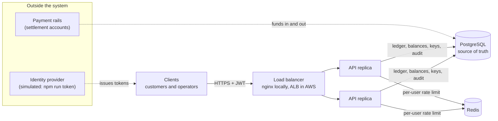

### Local stack

The services of [compose.yaml](compose.yaml) and the host ports they publish.

Only nginx is meant for clients. The replicas' own ports exist so the tests can reach each replica directly. Every port is bound to `127.0.0.1`, and `METRICS_PORT` (9464) is never published. Prometheus and Grafana start only with the `observability` profile, and `tools` only runs on demand.

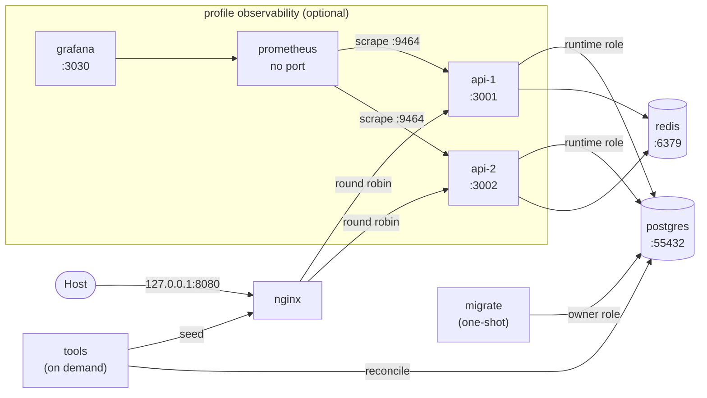

### Inside the service

Each module of `src/modules/` (accounts, ledger, movements, idempotency, auth) is a hexagon ([ADR-0003](docs/adr/0003-hexagonal-architecture-with-tactical-ddd.md)).

Dependencies point inward: the domain imports nothing from Fastify, Kysely, `pg` or ioredis, so the money rules are unit-tested without infrastructure. Modules talk to each other only through each other's `index.ts`, and [src/app.ts](src/app.ts) wires everything together.

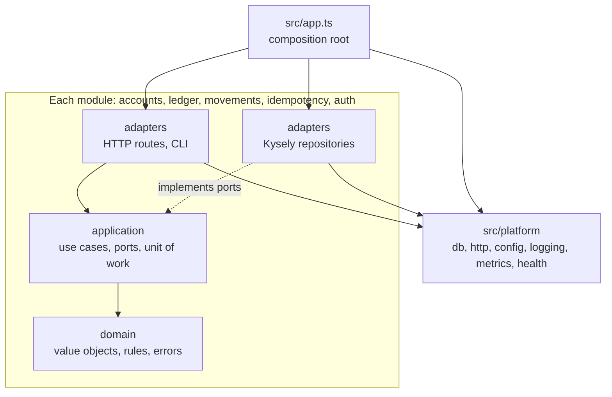

### Request lifecycle

The order in which every request is checked; the first failure answers (SYS-R31 in [spec 000](specs/000-overview/spec.md)).

The authentication, rate-limit and role checks answer before the body is read. A replay of a completed `Idempotency-Key` is answered before validation and every later check, so it returns what the first request got even after configuration changes. Every error leaves through one function, `toProblem` in [src/platform/http/error-handler.ts](src/platform/http/error-handler.ts), as `application/problem+json`.

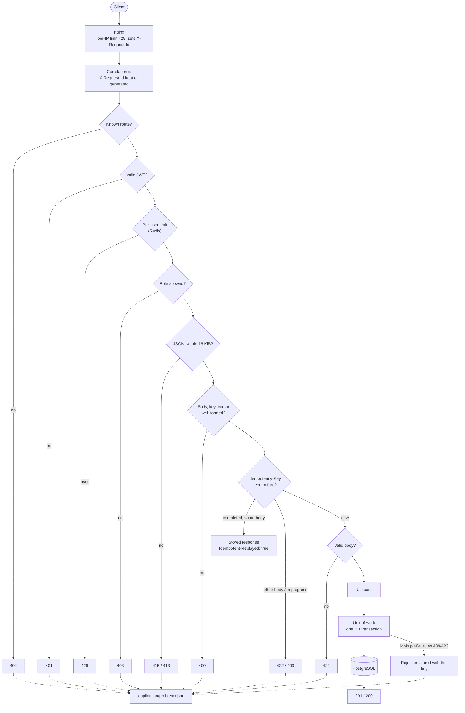

### Data model

Every table of [migrations/](migrations/).

`accounts` holds customer accounts with a cached balance, plus one settlement system account per currency, which has none ([ADR-0007](docs/adr/0007-system-accounts-without-a-cached-balance.md)). `transactions` and `ledger_entries` are append-only. Composite foreign keys on `(id, currency)` keep each entry in its account's and its transaction's currency. `pgmigrations` is node-pg-migrate's record of applied migrations.

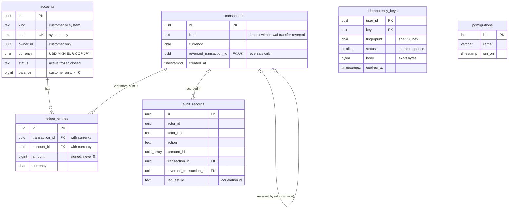

### Transfer, happy path

The statements of one transfer, all in one database transaction (section 6.2 of [plan 000](specs/000-overview/plan.md)).

The key row is the first write, so a duplicate waits on it. The accounts are locked in ascending id order and checked only once the locks are held. The response is stored with the key before the commit, and the deferred triggers then check that the entries sum to zero and that the key row holds its response.

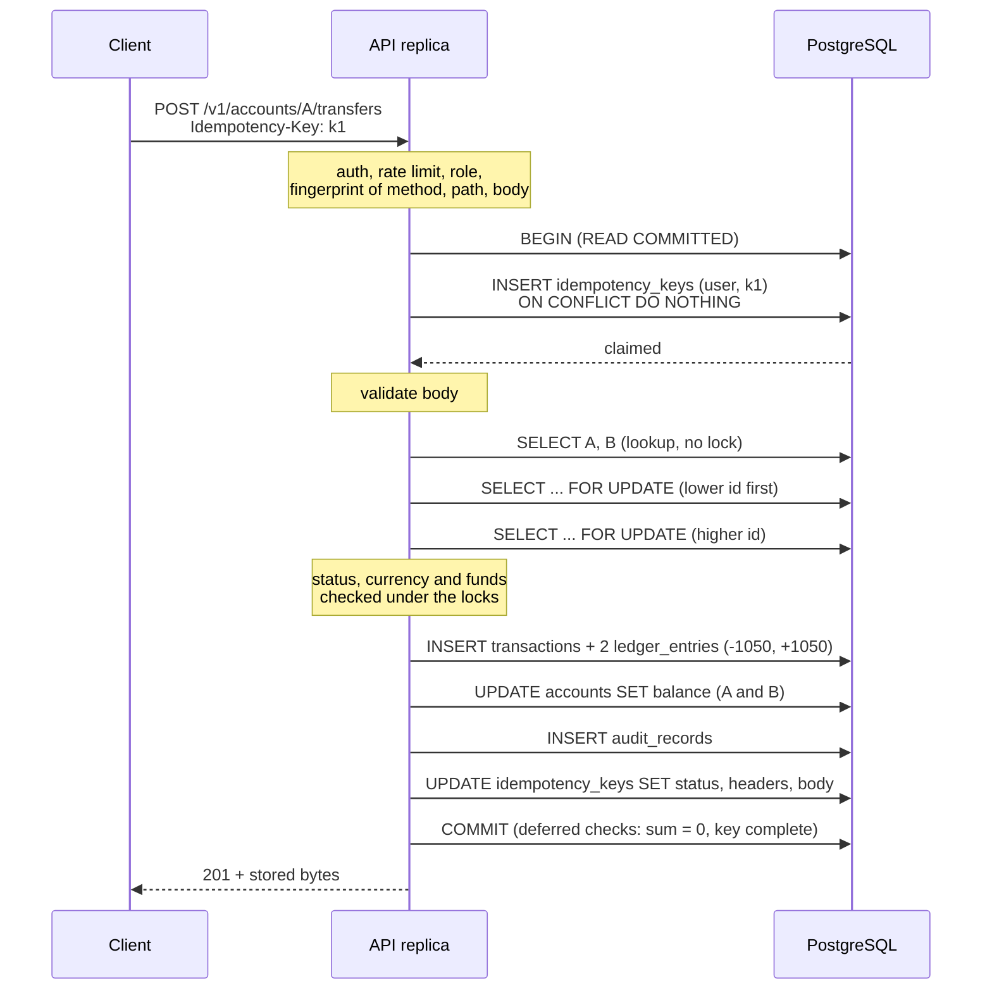

### Same request on two replicas

A client retries on another replica while the first attempt is still running.

The second insert of the same key blocks on the first request's uncommitted row, for at most `IDEMPOTENCY_WAIT_TIMEOUT_MS`. When the first commits, the second finds the stored response and replays it. If the first is still running when the wait ends, the second answers 409 `/problems/request-in-progress` with `Retry-After: 1`.

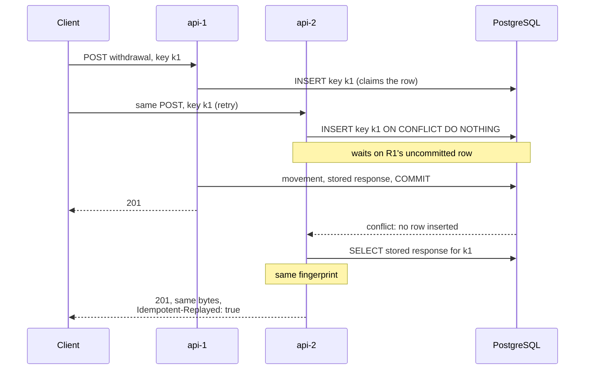

### Crossed transfers

A→B and B→A at the same time, with A's id lower than B's.

Both transactions lock the lower id first, so the second one waits for A instead of holding B. Locking in request order would let each hold one row and wait for the other, which is a deadlock ([ADR-0008](docs/adr/0008-read-committed-with-ordered-pessimistic-row-locks.md)).

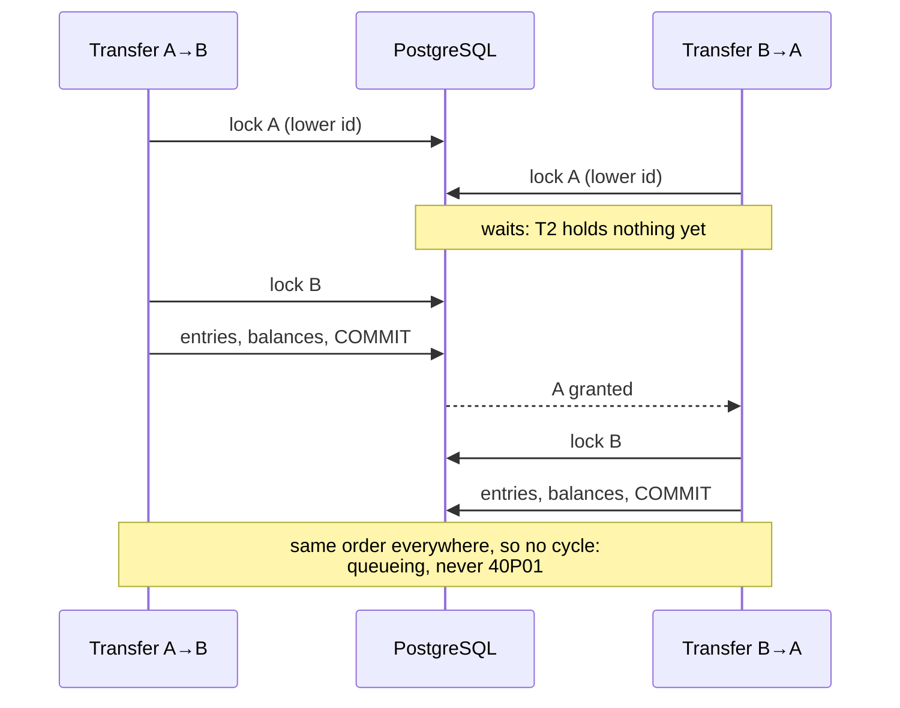

### Account lifecycle

The account statuses and the role that may change them ([spec 001](specs/001-accounts/spec.md)).

A frozen or closed account takes no deposit, withdrawal or transfer on either side. A reversal is still allowed on a frozen account, so a mistake can be undone while it is under review. Only an account with balance "0" can be closed, and `closed` is final.

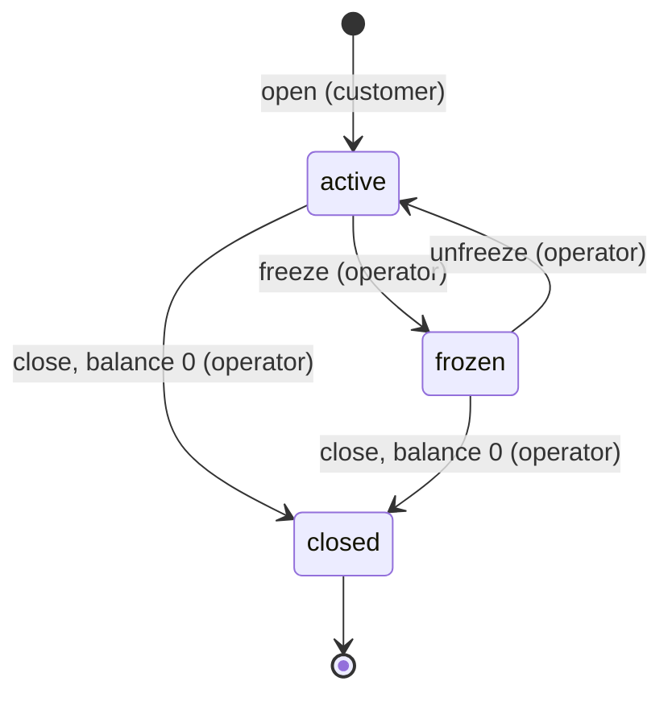

## API overview

Every endpoint is under `/v1` and needs `Authorization: Bearer <JWT>`. The role table is table 1.3 of [spec 006](specs/006-auth/spec.md). Another customer's account, a system account and an unknown id all answer the same 404, and a role that is not allowed gets 403 whatever ids the request names.

| Method | Path                              | Role               | Idempotency-Key | Success |
| ------ | --------------------------------- | ------------------ | --------------- | ------- |
| POST   | `/v1/accounts`                    | customer           | optional        | 201     |
| GET    | `/v1/accounts`                    | customer           | no              | 200     |
| GET    | `/v1/accounts/{id}`               | customer, operator | no              | 200     |
| GET    | `/v1/accounts/{id}/entries`       | customer, operator | no              | 200     |
| POST   | `/v1/accounts/{id}/freeze`        | operator           | no              | 200     |
| POST   | `/v1/accounts/{id}/unfreeze`      | operator           | no              | 200     |
| POST   | `/v1/accounts/{id}/close`         | operator           | no              | 200     |
| POST   | `/v1/accounts/{id}/deposits`      | operator           | **required**    | 201     |
| POST   | `/v1/accounts/{id}/withdrawals`   | customer           | **required**    | 201     |
| POST   | `/v1/accounts/{id}/transfers`     | customer           | **required**    | 201     |
| GET    | `/v1/transactions/{id}`           | customer, operator | no              | 200     |
| POST   | `/v1/transactions/{id}/reversals` | operator           | **required**    | 201     |

Outside `/v1`, without credentials: `GET /health/live`, `GET /health/ready`, Swagger UI at `/docs` and the OpenAPI document at `/docs/json`. Metrics are served at `/metrics`, but only on `METRICS_PORT`.

Amounts are strings of decimal digits in minor units (`"1050"` is 10.50 EUR; JPY has no minor unit), in USD, MXN, EUR, COP or JPY. Lists are newest first, keyset-paginated with an opaque signed `nextCursor` ([ADR-0017](docs/adr/0017-keyset-pagination-with-signed-cursors.md)). Every response carries `X-Request-Id`. A created movement carries `Location: /v1/transactions/{id}`.

**Errors** are `application/problem+json` (RFC 9457, [ADR-0016](docs/adr/0016-error-model.md)). `title` and `detail` are fixed per type, and no body ever holds a stack trace, SQL or an internal message. A real one, from a withdrawal larger than the balance, continuing the Quickstart:

```sh
curl -si -X POST http://localhost:8080/v1/accounts/$A/withdrawals \
  -H "Authorization: Bearer $TOKEN" -H 'Content-Type: application/json' \
  -H 'Idempotency-Key: quickstart-withdrawal-1' \
  -d '{"amount": "99999999", "currency": "EUR"}' | grep -iE '^(HTTP/|content-type|x-request-id)|^\{'
```

```text
HTTP/1.1 422 Unprocessable Entity
Content-Type: application/problem+json
x-request-id: ea8a81e8d7328840c90c1baf2f07c97e
{"type":"/problems/insufficient-funds","title":"Insufficient Funds","status":422,"detail":"The account balance does not cover the amount.","requestId":"ea8a81e8d7328840c90c1baf2f07c97e"}
```

Every problem type and when it is answered is in section 4 of [spec 000](specs/000-overview/spec.md). More:

- [docs/api/README.md](docs/api/README.md): a guide to the API.
- [docs/api/openapi.yaml](docs/api/openapi.yaml): the OpenAPI document, generated from the route schemas (`npm run openapi:export`) and linted in CI.
- [docs/api/requests.http](docs/api/requests.http): ready-to-run requests.
- [docs/api/postman/](docs/api/postman/supercool-finances.postman_collection.json): a Postman collection with its [local environment](docs/api/postman/local.postman_environment.json), which mints its own tokens; [how to import and run it](docs/api/README.md#postman-collection).
- Swagger UI: <http://localhost:8080/docs> on the running stack.

## Configuration

Every setting is an environment variable, read and validated once at startup by [src/platform/config/config.ts](src/platform/config/config.ts), before the service connects to anything. An invalid value stops it with exit code 1 and a single error that names every invalid variable and its rule, never its value. [.env.example](.env.example) lists the ones needed for local use, and `npm run env:sync` adds the missing ones to `.env`, filling the secrets with random values; the others take the defaults below.

| Variable                      | Default        | Purpose                                                                                                                                         |
| ----------------------------- | -------------- | ----------------------------------------------------------------------------------------------------------------------------------------------- |
| `NODE_ENV`                    | `development`  | `development`, `test` or `production`; production refuses the demo secrets and `http://` CORS origins.                                          |
| `PORT`                        | `3000`         | The API port.                                                                                                                                   |
| `METRICS_PORT`                | `9464`         | The Prometheus `/metrics` port, never routed by the load balancer; must differ from `PORT`.                                                     |
| `LOG_LEVEL`                   | `info`         | `fatal`, `error`, `warn`, `info`, `debug` or `trace`.                                                                                           |
| `DATABASE_URL`                | required       | The runtime role's `postgres://` URL; only `sslmode`, `sslrootcert`, `application_name` and `connect_timeout` are accepted as query parameters. |
| `PGPASSWORD`                  | unset          | The database password when the URL holds none, as in AWS; never logged.                                                                         |
| `MIGRATION_DATABASE_URL`      | unset          | The owner role's URL, read only by the migrations ([ADR-0018](docs/adr/0018-two-database-roles.md)).                                            |
| `REDIS_URL`                   | required       | `redis://` or `rediss://`; used only for the per-user rate limit.                                                                               |
| `JWT_SECRET`                  | required       | The HS256 key, at least 32 bytes.                                                                                                               |
| `JWT_ISSUER`, `JWT_AUDIENCE`  | required       | The expected `iss` and `aud` claims.                                                                                                            |
| `CURSOR_SECRET`               | required       | The HMAC key of pagination cursors, at least 32 bytes and different from `JWT_SECRET`.                                                          |
| `MAX_AMOUNT_MINOR`            | `100000000000` | The largest single deposit, withdrawal or transfer, in minor units.                                                                             |
| `ACCOUNT_LOCK_TIMEOUT_MS`     | `2000`         | The wait for one account row lock before 503 (1 to 4999).                                                                                       |
| `IDEMPOTENCY_WAIT_TIMEOUT_MS` | `2000`         | The wait for a key held by a request in progress before 409 (1 to 4999).                                                                        |
| `IDEMPOTENCY_KEY_TTL_SECONDS` | `86400`        | How long a key is replayed (1 hour to 30 days).                                                                                                 |
| `DB_POOL_MAX`                 | `10`           | Connections per replica.                                                                                                                        |
| `DB_POOL_ACQUIRE_TIMEOUT_MS`  | `2000`         | The wait for a pool connection before 503.                                                                                                      |
| `REDIS_COMMAND_TIMEOUT_MS`    | `100`          | After this the rate limit fails open.                                                                                                           |
| `REQUEST_TIMEOUT_MS`          | `25000`        | The service's answer deadline; must exceed the sum of the waits above, worst case.                                                              |
| `SHUTDOWN_DRAIN_DELAY_MS`     | `2000`         | The time readiness answers 503 before the server stops accepting connections.                                                                   |
| `SHUTDOWN_TIMEOUT_MS`         | `30000`        | The time to finish in-flight requests on SIGTERM; not less than `REQUEST_TIMEOUT_MS`.                                                           |
| `RATE_LIMIT_USER_MAX`         | `300`          | Requests per user per window, counted in Redis.                                                                                                 |
| `RATE_LIMIT_USER_WINDOW_S`    | `10`           | The window of that limit, in seconds.                                                                                                           |
| `TRUSTED_PROXY_CIDRS`         | empty          | The proxies whose `X-Forwarded-For` is trusted; empty trusts none.                                                                              |
| `CORS_ORIGINS`                | empty          | Exact allowed origins; empty turns CORS off.                                                                                                    |
| `REPLICA_ID`                  | the host name  | The replica's name in every log line.                                                                                                           |
| `SENTRY_DSN`                  | empty          | Error reporting of 500s to a Sentry-compatible endpoint; empty turns it off.                                                                    |

`PGOPTIONS` must be unset. The load balancer reads `RATE_LIMIT_IP_RPS` (500) and `RATE_LIMIT_IP_BURST` (1000). The compose stack reads `SCF_SUBNET_PREFIX` (`10.210.0`), which moves its network. The test tools read `TEST_DATABASE_URL`, `TEST_MIGRATION_DATABASE_URL`, `E2E_BASE_URL`, `E2E_KEEP_STACK`, `E2E_SUBNET_PREFIX` and `LOAD_RATE_PER_SECOND`. The rules are in section 1.2 of [spec 007](specs/007-security-ops/spec.md), and the timeout budget is explained in the [timeouts runbook](docs/runbooks/timeouts-and-503.md).

## Testing

| Level       | What it proves                                                                                                                 | Run                                            |
| ----------- | ------------------------------------------------------------------------------------------------------------------------------ | ---------------------------------------------- |
| Unit        | Domain rules, money arithmetic, schemas, configuration, the toolchain and the deployment files, with no infrastructure.        | `npm test` (inside `npm run check`)            |
| Integration | Real PostgreSQL and Redis: concurrency, locks, idempotency races, database constraints and triggers, HTTP behaviour, timeouts. | `npm run infra:up && npm run test:integration` |
| e2e         | The Compose stack through nginx: both replicas, the authorization matrix, replica loss, rate limits, the seed, observability.  | `npm run test:e2e` (stop your own stack first) |
| Load        | 200 movements per second for 60 s over 1000 account pairs, then a reconciliation.                                              | `npm run load` against a running stack         |

The Quickstart and every `make` target but `e2e` and `load` need only Docker: `make test` runs the unit and integration suites and the trace gate in the tools image. Node 24 on the host is needed for `npm test`, `npm run test:integration` (with `npm run infra:up`), `npm run test:e2e` and `npm run load`, which drive Docker from the host.

`npm run test:e2e` and `npm run load` both rewrite the tracked [docs/performance.md](docs/performance.md); discard that change unless you mean to commit a new result.

Every test name holds the ID of the acceptance criterion it proves. `npm run trace` reads the Vitest JSON reports and fails when a required AC has no passing test at its level. The full mapping is [docs/traceability.md](docs/traceability.md), and the rules are in [specs/README.md](specs/README.md).

Latest load test, from [docs/performance.md](docs/performance.md) (local run, Apple M2 Pro with 4 CPUs for Docker, two replicas):

| Requests      | Throughput | p50    | p95    | p99     | Errors | Ledger     |
| ------------- | ---------- | ------ | ------ | ------- | ------ | ---------- |
| 12000 in 60 s | 200/s      | 3.9 ms | 6.8 ms | 15.1 ms | 0      | reconciles |

These numbers are from a local run. CI's `e2e` job runs the load test at 100 requests per second and reports the p99 without enforcing it.

## CI and quality gates

[.github/workflows/ci.yml](.github/workflows/ci.yml) runs on pull requests to `main`, on pushes to `main` and on demand. Superseded runs on a branch are cancelled; runs on `main` always finish. There is no deploy job: deployment lives outside this repository ([docs/deployment/aws.md](docs/deployment/aws.md)).

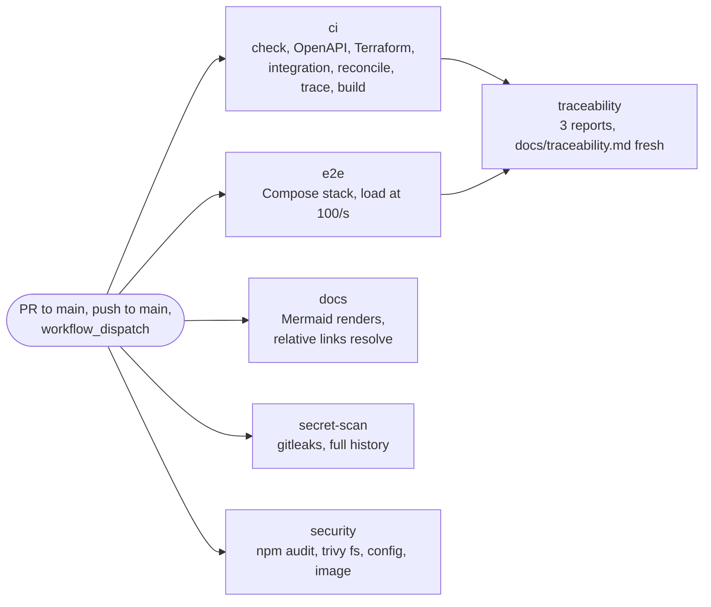

| Job            | Step                                                      | Checks                                                                                                               | Fails on                                                     |
| -------------- | --------------------------------------------------------- | -------------------------------------------------------------------------------------------------------------------- | ------------------------------------------------------------ |
| `ci`           | `npm run check`                                           | Typecheck, ESLint (type-checked rules), Prettier, unit tests                                                         | Any type, lint or format error, or a failed test             |
|                | `npm run openapi:lint`                                    | Redocly's recommended rules on `docs/api/openapi.yaml`                                                               | Any error                                                    |
|                | `npm run infra:validate`                                  | `terraform fmt -check`, `validate`, `tflint` with the AWS ruleset, `checkov` with [infra/policies/](infra/policies/) | Any finding                                                  |
|                | `npm run test:integration`                                | Integration tests against Postgres 16 and Redis 7 service containers                                                 | A failed test                                                |
|                | `npm run reconcile`                                       | Every cached balance against the ledger of the test database those tests leave behind                                | Any drift                                                    |
|                | `npm run trace -- --require unit,integration`             | Every required AC has a passing unit or integration test                                                             | A missing or failed proof                                    |
|                | `npm run build`                                           | The production build                                                                                                 | A compile error                                              |
| `e2e`          | `npm run test:e2e`                                        | The e2e suite against its own Compose stack, including the load test at `LOAD_RATE_PER_SECOND` 100                   | A failed test, a 5xx, a lost request, an unreconciled ledger |
| `traceability` | `npm run trace -- --require unit,integration,e2e --write` | Every AC at its level, over the three reports; then `docs/traceability.md` against the committed one                 | A missing proof, or a stale `docs/traceability.md`           |
| `docs`         | `npm run docs:check`                                      | Every Mermaid diagram of the tracked Markdown renders; every relative link and anchor resolves                       | A diagram that does not render, a broken link or anchor      |
| `secret-scan`  | gitleaks                                                  | The full git history, with [.gitleaks.toml](.gitleaks.toml)                                                          | Any finding                                                  |
| `security`     | `npm audit --audit-level=high`                            | Known vulnerabilities in the npm dependencies                                                                        | HIGH or CRITICAL                                             |
|                | trivy `fs`, `config`, `image`                             | The repository's files, the Dockerfile and Terraform, the built runtime image                                        | HIGH or CRITICAL                                             |

The e2e job runs the load test at 100 requests per second rather than 200, because its runner has 2 CPUs for the whole stack and the load generator. The p99 is reported, never enforced.

**Supply chain.** Every action is pinned to a commit SHA. The images of the Dockerfile and `compose.yaml`, and the tools CI runs from images (Terraform, tflint, checkov, trivy, the Mermaid CLI), are pinned by version and digest, and gitleaks by version and checksum. The CI service containers use the version tags of `compose.yaml`. Every job runs on `ubuntu-24.04` with a read-only `GITHUB_TOKEN`. [Dependabot](.github/dependabot.yml) updates npm, Docker, Compose and Actions weekly, and never proposes a major version.

**Before every push**, `/ship` runs `npm run check`, `npm run test:integration`, `npm run trace -- --require unit,integration`, `npm run infra:validate` (checkov with the policies of `infra/policies/`, as in CI) and gitleaks over the new commits. It never pushes a failing gate.

**Locally**, each CI step is the command shown in the table, and `make test` runs the `ci` job's test gates with Docker only. Terraform, tflint, checkov and the Mermaid CLI run from their pinned images, so Docker and Node 24 are the only prerequisites.

## Observability and operations

| Concern                  | What there is                                                                                                                                                                                                                                                                                                                                                     |
| ------------------------ | ----------------------------------------------------------------------------------------------------------------------------------------------------------------------------------------------------------------------------------------------------------------------------------------------------------------------------------------------------------------- |
| Logs                     | One JSON line per event (pino) with `reqId` (the correlation id) and `replicaId`. nginx logs JSON too. Tokens, secrets, `Idempotency-Key` values, passwords and `SENTRY_DSN` are redacted, and query strings are never logged.                                                                                                                                    |
| Correlation id           | `X-Request-Id`: the client's value when it matches `[A-Za-z0-9._:-]{1,128}`, otherwise generated. It is returned on every response and stored in every problem body and audit record.                                                                                                                                                                             |
| Metrics                  | Prometheus at `/metrics` on `METRICS_PORT`: request latency by route and status, money movements by kind and outcome, idempotent replays, lock timeouts, transaction retries, pool usage and rate limiting, plus Node's process metrics.                                                                                                                          |
| Health                   | `GET /health/live` checks only the process. `GET /health/ready` checks `SELECT 1` and that every migration is applied, and answers 503 from the start of a shutdown.                                                                                                                                                                                              |
| Shutdown                 | On SIGTERM: readiness 503, a drain delay, stop accepting connections, finish in-flight requests within `SHUTDOWN_TIMEOUT_MS`, close pool and Redis, then exit 0, or 1 if work was cut off.                                                                                                                                                                        |
| Dashboards (optional)    | `make observability` (or `docker compose --profile observability up --build --wait`) adds Prometheus and Grafana at <http://localhost:3030>, anonymous and read-only. Its panels show replicas, requests and errors, latency, movements, lock timeouts, replays, rate limiting and the pool.                                                                      |
| Alerting                 | In AWS, ten CloudWatch alarms and one EventBridge rule notify an SNS topic, each pointing at a runbook ([alarms](docs/observability.md#alarms)). The other situations with a runbook have a documented signal and condition but no deployed alarm ([alerts without an alarm](docs/observability.md#alerts-without-an-alarm)). The local stack has no alert rules. |
| Error reports (optional) | Off by default. `SENTRY_DSN=<dsn> docker compose -f compose.yaml -f compose.error-reporting.yaml up --build --wait` reports every 500 to a Sentry-compatible endpoint, scrubbed of headers, bodies, amounts, ids and secrets ([ADR-0023](docs/adr/0023-optional-observability-off-by-default.md)).                                                                |

The details are in [docs/observability.md](docs/observability.md). The twelve runbooks are indexed in [docs/runbooks/README.md](docs/runbooks/README.md), each with the alert that leads to it: [deploy and migrate](docs/runbooks/deploy-and-migrate.md), [database](docs/runbooks/database.md), [capacity](docs/runbooks/capacity.md), [timeouts and 503](docs/runbooks/timeouts-and-503.md), [rate limits](docs/runbooks/rate-limits.md), [reconciliation](docs/runbooks/reconciliation.md), [idempotency in progress](docs/runbooks/idempotency-in-progress.md), [retry storm](docs/runbooks/retry-storm.md), [secret rotation](docs/runbooks/secret-rotation.md), [compromised account](docs/runbooks/compromised-account.md), [shutdown](docs/runbooks/shutdown.md) and [idempotency cleanup](docs/runbooks/idempotency-cleanup.md).

## Security

- **Authentication and authorization:** an HS256 JWT on every `/v1` request (`sub`, `role`, `iss`, `aud`, `exp` at most 15 minutes ahead). The role is checked on every route, and foreign resources answer 404 like unknown ones.
- **Strict input:** Zod schemas reject unknown fields. The service accepts only `application/json` bodies of at most 16 KiB (nginx: 32 KiB). SQL is always parameterized, through Kysely or `pg`.
- **Rate limits:** per IP at nginx (or AWS WAF), and per user in Redis, which fails open after 100 ms ([ADR-0013](docs/adr/0013-rate-limiting-at-the-edge-and-in-redis.md)).
- **Least-privilege database:** an owner role runs the migrations, and the runtime role may only read and append to the ledger. Triggers refuse `UPDATE`, `DELETE` and `TRUNCATE` for both roles ([ADR-0018](docs/adr/0018-two-database-roles.md)).
- **Headers:** a strict CSP, HSTS, `nosniff`, `X-Frame-Options: DENY`, `Referrer-Policy: no-referrer` and `Cache-Control: no-store` under `/v1`. CORS is off unless `CORS_ORIGINS` lists exact origins. `X-Forwarded-For` is trusted only from `TRUSTED_PROXY_CIDRS`.
- **Secrets:** never logged, demo secrets refused in production, and in AWS held only in Secrets Manager; rotating them is in the [secret rotation runbook](docs/runbooks/secret-rotation.md), and a suspected stolen customer credential in the [compromised account runbook](docs/runbooks/compromised-account.md). gitleaks scans the whole history in CI.

The full threat model and controls are in [docs/security.md](docs/security.md).

## Deployment to AWS

The target architecture is in Terraform under [infra/terraform/](infra/terraform/): seven modules (`network`, `edge`, `service`, `database`, `cache`, `secrets`, `observability`) ([ADR-0014](docs/adr/0014-aws-deployment-on-ecs-fargate-with-rds-postgresql.md), [ADR-0015](docs/adr/0015-terraform-for-infrastructure-as-code.md)). CI validates and scans it on every change, and nothing in the repository applies it.

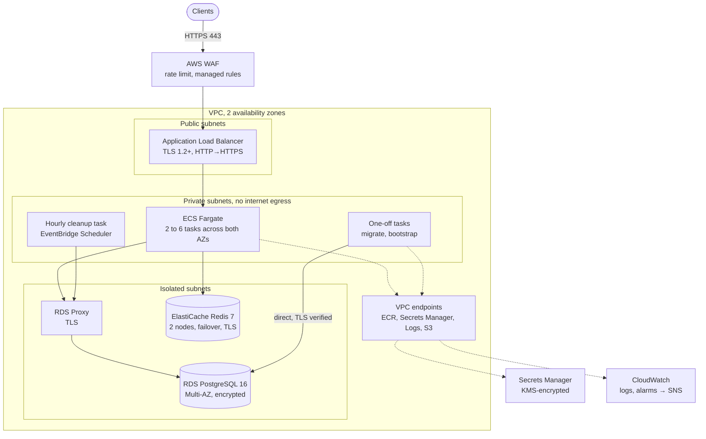

Migrations run as a one-off task before each rollout ([ADR-0020](docs/adr/0020-expand-then-contract-migrations.md)), and the idempotency cleanup runs every hour from EventBridge Scheduler. The estimated cost is about 350 USD per month in eu-west-1. [docs/deployment/aws.md](docs/deployment/aws.md) covers every component, the first deployment and each later one, failure modes and the cost estimate.

By choice, the Terraform has never been planned or applied against a real AWS account; CI validates and scans it on every change (`npm run infra:validate`). There is deliberately no live demo either: the Compose stack of the [Quickstart](#quickstart) is the demo.

## Design decisions

| ADR                                                                             | Decision                                                                             | Main alternative                        | Why                                                                         |
| ------------------------------------------------------------------------------- | ------------------------------------------------------------------------------------ | --------------------------------------- | --------------------------------------------------------------------------- |
| [0001](docs/adr/0001-spec-driven-development-with-adrs-and-ai-agents.md)        | Specs, ADRs and an enforced traceability gate                                        | Code first, documentation at the end    | AI output stays verifiable; behaviour and rationale cannot drift apart      |
| [0002](docs/adr/0002-modular-monolith.md)                                       | A modular monolith                                                                   | Microservices                           | One consistency boundary: ACID transfers without sagas or network failures  |
| [0003](docs/adr/0003-hexagonal-architecture-with-tactical-ddd.md)               | Hexagonal architecture with tactical DDD per module                                  | MVC                                     | Money rules unit-tested without a database or HTTP                          |
| [0004](docs/adr/0004-typescript-with-fastify.md)                                | TypeScript with Fastify                                                              | Express, NestJS                         | Schema validation, plugins, typed async error handling                      |
| [0005](docs/adr/0005-postgresql-as-the-only-source-of-truth.md)                 | PostgreSQL as the only source of truth; Redis only for rate limits                   | In-memory storage, SQLite               | Replicas need shared, durable state                                         |
| [0006](docs/adr/0006-double-entry-ledger-with-signed-integer-minor-units.md)    | Double-entry ledger with signed integer minor units                                  | A mutable balance column                | Balanced, immutable entries are auditable and provable                      |
| [0007](docs/adr/0007-system-accounts-without-a-cached-balance.md)               | System accounts have no cached balance and are never locked                          | A cached balance on every account       | Locking the settlement row would serialize every deposit and withdrawal     |
| [0008](docs/adr/0008-read-committed-with-ordered-pessimistic-row-locks.md)      | READ COMMITTED with ordered `FOR UPDATE` on customer accounts                        | SERIALIZABLE                            | Hot accounts under SERIALIZABLE abort and retry constantly                  |
| [0009](docs/adr/0009-idempotency-inside-the-movements-transaction.md)           | The idempotency key row is the movement's first write                                | Two-phase keys                          | Key and effect commit together; there is no external system to coordinate   |
| [0010](docs/adr/0010-kysely-and-pg-instead-of-an-orm.md)                        | Kysely over `pg`, SQL-file migrations                                                | Prisma, TypeORM                         | Transactions and locks must stay explicit                                   |
| [0011](docs/adr/0011-amounts-as-strings-in-the-api-and-bigint-in-the-domain.md) | Digit strings in the API, `bigint` in the domain                                     | JSON numbers                            | JSON numbers lose precision above 2^53 in JavaScript clients                |
| [0012](docs/adr/0012-simulated-authentication-with-jwt-and-two-roles.md)        | HS256 JWTs from a script; customer and operator roles                                | Opaque tokens in the database           | The challenge allows simulated auth; OIDC is the documented production path |
| [0013](docs/adr/0013-rate-limiting-at-the-edge-and-in-redis.md)                 | Per-IP at the edge, per-user in Redis, failing open                                  | In-memory limits per replica            | In-memory limits break with several replicas                                |
| [0014](docs/adr/0014-aws-deployment-on-ecs-fargate-with-rds-postgresql.md)      | ECS Fargate behind an ALB, RDS PostgreSQL Multi-AZ behind RDS Proxy                  | AWS Lambda                              | Long-lived containers suit connection pooling and graceful shutdown         |
| [0015](docs/adr/0015-terraform-for-infrastructure-as-code.md)                   | Terraform, validated in CI, never applied from the repository                        | AWS CDK, Pulumi                         | Widely read, with a plan and review workflow                                |
| [0016](docs/adr/0016-error-model.md)                                            | RFC 9457 problem details with distinct 400, 409 and 422                              | One 400 for every client error          | Clients can tell request bugs from business refusals                        |
| [0017](docs/adr/0017-keyset-pagination-with-signed-cursors.md)                  | Keyset pagination with HMAC-signed cursors                                           | Offset pagination                       | Offsets are slow on deep pages and unstable while entries arrive            |
| [0018](docs/adr/0018-two-database-roles.md)                                     | An owner role for migrations, a least-privilege runtime role                         | One shared role                         | The application cannot turn off its own safety net                          |
| [0019](docs/adr/0019-timeout-layers-and-rds-proxy.md)                           | Ordered timeout layers; per-transaction lock timeouts through a function             | `SET` statements per connection         | `SET` pins connections behind RDS Proxy                                     |
| [0020](docs/adr/0020-expand-then-contract-migrations.md)                        | A one-off migration task before rollout; expand-then-contract changes                | Migrations at service startup           | Startup migrations race between replicas                                    |
| [0021](docs/adr/0021-statement-timeout-function-for-maintenance-scripts.md)     | A transaction-local statement-timeout function for maintenance scripts               | Running them as the owner role          | The owner role could disable the ledger's checks                            |
| [0022](docs/adr/0022-request-timeout-answer-first-then-roll-back.md)            | On request timeout, answer 503 first, then roll back after the statement in flight   | Cancelling the statement by backend pid | A pid can point at the wrong statement behind RDS Proxy                     |
| [0023](docs/adr/0023-optional-observability-off-by-default.md)                  | Opt-in Prometheus and Grafana, and a Sentry-compatible reporter, both off by default | A product-analytics tool                | Nothing about customers leaves the system without need                      |

The full index is [docs/adr/README.md](docs/adr/README.md).

## Project structure

```text
.
├── src/
│   ├── main.ts                 process entry: config, signals, shutdown
│   ├── app.ts                  composition root: wires modules, platform and routes
│   ├── healthcheck.ts          the image's container healthcheck
│   ├── cli/                    migrate, bootstrap-roles, idempotency-cleanup
│   ├── modules/
│   │   ├── accounts/           open, list, read, freeze, unfreeze, close
│   │   ├── ledger/             entries, transactions, reconciliation
│   │   ├── movements/          deposits, withdrawals, transfers, reversals
│   │   ├── idempotency/        keys, fingerprints, stored responses, cleanup
│   │   └── auth/               JWT verification, roles, the token script
│   │       (each: domain/, application/, adapters/, index.ts)
│   └── platform/               db, http, config, logging, metrics, health,
│                               lifecycle, redis, audit, error-reporting, ids
├── migrations/                 SQL migrations (node-pg-migrate)
├── test/
│   ├── unit/  integration/  e2e/
│   └── support/                shared helpers: databases, sessions, test app and seams
├── specs/                      specs, plans and tasks, 000-overview to 008-deployment
├── docs/
│   ├── adr/                    architecture decision records
│   ├── api/                    openapi.yaml and the API guide
│   ├── deployment/             the AWS deployment
│   ├── runbooks/               operational runbooks
│   ├── ai/                     AI usage log and transcripts
│   ├── architecture.md         the architecture in depth
│   ├── observability.md        logs, metrics, dashboards, alarms and alerts
│   ├── security.md             threat model and controls
│   ├── development.md          host development, skills and guardrails
│   ├── limitations.md          limitations and roadmap
│   ├── performance.md          the latest load test
│   └── traceability.md         every AC with its proof
├── scripts/                    seed, token, reconcile, trace, load test, docs check
├── docker/                     postgres init, nginx, prometheus, grafana
├── infra/
│   ├── terraform/              AWS: root module and seven modules
│   └── policies/               custom checkov policies
├── compose.yaml                the local stack
├── compose.error-reporting.yaml  opt-in error reporting
├── Dockerfile                  build, tools and runtime stages
├── Makefile                    shortcuts over Docker Compose
└── AGENTS.md                   the working agreement for AI agents
```

## Development workflow

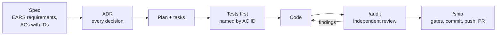

- **Spec first.** No behaviour exists without an acceptance criterion in [specs/](specs/README.md). When the code and a spec disagree, the spec wins.
- **ADRs.** Every decision is recorded in [docs/adr/](docs/adr/README.md), with its alternatives.
- **The AI working agreement.** [AGENTS.md](AGENTS.md) holds the money, concurrency, idempotency and security rules every agent follows, and the commands.
- **`/audit`** runs a read-only review in a separate agent that has not seen the conversation, against the specs, ADRs and AGENTS.md.
- **`/ship`** runs the gates, commits with Conventional Commits that list the ACs covered, pushes the phase branch and opens the pull request. Nothing is committed to `main` directly.
- **Guardrails.** What each skill does, the gates `/ship` runs before every commit, and what the permission rules deny the AI or make it ask first are in [Project skills and guardrails](docs/development.md#project-skills-and-guardrails).

Host development needs Node 24 (`.nvmrc`): `npm ci`, `npm run env:sync`, `npm run infra:up`, `npm run migrate:up`, then `npm run dev`. More is in [docs/development.md](docs/development.md).

## Limitations and roadmap

The authentication is simulated, there are no payment rails or currency conversion, and Prometheus scraping and error reporting are not wired in AWS. The full list, with what would come next, is in [docs/limitations.md](docs/limitations.md). Changes are recorded in [CHANGELOG.md](CHANGELOG.md).

## How this was built

I built this service with AI, under a spec-first process. I set the scope and the rules, decided the architecture and approved every change to a spec. Claude Code implemented each phase from the specs, ADRs and plans in this repository, and an independent review agent audited every phase before it was merged. docs/ai/ holds every Claude Code session in full and a summary of the separate chat I used to plan, draft prompts and review results, and explains what the AI did and what I decided.

## Troubleshooting

| Symptom                                                                                        | Fix                                                                                                                                                                                                                                                                      |
| ---------------------------------------------------------------------------------------------- | ------------------------------------------------------------------------------------------------------------------------------------------------------------------------------------------------------------------------------------------------------------------------ |
| `Bind for 127.0.0.1:8080 failed: port is already allocated` (or 3001, 3002, 55432, 6379, 3030) | Another process or stack holds the port. Find it with `lsof -i :8080`, stop it, or stop this project's other stack with `docker compose down`. `npm run test:e2e` uses the same ports, so stop your stack before it.                                                     |
| `docker: 'compose' is not a docker command` on macOS                                           | The Compose v2 plugin is missing. Install or update Docker Desktop, or, with Homebrew's `docker`, run `brew install docker-compose` and add `"cliPluginsExtraDirs": ["/opt/homebrew/lib/docker/cli-plugins"]` to `~/.docker/config.json`.                                |
| `error mounting ".../docker/nginx/nginx.conf" ... not a directory` with colima                 | colima shares only your home directory with its VM, so a clone in `/tmp` cannot be mounted. Clone under your home directory. Docker Desktop shares `/tmp`.                                                                                                               |
| `.env not found. Continuing without it.` from `make seed`, `make token` or `make demo-env`     | Expected: the `tools` container takes its settings from `compose.yaml`. Nothing to fix.                                                                                                                                                                                  |
| `invalid pool request: Pool overlaps with other one on this address space`                     | Another Docker network uses `10.210.0.0/24`. Run with another prefix, for example `SCF_SUBNET_PREFIX=10.212.0 docker compose up --build --wait`, and pass the same variable to every later command of that stack.                                                        |
| `migrate` exits non-zero, or `/health/ready` answers 503 after a schema change                 | The database volume predates the change, for example an edited migration or init script. Recreate it: `docker compose down -v && docker compose up --build --wait`; for the host's Postgres, `npm run infra:reset`.                                                      |
| `401 /problems/unauthenticated` on every request                                               | The token expired (15 minutes) or was minted for another stack's secret. Mint new ones with `eval "$(make demo-env)"`, or `make token`.                                                                                                                                  |
| `409 /problems/request-in-progress`                                                            | The same `Idempotency-Key` is still running elsewhere. Retry the same request after `Retry-After`. If it persists, see the [idempotency in progress runbook](docs/runbooks/idempotency-in-progress.md).                                                                  |
| `503 /problems/service-unavailable`                                                            | A transient condition: an exhausted pool, a lock wait, exhausted retries, a lost database connection, a request timeout or a shutdown. Retry after `Retry-After` with the same `Idempotency-Key`; see the [timeouts and 503 runbook](docs/runbooks/timeouts-and-503.md). |
