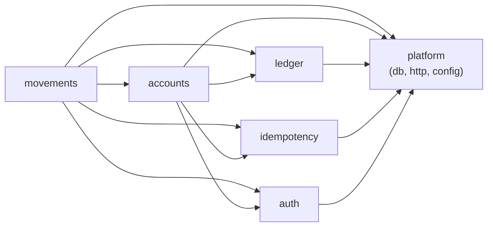
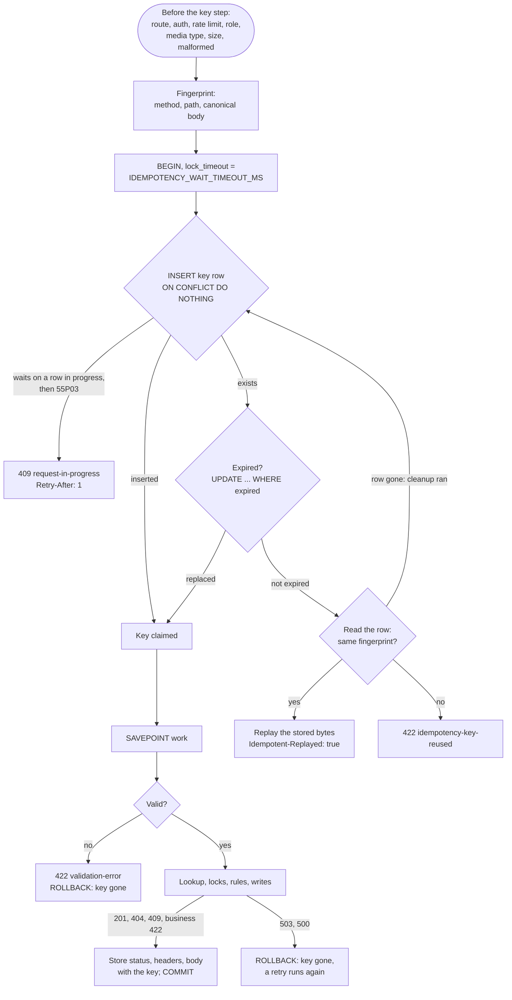

# Architecture

For reviewers and contributors: how the service is built and why it keeps money correct under concurrency, retries and failures. The README has the overview diagrams, linked from each section here; this document adds the module responsibilities, the consistency, concurrency and idempotency models in detail, and what happens when each part fails. The rules themselves are in the [specs](../specs/README.md), and the reasons in the [ADRs](adr/README.md).

## Contents

- [Shape of the system](#shape-of-the-system)
- [Modules and responsibilities](#modules-and-responsibilities)
- [Consistency model](#consistency-model)
- [Concurrency model](#concurrency-model)
- [Idempotency flow](#idempotency-flow)
- [Timeouts](#timeouts)
- [Failure modes](#failure-modes)

## Shape of the system

One deployable, a modular monolith ([ADR-0002](adr/0002-modular-monolith.md)), runs as several identical, stateless replicas behind a load balancer. PostgreSQL is the only source of truth: balances, the ledger, idempotency keys and the audit trail all live there ([ADR-0005](adr/0005-postgresql-as-the-only-source-of-truth.md)). Redis holds nothing but the per-user rate-limit counters, and the service keeps working without it. No lock, session, key or counter lives in a process, so any replica can serve any request.

See the README for the [system context](../README.md#system-context), the [local stack](../README.md#local-stack) and the [AWS deployment](../README.md#deployment-to-aws).

## Modules and responsibilities

Each module under [src/modules/](../src/modules/) is a hexagon ([ADR-0003](adr/0003-hexagonal-architecture-with-tactical-ddd.md), [layers diagram](../README.md#inside-the-service)): `domain/` holds value objects, rules and typed errors and imports no framework or driver; `application/` holds the use cases and the ports they need; `adapters/` holds the HTTP routes, the CLI commands and the Kysely repositories. A module uses another only through its `index.ts`, and ESLint rules enforce both that boundary and a domain free of frameworks and drivers. [src/app.ts](../src/app.ts) is the composition root that wires them.

| Module                                     | Owns                                                                                                                                                                                                                                                                                          | Main files                                                                                                                                                     |
| ------------------------------------------ | --------------------------------------------------------------------------------------------------------------------------------------------------------------------------------------------------------------------------------------------------------------------------------------------- | -------------------------------------------------------------------------------------------------------------------------------------------------------------- |
| [accounts](../src/modules/accounts/)       | Customer accounts: opening, reading, listing with keyset cursors, history, and the status lifecycle (`active`, `frozen`, `closed`) with its rules ([spec 001](../specs/001-accounts/spec.md)).                                                                                                | `domain/account.ts`, `application/change-account-status.ts`, `application/account-queries.ts`, `adapters/http/cursor.ts`                                       |
| [ledger](../src/modules/ledger/)           | Money and the double-entry ledger: currencies and their exponents, signed `bigint` amounts, the balanced transaction, reversals as negated copies, and reconciliation ([spec 002](../specs/002-ledger/spec.md), [ADR-0006](adr/0006-double-entry-ledger-with-signed-integer-minor-units.md)). | `domain/money.ts`, `domain/ledger-transaction.ts`, `application/reconciliation.ts`, `adapters/persistence/kysely-ledger.ts`                                    |
| [movements](../src/modules/movements/)     | Deposits, withdrawals, transfers and reversals: the lock plan, the rules checked under the locks, and reading transactions ([spec 003](../specs/003-money-movements/spec.md), [spec 004](../specs/004-reversals/spec.md)).                                                                    | `domain/lock-plan.ts`, `domain/movement-rules.ts`, `domain/reversal-rules.ts`, `application/transfer.ts`, `adapters/persistence/kysely-movements.ts`           |
| [idempotency](../src/modules/idempotency/) | The `Idempotency-Key` header, the request fingerprint, the key step inside the movement's transaction, the stored outcome and its replay, and the cleanup of expired keys ([spec 005](../specs/005-idempotency/spec.md)).                                                                     | `domain/fingerprint.ts`, `domain/outcome.ts`, `application/idempotent-runner.ts`, `adapters/http/keyed-handler.ts`, `adapters/persistence/kysely-key-store.ts` |
| [auth](../src/modules/auth/)               | Bearer token verification, the two roles and the route-to-role table, and the token script ([spec 006](../specs/006-auth/spec.md), [ADR-0012](adr/0012-simulated-authentication-with-jwt-and-two-roles.md)).                                                                                  | `application/token-verifier.ts`, `application/permissions.ts`, `adapters/http/authenticate.ts`, `adapters/cli/token.ts`                                        |
| [platform](../src/platform/)               | What every module shares: configuration, the database pool, the transaction runner and unit of work, error classification and the problem mapping, logging, metrics, health, shutdown, Redis, the audit log and error reporting ([spec 007](../specs/007-security-ops/spec.md)).              | `db/transaction-runner.ts`, `db/unit-of-work.ts`, `db/sqlstate.ts`, `http/error-handler.ts`, `config/config.ts`, `lifecycle/shutdown.ts`                       |

The modules depend on each other in one direction only. Every module uses platform; in return, only platform's HTTP edge reads the modules' public `index.ts`: `http/error-handler.ts` maps each module's domain errors to problem types, and `http/schemas/` uses the ledger's currencies and amount limit.

## Consistency model

| Rule                                                                                                                                                                                           | Where it is enforced                                                                                                                                                                                               |
| ---------------------------------------------------------------------------------------------------------------------------------------------------------------------------------------------- | ------------------------------------------------------------------------------------------------------------------------------------------------------------------------------------------------------------------ |
| One database transaction per money movement: the key row, the ledger transaction and its entries, the balance changes, the audit record and the stored response commit together or not at all. | The movement skeleton of section 6.2 of [plan 000](../specs/000-overview/plan.md), run by `runTransaction` in [transaction-runner.ts](../src/platform/db/transaction-runner.ts).                                   |
| A ledger transaction has two or more entries, in one currency, summing to zero, all written by the same database transaction.                                                                  | Deferred constraint triggers checked at `COMMIT`, in [the ledger migration](../migrations/1791468170000_ledger.sql), and the `LedgerTransaction` domain type.                                                      |
| Every entry shares its account's and its transaction's currency.                                                                                                                               | Composite foreign keys on `(id, currency)`.                                                                                                                                                                        |
| The ledger is append-only, for the runtime and the owner role alike.                                                                                                                           | Triggers that refuse `UPDATE`, `DELETE` and `TRUNCATE`, and the runtime role's grants ([ADR-0018](adr/0018-two-database-roles.md)).                                                                                |
| A customer balance never goes below zero, and a closed account holds zero.                                                                                                                     | Checks under the row lock, then `CHECK (balance >= 0)` and `accounts_closed_is_empty` in [the accounts migration](../migrations/1791468169000_accounts.sql).                                                       |
| A customer account's cached balance equals the sum of its entries; a system account has no cached balance at all.                                                                              | Both written in the same transaction; system balances are always summed ([ADR-0007](adr/0007-system-accounts-without-a-cached-balance.md)); `npm run reconcile` checks it ([runbook](runbooks/reconciliation.md)). |
| A transaction is reversed at most once, and a reversal is never reversed.                                                                                                                      | A unique constraint on `reversed_transaction_id`, and the reversal rules.                                                                                                                                          |

Reads are single statements on the primary, so each sees one committed state, and a client reads its own writes on any replica: there are no read replicas. Amounts are `bigint` from the database to the HTTP edge and strings of digits in JSON, never floating point ([ADR-0011](adr/0011-amounts-as-strings-in-the-api-and-bigint-in-the-domain.md)). The [data model diagram](../README.md#data-model) shows the tables and keys.

## Concurrency model

Every movement runs at READ COMMITTED and takes pessimistic row locks on the customer accounts it changes ([ADR-0008](adr/0008-read-committed-with-ordered-pessimistic-row-locks.md)):

1. **Look up** the accounts the request names, without locks, so an unknown or foreign account answers 404 before anything waits.
2. **Plan the locks**: `planLocks` in [lock-plan.ts](../src/modules/movements/domain/lock-plan.ts) keeps the customer accounts only, lowercases their ids, removes duplicates and sorts them ascending, which is PostgreSQL's `uuid` order.
3. **Lock** them one by one with `SELECT ... FOR UPDATE`, after setting `lock_timeout` to `ACCOUNT_LOCK_TIMEOUT_MS` through `app.set_lock_timeout`, a transaction-local function rather than a `SET`, so no connection is pinned behind RDS Proxy ([ADR-0019](adr/0019-timeout-layers-and-rds-proxy.md)).
4. **Check** status, currency and funds only now, on the rows as they are under the locks.
5. **Write** the ledger, the balances and the audit record, then commit, which releases the locks.

Because every transaction takes its locks in the same global order, two transactions can wait for each other only in that order, never in a cycle: crossed transfers (A→B with B→A) and longer cycles (A→B→C→A) queue instead of deadlocking ([sequence diagram](../README.md#crossed-transfers)). A lock wait longer than `ACCOUNT_LOCK_TIMEOUT_MS` (2000 ms) answers 503 `/problems/service-unavailable` with `Retry-After: 1`, after committing nothing.

System accounts, the settlement accounts of deposits and withdrawals, are never locked or updated: their balance is the sum of their entries. Otherwise every deposit and withdrawal in a currency would queue on one row ([ADR-0007](adr/0007-system-accounts-without-a-cached-balance.md)). The only lock their row ever sees is the `FOR KEY SHARE` of the foreign key check, which does not conflict with another one.

A deadlock (`40P01`) or serialization failure (`40001`) that still happens, for example with a statement outside this plan, is retried by the transaction runner: up to 3 attempts in all, on the same connection, with a random backoff of at most `min(200, 10 × 2^(n−1))` ms. After the third, the answer is 503 with `Retry-After: 1`. Account creation and status changes are not retried, since they are not money movements. Status changes lock the one account they change, under the same timeout.

This holds across replicas because the locks are PostgreSQL's: the [money guarantees](../README.md#highlights) are proven with 100 concurrent withdrawals on one account, 350 crossed and circular transfers, and 500 concurrent transfers through nginx over both replicas.

## Idempotency flow

The key row is the first write of the movement's own transaction ([ADR-0009](adr/0009-idempotency-inside-the-movements-transaction.md), [spec 005](../specs/005-idempotency/spec.md)). The README shows the [happy path](../README.md#transfer-happy-path) and [a retry on another replica](../README.md#same-request-on-two-replicas). This is every branch of the key step, with its timeouts:

| Case                                                                                          | Answer                                                                  | Effect on a retry with the same key                            |
| --------------------------------------------------------------------------------------------- | ----------------------------------------------------------------------- | -------------------------------------------------------------- |
| First request                                                                                 | Runs; 201 or a stored rejection                                         | Replayed byte for byte                                         |
| Same key, same request, while the first runs                                                  | Waits on the first's uncommitted row, then replays its committed answer | n/a                                                            |
| Same key, same request, still running after the wait                                          | 409 `/problems/request-in-progress`, `Retry-After: 1`                   | Replayed once the first commits; runs if the first rolled back |
| Same key, different method, path or body                                                      | 422 `/problems/idempotency-key-reused`                                  | Same 422                                                       |
| The first failed validation, or with a 5xx before `COMMIT`                                    | 422, 503 or 500; the key row rolled back                                | Runs again                                                     |
| The key expired (`IDEMPOTENCY_KEY_TTL_SECONDS`, 24 h)                                         | The row is replaced; the request runs as new                            | n/a                                                            |
| The request timeout fired after `COMMIT` was sent, or the connection was lost during `COMMIT` | 503; the outcome is unknown to the client                               | The stored answer if the commit succeeded                      |

The wait steps (the insert, the expired-row update and any re-pass after the cleanup deleted a row) share one deadline, so one attempt never waits for a key longer than `IDEMPOTENCY_WAIT_TIMEOUT_MS`. A replay is answered right after the malformed-request step, before validation and every later check, so it returns what the first request got even if configuration changed since (SYS-R33). Expired keys are deleted by `npm run idempotency:cleanup`, never by the service ([runbook](runbooks/idempotency-cleanup.md)).

## Timeouts

Each layer gives up before the layer around it, so the innermost layer that knows why answers ([ADR-0019](adr/0019-timeout-layers-and-rds-proxy.md), [ADR-0022](adr/0022-request-timeout-answer-first-then-roll-back.md)). The service validates the budget at startup and refuses to start when it does not fit (SEC-R35).

| Layer, innermost first         | Setting                                                  | Default    | Answer                                                                |
| ------------------------------ | -------------------------------------------------------- | ---------- | --------------------------------------------------------------------- |
| Redis command (per-user limit) | `REDIS_COMMAND_TIMEOUT_MS`                               | 100 ms     | none: the limit fails open                                            |
| Account row lock               | `ACCOUNT_LOCK_TIMEOUT_MS`                                | 2000 ms    | 503 `service-unavailable`                                             |
| Idempotency key wait           | `IDEMPOTENCY_WAIT_TIMEOUT_MS`                            | 2000 ms    | 409 `request-in-progress`                                             |
| Pool connection                | `DB_POOL_ACQUIRE_TIMEOUT_MS`                             | 2000 ms    | 503 `service-unavailable`                                             |
| Statement                      | the runtime role's `statement_timeout`                   | 5 s        | 503 `service-unavailable` (SQLSTATE 57014)                            |
| Idle in a transaction          | the runtime role's `idle_in_transaction_session_timeout` | 10 s       | the session is closed and the transaction rolled back                 |
| Request                        | `REQUEST_TIMEOUT_MS`                                     | 25000 ms   | 503 at once; the transaction rolls back after the statement in flight |
| Load balancer                  | nginx `proxy_read_timeout`; the ALB's idle timeout       | 30 s; 60 s | 504 `upstream-unavailable`                                            |

The [timeouts runbook](runbooks/timeouts-and-503.md) tells each 503 apart.

## Failure modes

What fails, what the client sees, and what keeps the money right. The AWS-specific cases (losing a zone, a database failover) are in [aws.md](deployment/aws.md#failure-modes).

| What fails                                               | What the client sees                                                                      | What protects the money                                                                                                                                                             |
| -------------------------------------------------------- | ----------------------------------------------------------------------------------------- | ----------------------------------------------------------------------------------------------------------------------------------------------------------------------------------- |
| A replica is killed during a movement                    | A connection error, or 502 `upstream-unavailable` from the load balancer                  | The transaction either committed with its key row or rolled back entirely; the retry with the same key replays or runs it once (DEP-AC11).                                          |
| A replica is stopped (deploy, scale-in)                  | Nothing: readiness turns 503, in-flight requests finish, new ones go to the other replica | The ordered shutdown of the [shutdown runbook](runbooks/shutdown.md).                                                                                                               |
| The database connection is lost during a request         | 503 `service-unavailable`, `Retry-After: 1`                                               | Rolled back before `COMMIT`; during `COMMIT` the outcome is unknown, and the retry with the same key replays it or runs it once; the connection is destroyed (SEC-R57).             |
| The client times out or disconnects                      | No answer; the movement may have committed                                                | The retry with the same key gets the stored answer, or runs if nothing committed.                                                                                                   |
| The same request arrives twice at once                   | One runs; the other waits and gets the same answer, or 409 `request-in-progress`          | The key row's primary key: the second insert waits on the first's row ([idempotency in progress](runbooks/idempotency-in-progress.md)).                                             |
| Two movements contend for one account                    | Both succeed in turn, or one gets 422 `insufficient-funds`                                | `SELECT ... FOR UPDATE`, checks after the lock, and `CHECK (balance >= 0)`.                                                                                                         |
| Crossed transfers                                        | Both succeed in turn                                                                      | Locks in ascending id order; a deadlock, if one still happens, is retried up to 3 attempts ([retry storm](runbooks/retry-storm.md)).                                                |
| A lock wait is too long                                  | 503 `service-unavailable`, `Retry-After: 1`                                               | Nothing committed; the retry runs again ([timeouts and 503](runbooks/timeouts-and-503.md)).                                                                                         |
| The connection pool is exhausted                         | 503 `service-unavailable`, `Retry-After: 1`                                               | Nothing started ([timeouts and 503](runbooks/timeouts-and-503.md)).                                                                                                                 |
| A statement or the request runs too long                 | 503 `service-unavailable`, `Retry-After: 1`                                               | Rolled back, unless `COMMIT` was already sent: then the retry finds the stored answer ([timeouts and 503](runbooks/timeouts-and-503.md)).                                           |
| PostgreSQL is unreachable                                | 503 when a connection is lost or none is free in time; readiness answers 503              | Nothing commits without the database; liveness stays 200, so replicas are not replaced in a loop ([database](runbooks/database.md)).                                                |
| Redis is unreachable                                     | Nothing: requests go on                                                                   | The per-user limit fails open after 100 ms and counts `scf_rate_limit_store_errors_total`; Redis holds no money state ([rate limits](runbooks/rate-limits.md)).                     |
| A bug writes an unbalanced or partial ledger transaction | 500 `internal-error`                                                                      | The deferred triggers refuse the commit; nothing is written (LED-AC23).                                                                                                             |
| Someone edits the ledger by hand                         | n/a                                                                                       | The append-only triggers refuse it for both roles; `npm run reconcile` reports any drift between balances and entries ([reconciliation](runbooks/reconciliation.md)).               |
| A deploy with a broken migration                         | Nothing: the running version keeps serving                                                | The migration runs as a one-off job before the rollout, and replicas do not start (locally) or roll out (AWS) without it ([ADR-0020](adr/0020-expand-then-contract-migrations.md)). |

A connection lost while a statement runs, `COMMIT` included, answers 503 `/problems/service-unavailable` with `Retry-After: 1`, never 500, and the connection is destroyed (SEC-R57). Lost before `COMMIT`, the transaction rolled back; lost during `COMMIT`, whether the movement committed is unknown to the client, and its retry with the same key, which the [API guide](api/README.md#idempotency-key) recommends for a 503, gets the stored answer if it did, or runs the request again if it did not.
