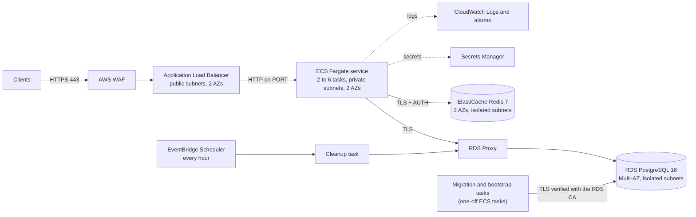
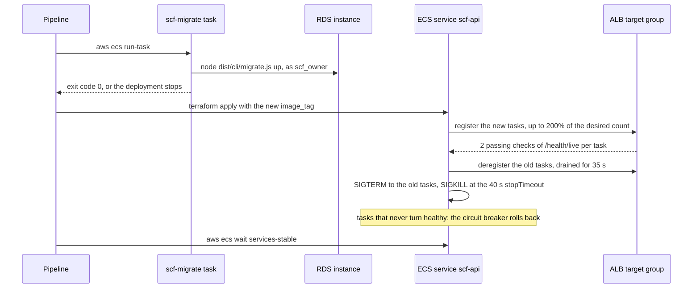

# AWS deployment

How SuperCool Finances runs in AWS: the target architecture of [spec 008](../../specs/008-deployment/spec.md) (section 1.3), decided in [ADR-0014](../adr/0014-aws-deployment-on-ecs-fargate-with-rds-postgresql.md) and expressed in Terraform under [`infra/terraform/`](../../infra/terraform/) ([ADR-0015](../adr/0015-terraform-for-infrastructure-as-code.md)). The image is the one the local stack runs; only the configuration differs.

Nothing in this repository applies the Terraform (DEP-R34). `npm run infra:validate` formats, validates and lints it, and checks it with checkov and the policies of [`infra/policies/`](../../infra/policies/). The commands below are the ones an operator, or a pipeline outside this repository, runs (section 6 of spec 008).

## Architecture



The tasks have no public IP and no route to the internet: VPC endpoints give them ECR, Secrets Manager, CloudWatch Logs and S3. The internet reaches only the ALB, on 443 and 80; every other security group admits only the group in front of it (DEP-R25).

## Components

### Network

Terraform module: `network` (`infra/terraform/modules/network/`)

A VPC over the two availability zones of `availability_zones`, with three tiers of subnets: public (the ALB only), private (the tasks) and isolated (RDS, RDS Proxy and ElastiCache). Only the public route table has a route, to the internet gateway; the private one reaches AWS through interface endpoints for the ECR API, ECR Docker, Secrets Manager and CloudWatch Logs and a gateway endpoint for S3; the isolated one has no route out of the VPC. There is no NAT gateway: a future call to the internet adds one with an egress allow-list (section 1.7).

The module also holds one security group per layer, with these rules and no others (DEP-R25, checked by `SCF_DEP_AC16_*`):

| Group        | Admits                                  | Sends to                                    |
| ------------ | --------------------------------------- | ------------------------------------------- |
| `alb`        | 443 and 80 from the internet            | the tasks on `PORT`                         |
| `tasks`      | `PORT` from `alb`; never `METRICS_PORT` | the endpoints, S3, RDS Proxy on 5432, Redis |
| `one-off-db` | nothing                                 | the endpoints, S3, the RDS instance on 5432 |
| `endpoints`  | 443 from `tasks` and `one-off-db`       | nothing                                     |
| `rds-proxy`  | 5432 from `tasks`                       | the RDS instance on 5432                    |
| `rds`        | 5432 from `rds-proxy` and `one-off-db`  | nothing                                     |
| `cache`      | 6379 from `tasks`                       | nothing                                     |

### Edge

Terraform module: `edge` (`infra/terraform/modules/edge/`)

The ALB in the public subnets, with `drop_invalid_header_fields`, an idle timeout of 60 s (above `REQUEST_TIMEOUT_MS`, below the service's keep-alive of 65 s, SEC-R34) and deletion protection. Its HTTPS listener on 443 serves the ACM certificate of `domain_name` with `ELBSecurityPolicy-TLS13-1-2-2021-06`; its HTTP listener on 80 answers every request with a 301 to HTTPS (DEP-R26). The target group reaches the tasks over plain HTTP inside the VPC, checks `/health/live` and drains a target for 35 s (DEP-R27). It checks liveness, not readiness, because ECS replaces every task the ALB reports unhealthy: a readiness check would turn a database outage into the replacement of every task, while with liveness the tasks stay and answer 503 on their own until the database is back. ECS deregisters a task from the ALB before stopping it, so draining needs no readiness signal (section 1.6 of spec 008, ADR-0014).

The AWS WAF web ACL holds the per-IP rate-based rule of SEC-R45, 60 × `RATE_LIMIT_IP_RPS` = 30000 requests per IP per minute, and the managed rule groups `AWSManagedRulesCommonRuleSet` and `AWSManagedRulesKnownBadInputsRuleSet`. Beyond the limit the rate rule answers 429 with `Retry-After: 60`, its window, and a body of content type `application/json` with the `type` `/problems/rate-limited`, `title`, `status` and `detail` of SEC-R01. That is as close to SEC-R01 as WAF allows: WAF cannot add a `requestId` or an `X-Request-Id` header, nor send `application/problem+json` (section 1.6 of spec 007). The managed rule groups answer a blocked request with a plain 403. Its logs go to CloudWatch Logs with the `authorization`, `cookie` and `idempotency-key` headers redacted.

Four differences from the local stack: WAF counts over whole minutes and allows no burst, where nginx allows a burst per second (section 1.6 of spec 007); its 429 carries `Retry-After: 60` and no `requestId`, where nginx's carries `Retry-After: 1` and one; the common rule set blocks request bodies above 8 KB with a 403 before the service, which would answer a body above 16 KB with its own 413 (SEC-R10); and the ALB answers its own 502, 503 and 504 as `text/html` without a problem body, `Retry-After` or `X-Request-Id`, where nginx renders `/problems/upstream-unavailable` (DEP-R16). The retry policy keys on the status, so a client retries the same way. The service's bodies are small JSON documents, so the body limit changes no normal request.

### Service

Terraform module: `service` (`infra/terraform/modules/service/`)

The ECR repository (immutable tags, scanned on push), the ECS cluster and four task definitions of the same image, each logging to its own log group:

| Task definition                   | Command                                | Database                         | Secrets                                                               |
| --------------------------------- | -------------------------------------- | -------------------------------- | --------------------------------------------------------------------- |
| `scf-api`, run by the ECS service | `node dist/main.js`                    | RDS Proxy, as `scf_app`          | `JWT_SECRET`, `CURSOR_SECRET`, `PGPASSWORD`, `REDIS_URL`              |
| `scf-migrate`                     | `node dist/cli/migrate.js up`          | the instance, as `scf_owner`     | `PGPASSWORD` (owner role)                                             |
| `scf-bootstrap`                   | `node dist/cli/bootstrap-roles.js`     | the instance, as the master user | `PGPASSWORD` (master), `OWNER_ROLE_PASSWORD`, `RUNTIME_ROLE_PASSWORD` |
| `scf-idempotency-cleanup`         | `node dist/cli/idempotency-cleanup.js` | RDS Proxy, as `scf_app`          | `PGPASSWORD` (runtime role)                                           |

Every container runs as uid 1000 with a read-only root file system and `NODE_ENV` `production` (DEP-R27). The service's task: 0.5 vCPU and 1 GB, `stopTimeout` 40 s, above `SHUTDOWN_DRAIN_DELAY_MS` + `SHUTDOWN_TIMEOUT_MS` (2 + 30 s), and a container health check on `/health/live` with Node, as the image's `HEALTHCHECK` (DEP-R21), which ECS does not read. The ECS service keeps 2 tasks across both zones, scales from 2 to 6 on 60% average CPU, keeps 100% of the desired count healthy during a deployment, rolls back a deployment that never turns healthy, and waits 30 s before the ALB's health checks count. With `DB_POOL_MAX` 10, a rollout at the autoscaling maximum runs 6 × 200% = 12 tasks, which hold at most 12 × 11 = 132 connections to RDS Proxy (SEC-R36). The Terraform variables refuse any `max_tasks`, `deployment_maximum_percent`, `db_pool_max` or `db_max_connections` that breaks the budget of section 1.9 of spec 007, and any `shutdown_drain_delay_ms` + `shutdown_timeout_ms` + 5 s that does not stay below `stop_timeout_seconds`, or a `shutdown_timeout_ms` below `request_timeout_ms` (SEC-R35).

An EventBridge Scheduler schedule, `rate(1 hour)`, runs the cleanup task in the private subnets without a public IP (DEP-R37). Its role may only run that task definition on this cluster and pass its two roles. Nothing else is scheduled.

IAM is least privilege: one execution role per task definition, which may pull the image, write to that task's log group and read only that task's secrets; and one task role with no permission at all, since the service calls no AWS API.

### Database

Terraform module: `database` (`infra/terraform/modules/database/`)

RDS PostgreSQL 16, `db.t4g.medium`, one Multi-AZ instance (not Aurora, so PostgreSQL stays identical to the local one), 20 GB of gp3 storage autoscaling to 100 GB, encrypted with the module's KMS key, not publicly accessible, with deletion protection, 7 days of automated backups with point-in-time recovery, Performance Insights and a final snapshot (DEP-R29). The parameter group sets `rds.force_ssl` 1, `log_parameter_max_length` 0, so no statement log holds a bind parameter, and `max_connections` 200, a static parameter applied at the next reboot: a rollout at the autoscaling maximum runs 6 × 200% = 12 tasks, 12 × (`DB_POOL_MAX` 10 + 1) + 10 = 142 of the 197 usable connections (SEC-R36, section 1.9 of spec 007). `db.t4g.medium`'s default would be far higher. RDS keeps its master password in Secrets Manager (`manage_master_user_password`), encrypted with the secrets module's key.

RDS Proxy fronts it, requires TLS and authenticates only the runtime role `scf_app`, with that role's secret. It waits at most 5 s (`connection_borrow_timeout`) for a database connection, then answers SQLSTATE 08000, which the service answers 503 (SEC-R49). It uses at most 90% of the instance's `max_connections`, which leaves the rest to the sessions that connect to the instance directly: the migration and bootstrap tasks. The service and the cleanup task connect only through the proxy, whose certificate is publicly trusted, so their URLs need no CA file.

Why the migrations do not go through the proxy, and why the service never sends `SET`: [ADR-0019](../adr/0019-timeout-layers-and-rds-proxy.md). node-pg-migrate holds a session advisory lock for its whole run, which would pin its proxy connection; the service sets its lock and statement timeouts through SQL functions, which RDS Proxy does not pin. The alarm on `DatabaseConnectionsCurrentlySessionPinned` watches that this stays true.

The migration and bootstrap tasks verify the instance's certificate (`sslmode=verify-full`) against AWS's public RDS CA bundle, which the image ships at `/app/dist/certs/rds-global-bundle.pem` (DEP-R41).

### Cache

Terraform module: `cache` (`infra/terraform/modules/cache/`)

An ElastiCache Redis 7 replication group of 2 `cache.t4g.small` nodes in the two zones, with automatic failover and Multi-AZ, encryption at rest with the module's KMS key and in transit (required), and an AUTH token (DEP-R30). Terraform reads the token from the Redis secret through an ephemeral resource into the write-only `auth_token_wo`, so it never enters the plan or the state; raising `redis_auth_token_version` sends a new token on the next apply. Redis holds only the per-user rate-limit counters (spec 007), and the service fails open without it.

### Secrets

Terraform module: `secrets` (`infra/terraform/modules/secrets/`)

The KMS key of the secrets, which also encrypts RDS's master secret, and one Secrets Manager secret per value the service needs, created without a value: Terraform holds no `aws_secretsmanager_secret_version` and no `random_password`, so no secret value enters the code or the state (DEP-R31). An operator sets each value:

| Secret              | Value                                                                            | Read by                                                 |
| ------------------- | -------------------------------------------------------------------------------- | ------------------------------------------------------- |
| `scf/jwt-secret`    | `JWT_SECRET`, at least 32 bytes                                                  | the service                                             |
| `scf/cursor-secret` | `CURSOR_SECRET`, at least 32 bytes, different from `JWT_SECRET`                  | the service                                             |
| `scf/db-owner`      | `{"username": "scf_owner", "password": "..."}`, printable ASCII                  | the migration and bootstrap tasks                       |
| `scf/db-runtime`    | `{"username": "scf_app", "password": "..."}`, printable ASCII                    | RDS Proxy, the service, the cleanup and bootstrap tasks |
| `scf/redis`         | `{"auth_token": "...", "url": "rediss://:<auth_token>@<primary endpoint>:6379"}` | Terraform (`auth_token`) and the service (`url`)        |

Each task gets its database URL without a password, as an environment variable built by Terraform from the endpoint it must use, and the password as the secret `PGPASSWORD`, which `pg` reads when the URL holds none. The logger redacts `PGPASSWORD` like the other secrets (SEC-R22).

### Observability

Terraform module: `observability` (`infra/terraform/modules/observability/`)

The CloudWatch log groups of the four task definitions and of AWS WAF, kept 30 days and encrypted with the module's KMS key (DEP-R32), and the one SNS topic, also encrypted, that every alarm notifies. Subscribe the on-call to `alarm_topic_arn`. The alarms are those of section 1.8 of spec 008, each on a metric or an event AWS publishes:

| Alarm                        | Fires when                                                                            |
| ---------------------------- | ------------------------------------------------------------------------------------- |
| ALB 5xx                      | the ALB's and the targets' 5xx are above 1% of requests over 5 minutes                |
| ALB target response time     | p99 above 300 ms over 5 minutes (SYS-R20)                                             |
| ALB healthy targets          | fewer than 2                                                                          |
| ECS CPU, ECS memory          | above 80%                                                                             |
| RDS CPU                      | above 80%                                                                             |
| RDS storage running out      | RDS publishes RDS-EVENT-0225, 0224, 0223 or 0007 (below)                              |
| RDS connections              | RDS Proxy's database connections above 80% of `MaxDatabaseConnectionsAllowed`         |
| RDS Proxy pinned connections | `DatabaseConnectionsCurrentlySessionPinned` Maximum above 0 over 5 minutes (ADR-0019) |
| ElastiCache memory           | any node above 80%                                                                    |
| WAF blocked requests         | above 1000 in 5 minutes                                                               |

Storage is watched through RDS events, because storage autoscaling grows the volume long before free space runs out, so a threshold on `FreeStorageSpace` would page during normal growth. An EventBridge rule sends the four events that say space really is running out: RDS-EVENT-0225 (allocated storage at 80% of the 100 GB maximum), RDS-EVENT-0224 (an autoscaling step would reach the maximum), RDS-EVENT-0223 (autoscaling cannot scale) and RDS-EVENT-0007 (storage exhausted). An RDS event subscription cannot be used: it filters by category only, and the "low storage" category also holds RDS-EVENT-0089, which fires before every autoscaling step, while 0223, 0224 and 0225 sit in the broad "failure" and "notification" categories.

The service's Prometheus metrics stay on `METRICS_PORT`, which no security group admits. Scraping them is the next step, out of scope here: an AWS Distro for OpenTelemetry collector as a sidecar, writing to Amazon Managed Service for Prometheus. Locally, the Compose profile `observability` scrapes them with Prometheus and shows them in Grafana (ADR-0023).

Error reporting (section 1.10 of spec 007) stays off in AWS: the task definitions set no `SENTRY_DSN`, and the tasks have no outbound internet path to reach an endpoint. Turning it on needs a NAT gateway with an egress allow-list for the endpoint, and the DSN as a Secrets Manager secret injected like the others.

## Request path

1. The client resolves the domain to the ALB and opens TLS 1.2 or 1.3 on 443; a request on 80 gets a 301 to HTTPS.
2. AWS WAF evaluates the request: the per-IP rate rule, then the two managed rule groups. A request over the per-IP limit ends here with a 429, one a managed rule group blocks with a 403.
3. The ALB drops invalid header fields, appends the client's address to `X-Forwarded-For`, its default (nginx replaces the header instead, SEC-R19), and forwards the request over HTTP to a healthy task in either zone. The service trusts `X-Forwarded-For` only from the public subnets, where the ALB's nodes are (`TRUSTED_PROXY_CIDRS`), and takes the rightmost address that is not one of them: the one the ALB appended, so any value the client sent is ignored (SEC-R18).
4. The task authenticates the token, applies the per-user limit in Redis (failing open without it) and the checks of section 1.3 of spec 007, then runs the movement in one database transaction through RDS Proxy, which hands the transaction a database connection and takes it back at commit.
5. The answer returns the same way. Logs go to CloudWatch Logs through the endpoint; nothing leaves the VPC except the response.

The overview diagram of the whole deployment, with the one-off tasks and the endpoints, is in the README's [Deployment to AWS](../../README.md#deployment-to-aws).

## Scaling

Only the ECS service scales on its own. The database and the cache keep the size the Terraform gives them.

### The service

An `aws_appautoscaling_target` on `ecs:service:DesiredCount` holds the service between `min_tasks` (2) and `max_tasks` (6), and the policy `scf-api-cpu`, of type `TargetTrackingScaling` on the predefined metric `ECSServiceAverageCPUUtilization`, keeps the average CPU of the tasks at 60% (section 1.7 of spec 008). The target is a literal of the root module, not a variable, and the policy sets no cooldown, so AWS's defaults apply. `desired_count` (2) only seeds the service: it is in `ignore_changes`, so an apply never resets the count autoscaling chose. `desired_count` and `min_tasks` refuse any value below 2 (DEP-R27).

Each task is 0.5 vCPU and 1 GB. The alarm on ECS CPU fires at 80% average over 5 minutes, above the 60% target, so it fires when autoscaling cannot bring the CPU back down, as at the maximum of 6 tasks.

### What bounds it

The task count is bounded by the database's connections, not by Fargate:

| Bound                          | Where                                                                   | Value                                                             |
| ------------------------------ | ----------------------------------------------------------------------- | ----------------------------------------------------------------- |
| Connections per task           | `DB_POOL_MAX` (`db_pool_max`) plus the readiness connection (SEC-R36)   | 10 + 1                                                            |
| Tasks during a rollout         | `max_tasks` × `deployment_maximum_percent` / 100                        | 6 × 200 / 100 = 12                                                |
| Connection budget              | the second validation of `max_tasks`, against `db_max_connections` − 3  | 12 × (10 + 1) + 10 = 142 < 197                                    |
| The instance's connections     | `max_connections` of the parameter group (`db_max_connections`)         | 200, applied at the next reboot                                   |
| RDS Proxy's share              | `max_connections_percent` (`db_proxy_max_connections_percent`, DEP-R29) | 90% of 200; the rest is left to the migration and bootstrap tasks |
| Wait for a database connection | `connection_borrow_timeout` of RDS Proxy                                | 5 s, then SQLSTATE 08000 and a 503 (SEC-R49)                      |

The validation computes `floor(max_tasks × deployment_maximum_percent / 100) × (db_pool_max + 1) + 10 < db_max_connections − 3`, so raising `max_tasks`, `deployment_maximum_percent` or `db_pool_max` fails at `terraform plan` unless `db_max_connections` grows with it. With every other default, the largest `max_tasks` it accepts is 8: 16 × 11 + 10 = 186 < 197, while 9 gives 18 × 11 + 10 = 208. A larger `db_max_connections` is a static parameter, applied only when the instance reboots. The alarm on RDS connections fires when RDS Proxy's database connections pass 80% of its `MaxDatabaseConnectionsAllowed`.

### During a rollout

The service keeps `deployment_minimum_healthy_percent` 100 and `deployment_maximum_percent` 200: ECS never runs fewer healthy tasks than the desired count, and may start as many new tasks as there are old ones before it stops any. At the autoscaling maximum that is 12 tasks for the length of the rollout, which the connection budget above already counts. A lower `deployment_maximum_percent` lowers that peak.

### The load balancer while scaling

The target group registers each task by IP. A new task receives requests once it passes 2 consecutive checks of `/health/live` (interval 10 s, timeout 5 s, `healthy_threshold` 2); ECS ignores the ALB's checks for the first 30 s of a task (`health_check_grace_period_seconds`), and the container's own check starts after its `startPeriod` of 10 s. The ALB checks liveness, so a task that cannot reach the database still joins and answers 503 on its own (section 1.6 of spec 008).

On a scale-in, ECS deregisters the task, the ALB drains it for 35 s (`deregistration_delay`), and the task then shuts down as in [the shutdown runbook](../runbooks/shutdown.md): `SHUTDOWN_DRAIN_DELAY_MS` (2 s), the requests in flight within `SHUTDOWN_TIMEOUT_MS` (30 s), and SIGKILL only at the 40 s `stopTimeout`. Every request is answered by its `REQUEST_TIMEOUT_MS` (25 s), which `SHUTDOWN_TIMEOUT_MS` never undercuts (SEC-R35), so a scale-in cuts no request off.

### Redis and RDS

Neither scales on its own:

- **Redis**: 2 `cache.t4g.small` nodes, a primary and one replica, from the module's `node_count` (default 2, at least 2), which the root module does not expose. `REDIS_URL` names the primary endpoint, so every command goes to the primary. Redis holds only the per-user rate-limit counters, nothing of the money; the alarm on ElastiCache memory fires above 80% on any node. Growing it is a change of `node_type` in the `cache` module.
- **RDS**: one Multi-AZ `db.t4g.medium` instance and no read replica: every read and every write goes to the one instance (ADR-0005). The instance class is a literal of the `database` module, not a variable. Storage grows on its own from 20 GB to `db_max_allocated_storage_gb` (100 GB), watched by the storage events of the Observability section; CPU is watched by the alarm on RDS CPU at 80%. Aurora PostgreSQL is the upgrade path of ADR-0014.

## Deployment and migration steps

Placeholders: `<region>`, `<cluster>` (output `cluster_name`), `<subnets>` (output `private_subnet_ids`, comma-separated), `<one-off-sg>` (output `one_off_db_security_group_id`), `<tag>` (the image tag).

### First deployment

1. Configure the state backend outside the repository. `backend.tf` is an empty `s3` block; give it a bucket with versioning and S3's native locking, for example `terraform init -backend-config="bucket=<state-bucket>" -backend-config="key=supercool-finances/terraform.tfstate" -backend-config="region=<region>" -backend-config="encrypt=true" -backend-config="use_lockfile=true"`. Copy `example.tfvars` to a variables file of the environment.
2. Create the secrets first, because the cache module reads the Redis token while it is applied: `terraform apply -target=module.secrets`.
3. Put every value of the table of the Secrets section with `aws secretsmanager put-secret-value --secret-id <name> --secret-string <value>`, generating passwords and tokens with `aws secretsmanager get-random-password --exclude-punctuation --password-length 40`. The Redis secret's `url` cannot be known yet: put `{"auth_token": "<token>", "url": "pending"}`.
4. Create the certificate alone, `terraform apply -target=module.edge.aws_acm_certificate.this`, and publish the DNS records of the output `certificate_validation_records` in the domain's zone. AWS refuses an HTTPS listener whose certificate is not issued, so this comes before the edge is applied.
5. Apply everything but the service, so that no task starts before the schema exists: `terraform apply -target=module.network -target=module.edge -target=module.database -target=module.cache -target=module.observability`. The edge waits on `aws_acm_certificate_validation` until ACM has issued the certificate, then creates the HTTPS listener with it.
6. Write the Redis `url` from the output `redis_primary_endpoint`, with the same token, and point the domain at `alb_dns_name`.
7. Create the ECR repository, `terraform apply -target=module.service.aws_ecr_repository.this`, then build the image's runtime stage for the `cpu_architecture` of the variables and push it to the output `ecr_repository_url`: `docker build --target runtime -t <ecr>:<tag> .` and `docker push <ecr>:<tag>`.
8. Register the one-off task definitions with that tag: `terraform apply -var image_tag=<tag> -target=module.service.aws_ecs_task_definition.bootstrap -target=module.service.aws_ecs_task_definition.migrate`.
9. Run the bootstrap task once (below). It creates `scf_owner` (`LOGIN CREATEROLE`) and `scf_app` (`LOGIN`) with the passwords of their secrets, grants `scf_app` to `scf_owner` `WITH ADMIN TRUE, INHERIT FALSE, SET FALSE` and gives the database to `scf_owner`, as `docker/postgres/init/01-databases.sql` does locally (section 1.7 of spec 008, ADR-0018). The RDS master credentials are used for nothing else.
10. Run the migration task (below) and wait for exit code 0.
11. Apply everything: `terraform apply -var image_tag=<tag>`. The service starts its tasks; wait with `aws ecs wait services-stable --cluster <cluster> --services scf-api`.

### Running a one-off task

The migration and bootstrap tasks run in the private subnets, in the `one-off-db` group, without a public IP:

```sh
task_arn=$(aws ecs run-task --cluster <cluster> --launch-type FARGATE \
  --task-definition scf-migrate \
  --network-configuration "awsvpcConfiguration={subnets=[<subnets>],securityGroups=[<one-off-sg>],assignPublicIp=DISABLED}" \
  --query 'tasks[0].taskArn' --output text)
aws ecs wait tasks-stopped --cluster <cluster> --tasks "$task_arn"
aws ecs describe-tasks --cluster <cluster> --tasks "$task_arn" \
  --query 'tasks[0].containers[0].exitCode' --output text   # must print 0
```

The same with `--task-definition scf-bootstrap` runs the bootstrap. A failure prints one line in the task's log group (`/scf/migrate` or `/scf/bootstrap`) with the SQLSTATE or the variable at fault, never a password.

### Every deployment

The pipeline runs, in order, and stops at the first failure:

1. Build and push the image with a new, immutable tag.
2. Register the migration task definition of that tag: `terraform apply -var image_tag=<tag> -target=module.service.aws_ecs_task_definition.migrate`.
3. Run the migration task and require exit code 0, as `depends_on` does locally. Migrations are expand-then-contract ([ADR-0020](../adr/0020-expand-then-contract-migrations.md)), so the running version keeps working on the new schema, and readiness accepts migrations newer than the code (SEC-R24). A failed migration stops the deployment with the old version still serving.
4. Apply with the new tag: `terraform apply -var image_tag=<tag>`. ECS starts the new tasks, waits for the ALB to see them healthy, then deregisters and drains the old ones: each gets SIGTERM, keeps serving for `SHUTDOWN_DRAIN_DELAY_MS`, finishes its requests within `SHUTDOWN_TIMEOUT_MS` and is killed only after the 40 s `stopTimeout`.
5. Wait for `aws ecs wait services-stable`. A deployment that never turns healthy is rolled back by the circuit breaker.

Rolling back the code is applying the previous tag; the schema still supports it. In production the way back for the schema is a new forward migration, never `migrate:down`.

### Rollout and rollback



The ECS service rolls out with these settings of the `service` module (DEP-R27):

| Setting                              | Value                | Effect                                                                             |
| ------------------------------------ | -------------------- | ---------------------------------------------------------------------------------- |
| `deployment_minimum_healthy_percent` | 100                  | the old tasks stop only once as many new ones are healthy; capacity never drops    |
| `deployment_maximum_percent`         | 200                  | up to twice the desired count during the rollout, counted in the connection budget |
| `health_check_grace_period_seconds`  | 30                   | the ALB's checks of a new task count only after 30 s                               |
| `deployment_circuit_breaker`         | `enable`, `rollback` | a deployment whose tasks never turn healthy goes back to the last one that did     |

For a while the old and the new version serve side by side against one schema, which is why the migration runs first and why it may only expand (ADR-0020). Readiness accepts migrations newer than the code (SEC-R24), so an old task stays ready on the new schema.

What the circuit breaker sees is a task that fails to start, exits, or fails its health checks: a configuration the service refuses (SEC-R40), a crash, or a failed `/health/live`. Nothing in AWS checks readiness, and the service sets no deployment alarms, so a version that is live but answers 503 or 500 is not rolled back on its own: the alarms on ALB 5xx and on healthy targets page, and an operator rolls back.

To roll back the code:

1. Apply the previous tag: `terraform apply -var image_tag=<previous tag>`, then `aws ecs wait services-stable --cluster <cluster> --services scf-api`. Tags are immutable in ECR, so the previous tag is the same image that ran before. This is the way that keeps Terraform and the service in step.
2. When there is no time for an apply: `aws ecs update-service --cluster <cluster> --service scf-api --task-definition scf-api:<previous revision>`, then the same wait. Terraform owns the service's task definition (only `desired_count` is in `ignore_changes`), so the next apply must carry the previous tag, or it rolls the new one out again.

Either way the rollout is the same rolling deployment, with the same draining. What is not rolled back is the schema: the migration task runs only `node dist/cli/migrate.js up`, no task definition runs `down`, and `migrate:down` is for development (ADR-0020). Expand-then-contract makes the schema compatible with the version just before, so a rollback by one release is safe; a migration that has to be undone is undone by a new forward migration, deployed like any other. A contract migration drops only what no running release uses any more (ADR-0020), so rolling back across one is not covered by that guarantee.

### Rotating a secret

- `JWT_SECRET`, `CURSOR_SECRET`: put the new value, then `aws ecs update-service --cluster <cluster> --service scf-api --force-new-deployment`. Tokens and cursors signed with the old value stop being accepted.
- The owner role's password (`scf/db-owner`): put the new value and run the bootstrap task, which sets both roles' passwords to their secrets' current values. Only the migration and bootstrap tasks use it, so nothing is interrupted.
- The runtime role's password (`scf/db-runtime`): this interrupts new database connections until the redeploy finishes, so it is done in a maintenance window. RDS Proxy checks a client's password against the secret's current value, and opens database connections with it, while the running tasks keep the old `PGPASSWORD` until they are replaced. In this order, which keeps the window shortest: register the bootstrap task definition beforehand; put the new value; run the bootstrap task at once, so the database accepts the new password and the proxy can open connections again; force a new deployment at once with `aws ecs update-service --cluster <cluster> --service scf-api --force-new-deployment` and wait for `aws ecs wait services-stable`. Until each old task is replaced, its new pool connections are refused, so requests may answer 503; connections it already holds keep working. A cleanup run that falls in the window fails and the next hour's run catches up. The follow-up that removes the window is an alternating two-user rotation: two login users for the runtime role, with the secret switching between them, so the old password stays valid until every task has the new one.
- The Redis token: put the new `auth_token` and `url`, raise `redis_auth_token_version` and apply, then force a new deployment.
- The RDS master password: RDS rotates it in its own secret; only the bootstrap task reads it.

### Refreshing the RDS CA bundle

`certs/rds-global-bundle.pem` is AWS's public bundle from `https://truststore.pki.rds.amazonaws.com/global/global-bundle.pem`. When AWS announces a new RDS CA, download it again, check that it parses and holds the new authority, commit it, and deploy a new image before the instance switches to a certificate of that authority (`ca_cert_identifier`). `npm run build` copies it to `dist/certs/` (DEP-AC29).

## Failure modes

What each loss does to requests and to money, and how the deployment recovers.

| Failure              | Detected by                                                                                | Recovery                                                          | The client sees                                                           |
| -------------------- | ------------------------------------------------------------------------------------------ | ----------------------------------------------------------------- | ------------------------------------------------------------------------- |
| A task               | 3 failed `/health/live` checks of the ALB, 10 s apart (30 s), or 3 failed container checks | ECS replaces the task; the alarm on healthy targets fires below 2 | a connection error or the ALB's 502 for the requests in flight on it      |
| An availability zone | the same checks, in every task of the zone                                                 | ECS starts the desired count in the other zone                    | as for a task, then normal service                                        |
| The database primary | RDS, which fails over to the standby; RDS Proxy keeps its endpoint                         | the tasks serve again without a restart                           | 503 with `Retry-After: 1` after at most 5 s per request, until it is back |
| A Redis node         | the 100 ms command timeout of the service; ElastiCache's automatic failover                | ElastiCache promotes the replica                                  | nothing: requests are served, without the per-user limit                  |

### Loss of a task

The ALB marks the target unhealthy after three failed liveness checks (30 s) and stops sending it requests; ECS replaces it in either zone. A task stopped by ECS drains first (SEC-R25). Requests in flight on a task that dies are lost to the client as a connection error or a 502; the client retries with the same Idempotency-Key, and the key's row tells whether the movement committed (DEP-R17, spec 005). Money is never lost or duplicated, which DEP-AC11 proves locally by killing a replica under load.

Two checks find a dead or hung task. The ALB checks `/health/live` every 10 s with a 5 s timeout and marks the target unhealthy after 3 failures (`unhealthy_threshold`); the task definition's own health check, which ECS does read, runs `node dist/healthcheck.js` every 10 s with a 3 s timeout and 3 retries after a `startPeriod` of 10 s. Either one makes ECS replace the task, and the replacement takes requests after 2 passing checks of the ALB. The alarm on healthy targets fires when the Minimum of `HealthyHostCount` drops below 2 over a minute, so losing one of the two tasks pages.

A task that ECS stops itself, on a deployment, a scale-in or a replacement, is deregistered and drained for 35 s first, then shuts down within its 40 s `stopTimeout`, so it loses nothing ([shutdown runbook](../runbooks/shutdown.md)). Only a task that dies, or is killed with SIGKILL (exit code 137), drops requests in flight; their transactions never commit, or commit with their key row, so the retry sees one result either way.

### Loss of an availability zone

The ALB, the tasks, RDS Proxy and Redis span both zones. The ALB stops routing to the lost zone; ECS keeps the desired count by starting tasks in the remaining zone; autoscaling adds tasks if CPU rises. If the lost zone held the RDS primary, the database fails over as below; if it held the Redis primary, ElastiCache promotes the replica. The interface endpoints have a network interface in each zone, so the remaining zone keeps reaching AWS services.

Every tier has one subnet in each of the two zones of `availability_zones`, and the DB and cache subnet groups both span the two isolated subnets, so nothing is pinned to one zone. While the zone is gone, the desired count runs in the remaining one; with the minimum of 2 that is both tasks in one zone. The service sets `availability_zone_rebalancing` to `ENABLED`, so ECS spreads the tasks across both zones again once the lost one returns. There is no NAT gateway, so no zone holds a component the other needs to reach AWS.

The database and Redis each fail over as below; the two failovers are independent, and a zone outage can bring both at once. Money is protected as for the loss of a task and the database failover.

### Database failover

RDS promotes the standby, usually within one to two minutes, and RDS Proxy reconnects to it without the service changing its endpoint. During the failover, RDS Proxy holds each new transaction's first statement for at most its `connection_borrow_timeout` of 5 s, then answers SQLSTATE 08000, and readiness answers 503: requests answer 503 with `Retry-After` (SEC-R49), the connection that met the timeout is destroyed rather than reused, a movement in flight rolls back and its key row is released, and clients retry with the same key. The ALB checks liveness, so the targets stay healthy and ECS replaces no task: they answer 503 until the database is back, and serve again without a restart (section 1.6 of spec 008, ADR-0014). Losing the instance without a standby is recovered from the automated backups to a point in time within 7 days.

Step by step, as the Terraform and spec 007 set it:

1. The primary is lost. RDS promotes the standby in the other zone; the instance's endpoint and RDS Proxy's endpoint stay the same, so no task changes its `DATABASE_URL`.
2. A transaction still open on the lost primary does not commit, and its key row goes with it: its connection is lost, the request answers 503 `/problems/service-unavailable` with `Retry-After: 1` (SEC-R57), and a retry with the same key runs the movement afresh. A connection lost during `COMMIT` answers the same 503 with an outcome unknown to the client, and the retry with the same key replays the stored answer if the commit succeeded.
3. A new transaction waits for a database connection at RDS Proxy for at most 5 s (`connection_borrow_timeout`), then gets SQLSTATE 08000. The service answers 503 `/problems/service-unavailable` with `Retry-After: 1`, sends nothing more on that connection, `ROLLBACK` included, and destroys it instead of returning it to the pool (SEC-R49). The pool opens a new one on the next request.
4. Every request is still bounded by `REQUEST_TIMEOUT_MS` (25 s), below the ALB's idle timeout of 60 s, so the service, not the ALB, answers it (SEC-R34). A request whose `COMMIT` was already sent at its deadline has an outcome unknown to the client, as after a gateway error, and its retry with the same key gets the stored response (ADR-0022).
5. `/health/live` keeps answering 200, so the ALB keeps the targets and ECS replaces no task; readiness answers 503 while `SELECT 1` fails, but nothing in AWS checks it (section 1.6 of spec 008).
6. Once the new primary takes connections, the proxy hands them out again and the tasks serve without a restart.

The failover is felt as a burst of 503s for its length (ADR-0014). The alarm on ALB 5xx counts the targets' 5xx, so a failover long enough to pass 1% of the requests over 5 minutes pages. How long failovers take in practice is what ADR-0014 says to watch, since it decides whether Aurora's faster failover is worth its cost.

### Loss of Redis

The per-user rate limit fails open: each Redis command times out after `REDIS_COMMAND_TIMEOUT_MS` (100 ms), the request is served, and the service logs one warning on the transition and one line on recovery (SEC-R06). Readiness ignores Redis, so no task is taken out of the ALB. Money movements never touch Redis, so they stay correct; the per-IP limit of AWS WAF still applies. On a node failure ElastiCache promotes the replica and the service reconnects.

The replication group has `automatic_failover_enabled` and `multi_az_enabled`, with its two nodes in the two zones (DEP-R30). The service reaches it through the primary endpoint of `REDIS_URL`, so it needs no change after a promotion. While Redis does not answer, each request waits at most `REDIS_COMMAND_TIMEOUT_MS` (100 ms) for the check, a wait already counted in the request's budget (SEC-R35), and `scf_rate_limit_store_errors_total` rises. Per-user limits are not enforced until Redis is back; the per-IP limit of WAF, 30000 requests per IP per minute, still is. The counters live only in Redis, so whatever a failover loses of them is a rate-limit window, never money.

### What the client sees

The client follows the retry policy of section 1.5 of spec 008: it retries with the same Idempotency-Key on a connection error, a 502, 503 or 504, or a 409 `/problems/request-in-progress`, waits the `Retry-After` of the response when it has one and 200 ms otherwise, up to 60 times, and never retries another 4xx. The service's 503s carry `Retry-After: 1`. The ALB's own 502, 503 and 504 are `text/html` with no `Retry-After` and no problem body (Edge section), so the client waits 200 ms after them; it keys on the status, so it retries them the same way.

### What protects the money

No failure above can lose or duplicate a movement, because nothing about money lives outside PostgreSQL (ADR-0005):

- Each movement is one database transaction, and its idempotency key row is the transaction's first write (ADR-0009). The key and the movement commit together or not at all, so a retry with the same key either gets the stored response of the one execution or runs the movement for the first time (DEP-R17, spec 005).
- Balances are checked only after the customer accounts are locked with `SELECT ... FOR UPDATE`, in the same transaction (ADR-0008), so no failover or retry can bring a balance below zero.
- The ledger is append-only; a movement that did commit is corrected only by a reversal, never by a failure path.
- Redis holds only rate-limit counters, and the tasks hold no state, so losing either loses nothing but capacity.
- A committed transaction is kept by the Multi-AZ instance and its 7 days of backups with point-in-time recovery (DEP-R29).

## Multi-region (not implemented)

Out of scope: section 6 of [spec 008](../../specs/008-deployment/spec.md) leaves out multi-region deployment and disaster recovery beyond Multi-AZ and RDS backups, as section 6 of [spec 000](../../specs/000-overview/spec.md) does multi-region deployment and cross-region replication. Nothing below is built or decided; it records what this design would have to change, as considerations for a future spec and ADR.

What does not move. PostgreSQL is the only source of truth (ADR-0005): the idempotency key row is written in the movement's transaction (ADR-0009), and balances are checked under `FOR UPDATE` locks on the customer accounts (ADR-0008). All three need one database that every request for an account writes to. A second region therefore changes where that writer runs and how it is replaced, not the rule that there is one.

- **Active-passive.** One region serves; the other holds a copy of the database and a stopped or scaled-down copy of the service, and takes over in a disaster. It keeps the single writer. The options for the copy are a cross-region read replica of the RDS instance, promoted on failover, or Aurora PostgreSQL Global Database, which ADR-0014 names as the upgrade path for its faster failover and which would replace RDS PostgreSQL, against that ADR's reason for keeping PostgreSQL identical to the local one.
- **Active-active.** Both regions write. Two writers of the same ledger would need either cross-region coordination of every account lock and key row, or each account pinned to a home region with every transfer between regions turned into a cross-database protocol: the sagas that ADR-0002 avoids by keeping one consistency boundary. The ledger's invariants favour the single writer.

The trade-offs to settle before choosing:

- **RPO.** Cross-region replication is asynchronous, so a promotion can lose the last transactions the old primary committed, key rows included. A client that retries in the new region with the same key would then find no key and run the movement again: the guarantee of DEP-R17 holds only for what the new primary has. The recovery plan must reconcile the ledger after a promotion (`npm run reconcile`, which has no AWS task yet: see below) and say how lost commits are found.
- **RTO.** Promotion, pointing the tasks of the other region at the new writer (RDS Proxy is regional and targets an instance of its own region), running the service there and moving traffic. The old region must stop writing before the new one starts, or the ledger forks.
- **Routing.** Route 53 failover records with health checks, or AWS Global Accelerator, in front of one ALB per region. Each region needs its own ACM certificate and WAF web ACL, whose scope is `REGIONAL`.
- **Redis per region.** The rate-limit counters stay regional, so a user's per-user limit would apply in each region separately; the service already fails open without Redis (SEC-R06), and no money depends on it.
- **Secrets and keys.** `JWT_SECRET` and `CURSOR_SECRET` must be the same in both regions for tokens and cursors to stay valid after a failover; each region has its own Secrets Manager secrets and KMS keys, so the values are replicated or set in both.
- **One-off and scheduled tasks.** The migration task runs once, against the writer only; the hourly cleanup runs only where the writer is.
- **Terraform.** The configuration takes one `aws_region` and one state; a second region is a second state with the same modules, plus the resources that join them.

## Limitations and follow-ups

- `npm run reconcile` runs locally and in CI only. In AWS it has no task definition yet, the runtime image ships neither npm nor the script, and no security group admits an operator's host to RDS Proxy or the instance. Follow-up: a one-off reconcile task on the tools stage, run like the migration task, in the tasks' security group.

## Cost estimate

Approximate monthly cost in `eu-west-1` at on-demand prices, before taxes, for the configuration as committed and light traffic. Prices change; check them with the AWS Pricing Calculator before relying on them.

| Item                                    | Assumption                                                             | USD per month |
| --------------------------------------- | ---------------------------------------------------------------------- | ------------: |
| ECS Fargate, service                    | 2 tasks × 0.5 vCPU, 1 GB, always on                                    |            36 |
| ECS Fargate, one-off tasks              | hourly cleanup, a few minutes each                                     |             1 |
| Application Load Balancer               | 730 hours and about 1 LCU                                              |            25 |
| AWS WAF                                 | 1 web ACL, 3 rules, a few million requests                             |            10 |
| RDS PostgreSQL `db.t4g.medium` Multi-AZ | instance hours, standby included                                       |           105 |
| RDS storage and backups                 | 20 GB gp3 Multi-AZ; backups within the free size                       |             6 |
| RDS Proxy                               | 2 vCPU of the instance                                                 |            22 |
| ElastiCache `cache.t4g.small`           | 2 nodes                                                                |            53 |
| VPC interface endpoints                 | 4 endpoints × 2 zones, little data                                     |            65 |
| Secrets Manager, KMS                    | 6 secrets, 4 customer-managed keys                                     |             7 |
| CloudWatch                              | a few GB of logs, 10 alarms and 1 EventBridge rule, Container Insights |            15 |
| ECR                                     | a few images                                                           |             1 |
| **Total**                               |                                                                        |     **≈ 350** |

At 6 tasks, Fargate adds about 72. The largest fixed items are the Multi-AZ database and the interface endpoints; the endpoints cost about as much as one NAT gateway with its data, and they keep the tasks without any path to the internet. Aurora PostgreSQL, the upgrade path of ADR-0014, would cost more at this size.

## Validation

`npm run infra:validate`, with Docker only, runs `terraform fmt -check`, `terraform init -backend=false`, `terraform validate`, tflint with the AWS ruleset, and checkov with the policies of `infra/policies/`, each from an image pinned by digest (section 1.7 of spec 008). A built-in checkov check is skipped only by a comment in the resource that gives the reason and the ADR behind it. The skipped ones are false positives across modules, settings the spec fixes (port 80 for the redirect, 30-day retention, the two managed rule groups), and features section 1.7 does not include: ALB access logs, VPC flow logs, exporting the PostgreSQL logs, RDS enhanced monitoring, IAM database authentication, automatic secret rotation and a customer key for the schedule.
