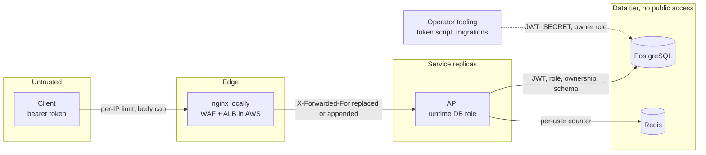

# Security

The threat model of SuperCool Finances and the controls that answer it, each linked to the code, configuration, test or spec that implements or proves it. It is written for reviewers and for whoever operates or extends the service. The short version is in the [README](../README.md#security); this page goes deeper and states what is left open.

## Contents

- [Scope and trust boundaries](#scope-and-trust-boundaries)
- [Threat model (STRIDE)](#threat-model-stride)
- [Controls implemented](#controls-implemented)
- [What production would add](#what-production-would-add)

## Scope and trust boundaries

The service holds customer balances and an append-only ledger in PostgreSQL. Redis holds only the per-user rate-limit counters. Authentication is simulated, as the challenge allows: tokens are HS256 JWTs signed with a shared secret by a local script, and the API issues none ([ADR-0012](adr/0012-simulated-authentication-with-jwt-and-two-roles.md)). Two roles exist, `customer` and `operator`, with the authorization matrix of [spec 006](../specs/006-auth/spec.md) (section 1.3).

How a request is checked, in order, is in [Request lifecycle](../README.md#request-lifecycle). The AWS request path is in [docs/deployment/aws.md](deployment/aws.md#request-path). The diagram below shows only where trust changes.

| Boundary                | What crosses it                       | What is trusted after it                                                                       |
| ----------------------- | ------------------------------------- | ---------------------------------------------------------------------------------------------- |
| Client to edge          | Any HTTP request                      | Nothing yet. The edge only limits rate and size.                                               |
| Edge to replica         | Requests within the limits            | The client address, only from `TRUSTED_PROXY_CIDRS`. Identity comes only from the token.       |
| Replica to database     | Parameterized SQL as the runtime role | The database enforces the ledger rules again, whatever the service sends.                      |
| Operator tooling to all | Tokens, migrations, role bootstrap    | Whoever holds `JWT_SECRET` or the owner role's password. These are the most sensitive secrets. |

## Threat model (STRIDE)

Each table lists concrete threats to this service, the control that addresses each one, and where it is implemented or proven. Residual risks follow each table.

### Spoofing

| Threat                                                              | Control                                                                                                                                                                     | Implemented or proven in                                                                                                                                                                                                     |
| ------------------------------------------------------------------- | --------------------------------------------------------------------------------------------------------------------------------------------------------------------------- | ---------------------------------------------------------------------------------------------------------------------------------------------------------------------------------------------------------------------------- |
| A forged JWT, or one with `alg` `none`                              | `alg` must be exactly `HS256`, the signature must verify with `JWT_SECRET`, and `crit` is refused (AUT-R02).                                                                | [token-verifier.ts](../src/modules/auth/application/token-verifier.ts), AUT-AC04 in [token-verifier.test.ts](../test/unit/auth/token-verifier.test.ts)                                                                       |
| Algorithm confusion: an RS256 or ES256 token, or a key in a header  | The key is never taken from `kid`, `jwk`, `jku`, `x5u` or `x5c` (AUT-R02).                                                                                                  | AUT-AC04 in [token-verifier.test.ts](../test/unit/auth/token-verifier.test.ts)                                                                                                                                               |
| A token for another service or issuer                               | `iss` must equal `JWT_ISSUER` and `aud` must contain `JWT_AUDIENCE` (AUT-R03).                                                                                              | AUT-AC05 in [token-verifier.test.ts](../test/unit/auth/token-verifier.test.ts)                                                                                                                                               |
| A stolen token used for a long time                                 | At most 900 seconds between `iat` and `exp`, with a fixed 5-second clock tolerance (AUT-R04, AUT-R05).                                                                      | AUT-AC03 in [token-verifier.test.ts](../test/unit/auth/token-verifier.test.ts)                                                                                                                                               |
| A weak or placeholder signing secret                                | `JWT_SECRET` must be at least 32 bytes, so `change-me` is refused (AUT-R18). The demo secrets of `compose.yaml` are refused when `NODE_ENV` is `production` (DEP-R07).      | [config.ts](../src/platform/config/config.ts), AUT-AC15 in [config.test.ts](../test/unit/platform/config.test.ts), DEP-AC05 in [demo-secrets.test.ts](../test/unit/deployment/demo-secrets.test.ts)                          |
| Identity claimed in the body, query string or an `X-User-Id` header | The user id and role come only from the token (AUT-R07, AUT-R08). Unknown members such as `ownerId`, `userId` or `role` answer 422 (AUT-R09).                               | [authenticate.ts](../src/modules/auth/adapters/http/authenticate.ts), AUT-AC11 in [identity-source.test.ts](../test/integration/auth/identity-source.test.ts)                                                                |
| A spoofed client address to dodge the per-IP limit                  | nginx keys its limit on the TCP peer and replaces any client `X-Forwarded-For` (SEC-R02, SEC-R19). The service trusts the header only from `TRUSTED_PROXY_CIDRS` (SEC-R18). | [default.conf.template](../docker/nginx/templates/default.conf.template), [trust-proxy.ts](../src/platform/http/trust-proxy.ts), SEC-AC14 in [trusted-proxies.test.ts](../test/integration/security/trusted-proxies.test.ts) |

**Residual risks.** `JWT_SECRET` is a master key: whoever holds it can mint any identity with any role ([ADR-0012](adr/0012-simulated-authentication-with-jwt-and-two-roles.md), "Negative / costs"). A token cannot be revoked before it expires. The service does not stop one `sub` from appearing with both roles; that is an accepted risk (section 1.1 of [spec 006](../specs/006-auth/spec.md)). Rotating `JWT_SECRET` needs a restart, and only one secret is accepted at a time.

### Tampering

| Threat                                                          | Control                                                                                                                                                                                                       | Implemented or proven in                                                                                                                                                                                                                                                                                |
| --------------------------------------------------------------- | ------------------------------------------------------------------------------------------------------------------------------------------------------------------------------------------------------------- | ------------------------------------------------------------------------------------------------------------------------------------------------------------------------------------------------------------------------------------------------------------------------------------------------------- |
| Ledger rows updated or deleted after the fact                   | The runtime role has only `SELECT` and `INSERT` on `transactions` and `ledger_entries`. Triggers refuse `UPDATE`, `DELETE` and `TRUNCATE` for both roles. Mistakes are corrected only by reversals.           | [1791468170000_ledger.sql](../migrations/1791468170000_ledger.sql), LED-AC11 in [append-only.test.ts](../test/integration/ledger/append-only.test.ts), [ADR-0018](adr/0018-two-database-roles.md)                                                                                                       |
| Entries that do not sum to zero, or a negative customer balance | A deferred constraint trigger checks each transaction at commit, and `accounts.balance` has `CHECK (balance >= 0)`.                                                                                           | [1791468170000_ledger.sql](../migrations/1791468170000_ledger.sql), [1791468169000_accounts.sql](../migrations/1791468169000_accounts.sql), [ledger-invariants.test.ts](../test/integration/overview/ledger-invariants.test.ts)                                                                         |
| A replayed request moving money twice                           | Every money-moving `POST` needs an `Idempotency-Key`, scoped per user. A repeat gets the stored response; the same key with another body answers 422. A key lives 24 hours by default, longer than any token. | [src/modules/idempotency/](../src/modules/idempotency/), IDM-AC05 in [key-scope.test.ts](../test/integration/idempotency/key-scope.test.ts), IDM-AC09 in [key-reused.test.ts](../test/integration/idempotency/key-reused.test.ts), [ADR-0009](adr/0009-idempotency-inside-the-movements-transaction.md) |
| A token's payload edited, for example `role` changed            | The signature covers the payload, so the token is rejected.                                                                                                                                                   | AUT-AC04 in [token-verifier.test.ts](../test/unit/auth/token-verifier.test.ts)                                                                                                                                                                                                                          |
| An altered pagination cursor, or another user's cursor          | Cursors carry an HMAC-SHA256 tag keyed with `CURSOR_SECRET` and the id of the user they were issued to.                                                                                                       | [cursor.ts](../src/modules/accounts/adapters/http/cursor.ts), ACC-AC21 in [history.test.ts](../test/integration/accounts/history.test.ts), [ADR-0017](adr/0017-keyset-pagination-with-signed-cursors.md)                                                                                                |
| SQL injection                                                   | Parameterized SQL only, through Kysely or `pg` placeholders. Strict schemas reject unknown members before any query.                                                                                          | [src/platform/db/](../src/platform/db/), [validation.ts](../src/platform/http/validation.ts), [ADR-0010](adr/0010-kysely-and-pg-instead-of-an-orm.md)                                                                                                                                                   |
| Request or response altered in transit                          | In AWS, TLS 1.2 or 1.3 at the ALB, TLS with `sslmode=verify-full` to RDS Proxy and the instance, and TLS to Redis.                                                                                            | [infra/terraform/modules/edge/](../infra/terraform/modules/edge/), [infra/terraform/modules/service/](../infra/terraform/modules/service/), [aws.md](deployment/aws.md#database)                                                                                                                        |

**Residual risks.** The owner role can still bypass the triggers through DDL, and a superuser bypasses everything; the protection relies on the service never connecting as either ([ADR-0018](adr/0018-two-database-roles.md)). `audit_records` is protected by grants only (`SELECT` and `INSERT` for the runtime role), with no trigger. Inside the VPC the ALB reaches the tasks over plain HTTP, and local traffic is plain HTTP (section 6 of [spec 007](../specs/007-security-ops/spec.md)).

### Repudiation

| Threat                                         | Control                                                                                                                                                                                 | Implemented or proven in                                                                                                                                                                                                     |
| ---------------------------------------------- | --------------------------------------------------------------------------------------------------------------------------------------------------------------------------------------- | ---------------------------------------------------------------------------------------------------------------------------------------------------------------------------------------------------------------------------- |
| A customer or operator denies a movement       | Every committed movement and status change writes one audit record with the actor, the role and the correlation id, in the same transaction.                                            | [1791468172000_audit-records.sql](../migrations/1791468172000_audit-records.sql), [kysely-audit-log.ts](../src/platform/audit/kysely-audit-log.ts), MOV-AC16 in [audit.test.ts](../test/integration/movements/audit.test.ts) |
| History rewritten to hide a movement           | The ledger is append-only; a reversal is a new transaction that names the original.                                                                                                     | LED-AC11 in [append-only.test.ts](../test/integration/ledger/append-only.test.ts)                                                                                                                                            |
| A request that cannot be traced across layers  | One correlation id, `X-Request-Id`, from nginx's access log to every service log line, problem body and audit record. A client value is kept only if it matches the allowed characters. | [request-id.ts](../src/platform/http/request-id.ts), SEC-AC15 in [correlation-id.test.ts](../test/e2e/correlation-id.test.ts), SEC-AC16 in [json-logs.test.ts](../test/integration/security/json-logs.test.ts)               |
| Failed authentication attempts going unnoticed | Each 401 writes one `warn` line with a reason code (`missing`, `malformed`, `algorithm`, `signature`, `expired`, `not_yet_valid`, `lifetime`, `claims`), never the token (AUT-R19).     | AUT-AC06 in [auth-logs.test.ts](../test/integration/auth/auth-logs.test.ts)                                                                                                                                                  |

**Residual risks.** The identity in an audit record is only as strong as the token: anyone with `JWT_SECRET` can act as any user. Logs are not tamper-evident, and in AWS they are kept 30 days ([aws.md](deployment/aws.md#observability)).

### Information disclosure

| Threat                                                   | Control                                                                                                                                                                                                                                                                                                                               | Implemented or proven in                                                                                                                                                                                                        |
| -------------------------------------------------------- | ------------------------------------------------------------------------------------------------------------------------------------------------------------------------------------------------------------------------------------------------------------------------------------------------------------------------------------- | ------------------------------------------------------------------------------------------------------------------------------------------------------------------------------------------------------------------------------- |
| Enumeration of other customers' accounts                 | A foreign account answers 404 with the same body as an unknown id, except `requestId` (AUT-R12, SYS-R05).                                                                                                                                                                                                                             | AUT-AC09 in [foreign-accounts.test.ts](../test/integration/auth/foreign-accounts.test.ts), AUT-AC16 in [authorization-matrix.test.ts](../test/e2e/authorization-matrix.test.ts)                                                 |
| Learning which token check failed                        | Every 401 has the same body and `WWW-Authenticate` header; the reason is only in the log (AUT-R06).                                                                                                                                                                                                                                   | AUT-AC02 in [unauthenticated.test.ts](../test/integration/auth/unauthenticated.test.ts)                                                                                                                                         |
| Tokens, secrets or keys leaking into logs                | A token travels only in the `Authorization` header, the only place the service reads one; pino redacts it with the `cookie` and `idempotency-key` headers, and a scrubber replaces the values of `JWT_SECRET`, `CURSOR_SECRET`, `PGPASSWORD`, `SENTRY_DSN` and the URL passwords (SEC-R22). Query strings are never logged (SEC-R46). | [logger.ts](../src/platform/logging/logger.ts), SEC-AC17 in [redaction.test.ts](../test/integration/security/redaction.test.ts), [log-scrubber.test.ts](../test/unit/platform/log-scrubber.test.ts)                             |
| A token in the query string reaching access logs         | `access_token` is never read; the request answers 401 as one without credentials. nginx logs `$uri`, without the query string.                                                                                                                                                                                                        | AUT-AC02 in [unauthenticated.test.ts](../test/integration/auth/unauthenticated.test.ts), [default.conf.template](../docker/nginx/templates/default.conf.template)                                                               |
| Internal details in error answers                        | Every error is `application/problem+json` from one function; a 500 says only "The service failed to process the request." Readiness 503 names no host, error or check.                                                                                                                                                                | [error-handler.ts](../src/platform/http/error-handler.ts), [problem.ts](../src/platform/http/problem.ts), SEC-AC19 in [health.test.ts](../test/integration/security/health.test.ts)                                             |
| Request data leaking to an error-reporting service       | Off by default. When on, events are built from an allowlist; the message is scrubbed of secrets, the request's token and key, JWT-shaped strings, UUIDs and digit runs (SEC-R53).                                                                                                                                                     | [event.ts](../src/platform/error-reporting/event.ts), SEC-AC42 in [error-reporting.test.ts](../test/integration/security/error-reporting.test.ts), SEC-AC43 in [error-event.test.ts](../test/unit/platform/error-event.test.ts) |
| Balances kept by a shared or browser cache               | `Cache-Control: no-store` on every response under `/v1`.                                                                                                                                                                                                                                                                              | [security-headers.ts](../src/platform/http/security-headers.ts), SEC-AC11 in [headers.test.ts](../test/integration/security/headers.test.ts)                                                                                    |
| Metrics exposed to clients                               | `METRICS_PORT` is never routed by the load balancer and never published (SEC-R43).                                                                                                                                                                                                                                                    | SEC-AC33 in [metrics-port.test.ts](../test/unit/deployment/metrics-port.test.ts), [security_groups.tf](../infra/terraform/modules/network/security_groups.tf)                                                                   |
| Bind parameters in the database's statement logs, in AWS | The parameter group sets `log_parameter_max_length` to 0.                                                                                                                                                                                                                                                                             | [infra/terraform/modules/database/](../infra/terraform/modules/database/)                                                                                                                                                       |

**Residual risks.** Timing side channels of token verification and of the ownership check are out of scope (section 6 of [spec 006](../specs/006-auth/spec.md)). The API documentation at `/docs` is public in every environment, behind the per-IP limit (SEC-R44). Service log lines hold the client address and the request headers other than the redacted ones.

### Denial of service

| Threat                                       | Control                                                                                                                                                                                                          | Implemented or proven in                                                                                                                                                                                                                                                                                                                                                                    |
| -------------------------------------------- | ---------------------------------------------------------------------------------------------------------------------------------------------------------------------------------------------------------------- | ------------------------------------------------------------------------------------------------------------------------------------------------------------------------------------------------------------------------------------------------------------------------------------------------------------------------------------------------------------------------------------------- |
| A request flood from one address             | nginx `limit_req` per IP, 500 requests per second with a burst of 1000 by default; in AWS a WAF rate-based rule of 60 × `RATE_LIMIT_IP_RPS` per minute (SEC-R01, SEC-R45).                                       | [default.conf.template](../docker/nginx/templates/default.conf.template), [infra/terraform/modules/edge/](../infra/terraform/modules/edge/), SEC-AC01 in [edge-rate-limit.test.ts](../test/e2e/edge-rate-limit.test.ts), [sec_ac35_waf_rate_limit.yaml](../infra/policies/sec_ac35_waf_rate_limit.yaml)                                                                                     |
| One authenticated user scripting requests    | A fixed window per user in Redis, 300 requests per 10 seconds by default, shared by every replica, counting 403s and replays too (SEC-R03 to SEC-R05).                                                           | [rate-limit.ts](../src/platform/http/rate-limit.ts), SEC-AC02 and SEC-AC03 in [user-rate-limit.test.ts](../test/integration/security/user-rate-limit.test.ts), [ADR-0013](adr/0013-rate-limiting-at-the-edge-and-in-redis.md)                                                                                                                                                               |
| Large or non-JSON bodies                     | The service answers 413 above 16384 bytes and 415 for anything but `application/json`; nginx caps bodies at 32 KB (SEC-R10, SEC-R11, SEC-R13).                                                                   | [body-limits.ts](../src/platform/http/body-limits.ts), SEC-AC07 to SEC-AC09 in [body-limits.test.ts](../test/integration/security/body-limits.test.ts)                                                                                                                                                                                                                                      |
| Slow requests, long statements or held locks | Ordered timeouts: lock waits, `statement_timeout` and `idle_in_transaction_session_timeout` on the runtime role, pool acquire, request timeout, load balancer. A configuration that breaks the order is refused. | [request-timeout.ts](../src/platform/http/request-timeout.ts), [1791468167000_runtime-role-settings.sql](../migrations/1791468167000_runtime-role-settings.sql), SEC-AC24 in [statement-timeout.test.ts](../test/integration/security/statement-timeout.test.ts), [ADR-0019](adr/0019-timeout-layers-and-rds-proxy.md), [ADR-0022](adr/0022-request-timeout-answer-first-then-roll-back.md) |
| Connection exhaustion                        | A bounded pool that answers 503 in bounded time, and a pool budget checked against `max_connections` in every deployment (SEC-R36, SEC-R37).                                                                     | SEC-AC27 and SEC-AC28 in [pool.test.ts](../test/integration/security/pool.test.ts), [pool-budget.test.ts](../test/unit/deployment/pool-budget.test.ts)                                                                                                                                                                                                                                      |
| Redis down taking the API down               | The per-user limit fails open after `REDIS_COMMAND_TIMEOUT_MS` (100 ms), and readiness ignores Redis (SEC-R06).                                                                                                  | SEC-AC06 in [redis-down.test.ts](../test/integration/security/redis-down.test.ts)                                                                                                                                                                                                                                                                                                           |
| Known-bad inputs at the edge, in AWS         | WAF managed rule groups `AWSManagedRulesCommonRuleSet` and `AWSManagedRulesKnownBadInputsRuleSet`.                                                                                                               | [infra/terraform/modules/edge/](../infra/terraform/modules/edge/), [aws.md](deployment/aws.md#edge)                                                                                                                                                                                                                                                                                         |

**Residual risks.** A fixed window lets a client burst up to twice the per-user limit around a window boundary. While Redis is down only the edge limit applies ([ADR-0013](adr/0013-rate-limiting-at-the-edge-and-in-redis.md)). Volumetric DDoS beyond the per-IP limit (AWS Shield), and limits per endpoint, account or amount, are out of scope (section 6 of [spec 007](../specs/007-security-ops/spec.md)). What to do when limits trip is in the [rate limits runbook](runbooks/rate-limits.md).

### Elevation of privilege

| Threat                                                    | Control                                                                                                                                                                              | Implemented or proven in                                                                                                                                                                                      |
| --------------------------------------------------------- | ------------------------------------------------------------------------------------------------------------------------------------------------------------------------------------ | ------------------------------------------------------------------------------------------------------------------------------------------------------------------------------------------------------------- |
| A customer acting as operator (deposit, freeze, reversal) | Each route lists the roles it allows; any other role answers 403, whatever id the path names (AUT-R10). The role comes only from a verified token.                                   | [permissions.ts](../src/modules/auth/application/permissions.ts), [authorize.ts](../src/modules/auth/adapters/http/authorize.ts), AUT-AC07 in [forbidden.test.ts](../test/integration/auth/forbidden.test.ts) |
| An operator acting on a customer's behalf                 | Withdrawals, transfers, account creation and listing are customer-only (AUT-R11).                                                                                                    | AUT-AC08 in [forbidden.test.ts](../test/integration/auth/forbidden.test.ts)                                                                                                                                   |
| A customer debiting another customer's account            | The source account must belong to the caller, or the request answers 404 (AUT-R12). Every cell of the matrix is proven on both replicas.                                             | AUT-AC09 in [foreign-accounts.test.ts](../test/integration/auth/foreign-accounts.test.ts), AUT-AC16 in [authorization-matrix.test.ts](../test/e2e/authorization-matrix.test.ts)                               |
| A token-issuing endpoint                                  | None exists (AUT-R15).                                                                                                                                                               | AUT-AC14 in [no-token-endpoint.test.ts](../test/integration/auth/no-token-endpoint.test.ts)                                                                                                                   |
| The app role disabling triggers or altering tables        | The service connects as the runtime role, which owns no table and is not a superuser, so it cannot `ALTER`, `DROP` or `DISABLE TRIGGER` (LED-R17). Migrations run as the owner role. | LED-AC12 in [runtime-role.test.ts](../test/integration/ledger/runtime-role.test.ts), [ADR-0018](adr/0018-two-database-roles.md), [01-databases.sql](../docker/postgres/init/01-databases.sql)                 |
| Session settings changed through SQL functions            | `app.set_lock_timeout` and `app.set_statement_timeout` are `SECURITY INVOKER`, bounded, transaction-local, and executable only by the runtime role.                                  | [1791468168000_app-functions.sql](../migrations/1791468168000_app-functions.sql), SEC-AC22 and SEC-AC23 in [database-sessions.test.ts](../test/integration/security/database-sessions.test.ts)                |
| A compromised container escalating                        | The image runs as the non-root user `node`; in AWS with a read-only root file system and a task role with no permission at all.                                                      | [Dockerfile](../Dockerfile), [infra/terraform/modules/service/](../infra/terraform/modules/service/), [aws.md](deployment/aws.md#service)                                                                     |

**Residual risks.** Two roles only, with no finer permissions or scopes (section 6 of [spec 006](../specs/006-auth/spec.md)). An operator action, such as a large deposit or a reversal, needs no second approval.

## Controls implemented

### Authentication

- HS256 JWT in `Authorization: Bearer`, verified with `jose`: [token-verifier.ts](../src/modules/auth/application/token-verifier.ts), [authenticate.ts](../src/modules/auth/adapters/http/authenticate.ts).
- Token rules, configuration and the uniform 401: sections 1.1, 1.4 and 1.5 of [spec 006](../specs/006-auth/spec.md).
- Tokens are minted only by `npm run token`, a local tool the service never calls: [token.ts](../src/modules/auth/adapters/cli/token.ts).
- Stateless verification, identical on every replica (AUT-R21): AUT-AC16 in [authorization-matrix.test.ts](../test/e2e/authorization-matrix.test.ts).

### Authorization

- Roles per route: [permissions.ts](../src/modules/auth/application/permissions.ts), enforced by [authorize.ts](../src/modules/auth/adapters/http/authorize.ts).
- The full matrix of 50 cells: section 1.3 of [spec 006](../specs/006-auth/spec.md), proven by AUT-AC16.
- Foreign resources answer 404, like unknown ones (SYS-R05, AUT-R12).
- Idempotency keys are scoped per user (IDM-R04): [src/modules/idempotency/](../src/modules/idempotency/).

### Input validation and limits

- Zod schemas reject unknown members with 422: [validation.ts](../src/platform/http/validation.ts), [accounts schemas](../src/modules/accounts/adapters/http/schemas.ts), [movements schemas](../src/modules/movements/adapters/http/schemas.ts).
- Amounts are decimal-digit strings, capped per movement by `MAX_AMOUNT_MINOR` (LED-R23): LED-AC18 in [amount-limits.test.ts](../test/integration/ledger/amount-limits.test.ts).
- Bodies: `application/json` only, at most 16384 bytes: [body-limits.ts](../src/platform/http/body-limits.ts).
- Signed cursors: [cursor.ts](../src/modules/accounts/adapters/http/cursor.ts).

### Rate limiting

- Per IP at nginx: [default.conf.template](../docker/nginx/templates/default.conf.template); per IP in AWS WAF: [infra/terraform/modules/edge/](../infra/terraform/modules/edge/).
- Per user in Redis, failing open: [rate-limit.ts](../src/platform/http/rate-limit.ts).
- Decision and trade-offs: [ADR-0013](adr/0013-rate-limiting-at-the-edge-and-in-redis.md); operations: [rate limits runbook](runbooks/rate-limits.md).

### Transport and headers

- helmet sets the headers of table 1.5 of [spec 007](../specs/007-security-ops/spec.md) on every response: a strict `Content-Security-Policy`, `Strict-Transport-Security`, `X-Content-Type-Options: nosniff`, `X-Frame-Options: DENY`, `Referrer-Policy: no-referrer`, the cross-origin policies, and `Cache-Control: no-store` under `/v1`: [security-headers.ts](../src/platform/http/security-headers.ts), SEC-AC11 in [headers.test.ts](../test/integration/security/headers.test.ts).
- No `X-Powered-By`, and nginx sends no version (`server_tokens off`) (SEC-R15): SEC-AC10 in [edge.test.ts](../test/e2e/edge.test.ts).
- In AWS, TLS terminates at the ALB with `ELBSecurityPolicy-TLS13-1-2-2021-06`, HTTP redirects to HTTPS, and the ALB drops invalid header fields: [aws.md](deployment/aws.md#edge).

### CORS

- Off unless `CORS_ORIGINS` lists exact origins; `*` is refused, credentials are never allowed, and `http://` origins are refused in production: [cors.ts](../src/platform/http/cors.ts), [config.ts](../src/platform/config/config.ts), SEC-AC12 and SEC-AC13 in [cors.test.ts](../test/integration/security/cors.test.ts).

### Trusted proxies

- `X-Forwarded-For` is read only when the TCP peer is in `TRUSTED_PROXY_CIDRS`, taking the rightmost untrusted address: [trust-proxy.ts](../src/platform/http/trust-proxy.ts).
- nginx replaces the client's header; locally only nginx's fixed address is trusted ([compose.yaml](../compose.yaml)); in AWS only the ALB's subnets ([aws.md](deployment/aws.md#request-path)).

### Secrets and configuration

- Every variable is validated at startup; an invalid one stops the process before it listens, and the error names the variable, never its value (SEC-R39, SEC-R40): [config.ts](../src/platform/config/config.ts), SEC-AC31 in [startup.test.ts](../test/integration/security/startup.test.ts).
- `CURSOR_SECRET` must differ from `JWT_SECRET`; demo secrets are refused in production (DEP-R07).
- In AWS, every secret lives in Secrets Manager under a KMS key, is injected into the tasks as a secret, and never enters the Terraform code or state (DEP-R31): [infra/terraform/modules/secrets/](../infra/terraform/modules/secrets/), [aws.md](deployment/aws.md#secrets).
- Rotation steps: [aws.md](deployment/aws.md#rotating-a-secret). `.env` is never committed, and `npm run env:sync` adds missing variables without printing values.

### Logging and redaction

- One JSON line per event with `reqId`; redacted headers and scrubbed secret values; no query strings: [logger.ts](../src/platform/logging/logger.ts), SEC-AC16 and SEC-AC17.
- A client's `X-Request-Id` is kept only when it matches `[A-Za-z0-9._:-]{1,128}`, so it cannot inject into logs (SYS-R21): [request-id.ts](../src/platform/http/request-id.ts).
- In AWS, WAF logs redact the `authorization`, `cookie` and `idempotency-key` headers: [infra/terraform/modules/observability/](../infra/terraform/modules/observability/).

### Database roles and append-only ledger

- Owner role for migrations, runtime role for the service, each with its own URL and secret: [ADR-0018](adr/0018-two-database-roles.md), [01-databases.sql](../docker/postgres/init/01-databases.sql), [bootstrap-roles.ts](../src/platform/db/bootstrap-roles.ts) for AWS.
- Least-privilege grants and append-only triggers in [migrations/](../migrations/); the runtime role may update only `status`, `balance` and `updated_at` of `accounts`.
- Proven by LED-AC11 and LED-AC12, and checked continuously by `npm run reconcile` ([runbook](runbooks/reconciliation.md)).

### Timeouts

- The ordered layers of section 1.1 of [spec 007](../specs/007-security-ops/spec.md): [ADR-0019](adr/0019-timeout-layers-and-rds-proxy.md), [ADR-0022](adr/0022-request-timeout-answer-first-then-roll-back.md), [request-timeout.ts](../src/platform/http/request-timeout.ts), [timeouts and 503 runbook](runbooks/timeouts-and-503.md).

### Error reporting scrubbing

- Off unless `SENTRY_DSN` is set, and off in AWS, whose tasks have no outbound path ([ADR-0023](adr/0023-optional-observability-off-by-default.md)).
- Allowlisted fields and a scrubbed message: [event.ts](../src/platform/error-reporting/event.ts), [reporter.ts](../src/platform/error-reporting/reporter.ts), SEC-AC41 to SEC-AC45.

### Supply chain and CI scanning

| Control          | What it does                                                                                                   | Where                                                                                                                                                                            |
| ---------------- | -------------------------------------------------------------------------------------------------------------- | -------------------------------------------------------------------------------------------------------------------------------------------------------------------------------- |
| gitleaks         | Scans the full git history, with an allowlist of anchored values only (DEP-R36); verified by checksum.         | [.gitleaks.toml](../.gitleaks.toml), job `secret-scan` of [ci.yml](../.github/workflows/ci.yml), DEP-AC25 in [gitleaks.test.ts](../test/integration/deployment/gitleaks.test.ts) |
| npm audit        | Fails on HIGH or CRITICAL advisories in the npm dependencies.                                                  | job `security` of [ci.yml](../.github/workflows/ci.yml)                                                                                                                          |
| trivy            | `fs`, `config` and `image` scans of the repository, the Dockerfile and Terraform, and the built runtime image. | job `security` of [ci.yml](../.github/workflows/ci.yml)                                                                                                                          |
| checkov, tflint  | Every Terraform change, with the custom policies of [infra/policies/](../infra/policies/); any finding fails.  | `npm run infra:validate` in job `ci`                                                                                                                                             |
| Dependabot       | Weekly updates for npm, Docker, Compose and Actions, never a major version.                                    | [dependabot.yml](../.github/dependabot.yml)                                                                                                                                      |
| Pinning          | Actions pinned by commit SHA; images and CI tools pinned by version and digest; `GITHUB_TOKEN` read-only.      | [ci.yml](../.github/workflows/ci.yml), [Dockerfile](../Dockerfile), [compose.yaml](../compose.yaml)                                                                              |
| New dependencies | Need an ADR or the owner's approval.                                                                           | [docs/dependencies.md](dependencies.md)                                                                                                                                          |

More on the gates: [CI and quality gates](../README.md#ci-and-quality-gates).

### AWS

| Control         | Where                                                                                                                                                                                                                                                                                                                                                                      |
| --------------- | -------------------------------------------------------------------------------------------------------------------------------------------------------------------------------------------------------------------------------------------------------------------------------------------------------------------------------------------------------------------------- |
| WAF             | Rate-based rule and managed rule groups on the ALB: [edge](../infra/terraform/modules/edge/), [aws.md](deployment/aws.md#edge).                                                                                                                                                                                                                                            |
| Private subnets | Tasks in private subnets without a public IP; RDS, RDS Proxy and Redis in isolated subnets; one security group per layer (DEP-R25): [network](../infra/terraform/modules/network/).                                                                                                                                                                                        |
| No egress       | No NAT gateway; VPC endpoints for ECR, Secrets Manager, CloudWatch Logs and S3 only: [aws.md](deployment/aws.md#network).                                                                                                                                                                                                                                                  |
| KMS             | Four customer-managed keys, each with rotation on: for RDS, ElastiCache, the secrets (which also encrypts RDS's master secret) and the log groups and SNS topic: [database](../infra/terraform/modules/database/), [cache](../infra/terraform/modules/cache/), [secrets](../infra/terraform/modules/secrets/), [observability](../infra/terraform/modules/observability/). |
| Secrets Manager | All secrets, with no value in Terraform: [secrets](../infra/terraform/modules/secrets/).                                                                                                                                                                                                                                                                                   |
| TLS to RDS      | `rds.force_ssl` 1; RDS Proxy requires TLS; URLs use `sslmode=verify-full`, the one-off tasks against the RDS CA bundle the image ships: [service](../infra/terraform/modules/service/), [aws.md](deployment/aws.md#database).                                                                                                                                              |
| TLS to Redis    | Encryption in transit required, plus an AUTH token: [cache](../infra/terraform/modules/cache/).                                                                                                                                                                                                                                                                            |
| IAM             | One execution role per task definition, reading only its own secrets; a task role with no permission: [service](../infra/terraform/modules/service/).                                                                                                                                                                                                                      |

Nothing in the repository applies the Terraform (DEP-R34).

## What production would add

None of the items below is implemented. They are recommendations for a real deployment, not decisions; each would need its own spec and ADR. The known limits of this version are listed in [docs/limitations.md](limitations.md), the security ones under [Identity and edge security](limitations.md#identity-and-edge-security).

| Area         | Recommendation                                                                                                                                                                                                                                                                                                                                                                                                                                                                                                         |
| ------------ | ---------------------------------------------------------------------------------------------------------------------------------------------------------------------------------------------------------------------------------------------------------------------------------------------------------------------------------------------------------------------------------------------------------------------------------------------------------------------------------------------------------------------- |
| OIDC         | Tokens from an external OpenID Connect provider, signed with asymmetric keys (RS256 or ES256) and verified through its JWKS, with key rotation by the provider and the algorithm still pinned. The service could then verify but never mint. [ADR-0012](adr/0012-simulated-authentication-with-jwt-and-two-roles.md) already records this as the production path, with a mapping table from (issuer, subject) to a UUIDv7 user id. Shorter token lifetimes or revocation would close the window a stolen token leaves. |
| mTLS         | Mutual TLS for service-to-service traffic, which ADR-0012 names for any internal callers, and between the load balancer and the replicas, which spec 007 leaves out of scope. Client certificates for the database connection would add a second factor to the role passwords.                                                                                                                                                                                                                                         |
| KMS          | Beyond today's KMS encryption at rest: sign tokens and cursors with KMS keys instead of HMAC secrets held in process memory, so no replica holds a key that can mint identities; and use envelope encryption with data keys for any sensitive field stored by the service.                                                                                                                                                                                                                                             |
| PII handling | Today the service stores user ids (UUIDs) and no names or contact data, but its logs hold client addresses. A real deployment would classify the data it holds, keep only what it needs, set retention per class, encrypt sensitive fields at the application level, and log every access to customer data by operators.                                                                                                                                                                                               |
| Fraud limits | `MAX_AMOUNT_MINOR` caps a single movement, and nothing else limits value. Velocity and daily limits per account and per user, anomaly detection on movement patterns, and step-up approval (a second operator) for large deposits and reversals.                                                                                                                                                                                                                                                                       |
