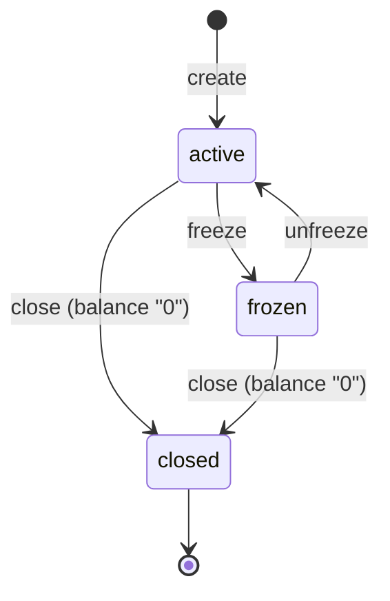

# 001 · Accounts

- **Status:** Draft
- **ID prefix:** ACC
- **Related ADRs:** none yet (phase 03-adrs)
- **Depends on specs:** 000-overview, 002-ledger, 003-money-movements, 004-reversals, 005-idempotency

## 1. Context and goal

Customer accounts hold customers' money. This spec covers how a customer creates and reads accounts, how operators read them and move them through their lifecycle (active, frozen, closed), how the status of an account limits the movements on it, and how the history of an account is read. Deposits, withdrawals and transfers are defined in spec 003 and reversals in spec 004; this spec defines only the effect of an account's status on them.

Terms (account, customer account, system account, balance, ledger entry, problem details) have the meanings in the glossary of spec 000. Requirements marked with a question number, for example "(Q3)", follow the recommended answer of that open question until the owner decides; "(000 Q10)" refers to an open question of spec 000.

### 1.1 Operations

Paths are proposed here and become final in the OpenAPI document (phase 08-api).

| Operation                 | Method and path                | Caller                                  |
| ------------------------- | ------------------------------ | --------------------------------------- |
| Create an account         | `POST /accounts`               | Customer                                |
| List own accounts         | `GET /accounts`                | Customer                                |
| Read an account           | `GET /accounts/{id}`           | Customer (own accounts), operator (any) |
| List an account's history | `GET /accounts/{id}/entries`   | Customer (own accounts), operator (Q10) |
| Freeze an account         | `POST /accounts/{id}/freeze`   | Operator                                |
| Unfreeze an account       | `POST /accounts/{id}/unfreeze` | Operator                                |
| Close an account          | `POST /accounts/{id}/close`    | Operator                                |

### 1.2 Status lifecycle

| Status   | Customer movements (send or receive) | Readable | Allowed transitions               |
| -------- | ------------------------------------ | -------- | --------------------------------- |
| `active` | Yes                                  | Yes      | freeze → frozen, close → closed   |
| `frozen` | No                                   | Yes      | unfreeze → active, close → closed |
| `closed` | No                                   | Yes      | none                              |

"Customer movements" are deposits, withdrawals and transfers, on either side (Q7).

### 1.3 Account representation

| Field       | Meaning                                                                                                                                                          |
| ----------- | ---------------------------------------------------------------------------------------------------------------------------------------------------------------- |
| `id`        | The account id, a UUIDv7 string generated monotonically: an id generated later on the same replica sorts after an earlier one, even within the same millisecond. |
| `currency`  | The ISO 4217 code from table 1.3 of spec 000, fixed at creation.                                                                                                 |
| `status`    | `active`, `frozen` or `closed`.                                                                                                                                  |
| `balance`   | The cached balance as a string of decimal digits in minor units, for example `"1050"`.                                                                           |
| `createdAt` | When the account was created (Q13).                                                                                                                              |
| `updatedAt` | When its status or balance last changed; equal to `createdAt` until the first change (Q13).                                                                      |

Operators also see `ownerId`, the id of the owning customer (Q10).

### 1.4 History entry representation

| Field           | Meaning                                                                                                       |
| --------------- | ------------------------------------------------------------------------------------------------------------- |
| `id`            | The ledger entry id, a UUIDv7 string generated monotonically like account ids.                                |
| `transactionId` | The transaction the entry belongs to.                                                                         |
| `kind`          | The kind of movement: `deposit`, `withdrawal`, `transfer` or `reversal`.                                      |
| `amount`        | The signed amount in minor units as a string: `"5000"` adds to the balance, `"-1200"` subtracts from it (Q9). |
| `currency`      | The account's currency.                                                                                       |
| `createdAt`     | When the entry was recorded (Q13).                                                                            |

## 2. Requirements

| ID      | Requirement (EARS)                                                                                                                                                                                                                                                                                                                    |
| ------- | ------------------------------------------------------------------------------------------------------------------------------------------------------------------------------------------------------------------------------------------------------------------------------------------------------------------------------------- |
| ACC-R01 | WHEN a customer creates an account with a currency from table 1.3 of spec 000 THE SYSTEM SHALL create a customer account owned by that customer, in that currency, with status `active` and balance `"0"`, and answer 201 with the account and a `Location` header pointing to it.                                                    |
| ACC-R02 | THE SYSTEM SHALL let a customer hold any number of accounts, including several in the same currency (Q2).                                                                                                                                                                                                                             |
| ACC-R03 | WHERE an account creation request carries an `Idempotency-Key`, THE SYSTEM SHALL apply the semantics of spec 005, so a repeat of the same request by the same customer with the same key returns the original response and creates no second account.                                                                                 |
| ACC-R04 | WHEN an account creation request carries no `Idempotency-Key` THE SYSTEM SHALL create a new account for every request.                                                                                                                                                                                                                |
| ACC-R05 | IF the currency of an account creation request is missing, not a string, or not exactly a code of table 1.3 of spec 000, THEN THE SYSTEM SHALL answer 422 with problem type `/problems/validation-error` and an `errors` entry for `currency`, and create no account.                                                                 |
| ACC-R06 | IF an operator requests to create an account THEN THE SYSTEM SHALL answer 403 with problem type `/problems/forbidden` and create no account (Q1).                                                                                                                                                                                     |
| ACC-R07 | WHEN a customer reads one of their own accounts THE SYSTEM SHALL answer 200 with the representation of section 1.3.                                                                                                                                                                                                                   |
| ACC-R08 | WHEN a customer lists their accounts THE SYSTEM SHALL return only the customer accounts they own, in every status, newest first by (`createdAt`, `id`), one page at a time with an opaque cursor for the next page (Q3).                                                                                                              |
| ACC-R09 | IF a customer reads, or lists the history of, an account that does not exist, is owned by another customer, is a system account, or whose id in the path is not a UUID (SYS-R42), THEN THE SYSTEM SHALL answer 404 with problem type `/problems/not-found`, with bodies that differ only in `requestId`, and never 403.               |
| ACC-R10 | WHEN an operator reads any customer account, or lists its history, THE SYSTEM SHALL answer 200 with the same representation a customer gets, plus `ownerId` (Q10).                                                                                                                                                                    |
| ACC-R11 | WHEN an operator freezes an `active` account THE SYSTEM SHALL set its status to `frozen`.                                                                                                                                                                                                                                             |
| ACC-R12 | WHEN an operator unfreezes a `frozen` account THE SYSTEM SHALL set its status to `active`.                                                                                                                                                                                                                                            |
| ACC-R13 | WHEN an operator closes an `active` or `frozen` account whose balance is `"0"` THE SYSTEM SHALL set its status to `closed`.                                                                                                                                                                                                           |
| ACC-R14 | IF an operator requests a status change that is not in the lifecycle of section 1.2 (freezing or unfreezing a `closed` account) THEN THE SYSTEM SHALL answer 409 with problem type `/problems/invalid-status-transition` and leave the account unchanged (Q5).                                                                        |
| ACC-R15 | WHEN an operator requests the status an account already has (freezing a `frozen` account, unfreezing an `active` one, closing a `closed` one) THE SYSTEM SHALL answer 200 with the account unchanged (Q5).                                                                                                                            |
| ACC-R16 | IF an operator closes an account whose balance is not `"0"` THEN THE SYSTEM SHALL answer 409 with problem type `/problems/account-balance-not-zero` and leave the account unchanged.                                                                                                                                                  |
| ACC-R17 | THE SYSTEM SHALL check an account's status and balance for a status change only while holding the lock on that account's row, so that a status change and a movement on the same account take effect one after the other.                                                                                                             |
| ACC-R18 | IF a customer requests to freeze, unfreeze or close any account THEN THE SYSTEM SHALL answer 403 with problem type `/problems/forbidden` and leave the account unchanged.                                                                                                                                                             |
| ACC-R19 | IF a deposit, withdrawal or transfer would debit or credit a `frozen` or `closed` account THEN THE SYSTEM SHALL reject it with 422 and apply none of its effects (Q7, Q8).                                                                                                                                                            |
| ACC-R20 | THE SYSTEM SHALL keep `frozen` and `closed` accounts, and their history, readable by their owner and by operators.                                                                                                                                                                                                                    |
| ACC-R21 | WHEN a customer lists the history of one of their own accounts THE SYSTEM SHALL return the account's ledger entries, newest first by (`createdAt`, `id`), with the representation of section 1.4, one page at a time with an opaque cursor for the next page (Q3, Q9).                                                                |
| ACC-R22 | THE SYSTEM SHALL start each next page strictly after the (`createdAt`, `id`) position held in the cursor, with `createdAt` at the precision it is stored with (microseconds), not the milliseconds the API shows, so that items added while a client pages through a list are neither repeated nor cause an item to be skipped (Q14). |
| ACC-R23 | IF a cursor was altered, was not issued by the service, or was issued for a different list or to a different user, THEN THE SYSTEM SHALL answer 400 with problem type `/problems/malformed-request`.                                                                                                                                  |
| ACC-R24 | IF the page size `limit` is not an integer from 1 to 100 THEN THE SYSTEM SHALL answer 422 with problem type `/problems/validation-error` and an `errors` entry for `limit` (Q3).                                                                                                                                                      |
| ACC-R25 | THE SYSTEM SHALL never return a system account, or an entry of a system account, through a customer endpoint.                                                                                                                                                                                                                         |
| ACC-R26 | WHEN an operator changes the status of an account THE SYSTEM SHALL write, in the same database transaction, one audit record with the operator, their role, the account id, the old and new status, the correlation id and the time (000 Q10). A status request that changes nothing (ACC-R15) writes no audit record.                |
| ACC-R27 | IF an operator lists accounts (`GET /accounts`) THEN THE SYSTEM SHALL answer 403 with problem type `/problems/forbidden` (Q10).                                                                                                                                                                                                       |
| ACC-R28 | WHEN an operator freezes, unfreezes or closes an account THE SYSTEM SHALL wait for that account's row lock at most `ACCOUNT_LOCK_TIMEOUT_MS` (spec 003).                                                                                                                                                                              |
| ACC-R29 | IF the row lock of a freeze, unfreeze or close is not acquired within `ACCOUNT_LOCK_TIMEOUT_MS` THEN THE SYSTEM SHALL answer 503 with problem type `/problems/service-unavailable` and the header `Retry-After: 1`, and leave the account unchanged with no audit record.                                                             |

## 3. Acceptance criteria

Unless stated otherwise: customer user C1 owns account A1 (EUR), customer user C2 owns account B1 (EUR), operator user O1 is an operator, balances are set up by deposits from O1, S is the EUR settlement system account, and every deposit, withdrawal, transfer and reversal carries a fresh Idempotency-Key unless the AC names one or says it has none.

### ACC-AC01 · A customer creates an account

- **Level:** integration
- **Covers:** ACC-R01
- **Given** C1 has no accounts
- **When** C1 posts `{"currency": "EUR"}` to create an account
- **Then** the answer is 201 with `Location: /accounts/<id>`, and a body with that `id`, `currency` "EUR", `status` "active", `balance` "0" and `createdAt` equal to `updatedAt`; and C1 reading `/accounts/<id>` gets the same body

### ACC-AC02 · A customer holds several accounts, including in the same currency

- **Level:** integration
- **Covers:** ACC-R02
- **Given** C1 has no accounts
- **When** C1 creates an account in "EUR", another in "EUR" and one in "JPY", without Idempotency-Key
- **Then** three accounts with distinct ids exist, two in EUR and one in JPY, all `active` with balance "0", and C1's account list contains exactly those three

### ACC-AC03 · Account creation with an Idempotency-Key

- **Level:** integration
- **Covers:** ACC-R03
- **Given** C1 and C2 have no accounts
- **When** C1 creates an account in "EUR" with Idempotency-Key k1, C1 repeats the same request with k1, C2 sends the same request with k1, and C1 sends `{"currency": "JPY"}` with k1
- **Then** C1's two first requests answer 201 with identical bodies and C1 has one account; C2 gets a new account of its own, because keys are scoped per user; C1's JPY request answers 422 with type `/problems/idempotency-key-reused` (IDM-R09), and C1 still has one account

### ACC-AC04 · Account creation without an Idempotency-Key

- **Level:** integration
- **Covers:** ACC-R04
- **Given** C1 has no accounts
- **When** C1 posts `{"currency": "EUR"}` twice without Idempotency-Key
- **Then** both answer 201 with different `id` values and C1 has two EUR accounts

### ACC-AC05 · Unsupported or malformed currencies are rejected

- **Level:** integration
- **Covers:** ACC-R05
- **Given** C1 has no accounts
- **When** C1 creates an account with each of the bodies `{"currency": "GBP"}`, `{"currency": "eur"}`, `{"currency": "EURO"}`, `{"currency": ""}`, `{"currency": 978}`, `{"currency": null}` and `{}`
- **Then** each answers 422 with type `/problems/validation-error` and one `errors` entry, for `currency`, and C1 has no accounts

### ACC-AC06 · An operator cannot create an account

- **Level:** integration
- **Covers:** ACC-R06
- **Given** O1 is an operator
- **When** O1 posts `{"currency": "EUR"}` to create an account
- **Then** the answer is 403 with type `/problems/forbidden` and no account exists

### ACC-AC07 · A customer reads their own account

- **Level:** integration
- **Covers:** ACC-R07
- **Given** C1 owns A1 in EUR and J1 in JPY, and O1 has deposited "1050" EUR into A1 and "1500" JPY into J1
- **When** C1 reads A1 and J1
- **Then** both answer 200 with exactly the fields `id`, `currency`, `status`, `balance`, `createdAt` and `updatedAt`; A1 has `balance` "1050" and J1 has `balance` "1500", both JSON strings; and `updatedAt` is not earlier than `createdAt`

### ACC-AC08 · A customer lists their accounts page by page

- **Level:** integration
- **Covers:** ACC-R08
- **Given** C1 created accounts P1, P2, P3, P4 and P5 in that order, C2 owns B1, and O1 has frozen P2 and closed P4
- **When** C1 lists their accounts with `limit=2` and follows each next cursor
- **Then** there are three pages of 2, 2 and 1 accounts; together they hold P1 to P5, each exactly once, in descending (`createdAt`, `id`) order, which is P5, P4, P3, P2, P1 because ids are generated monotonically; the last page has no next cursor; P2 shows `frozen` and P4 `closed`; and B1 appears on no page

### ACC-AC09 · Another customer's account answers 404, never 403

- **Level:** integration
- **Covers:** ACC-R09
- **Given** C1 owns A1, C2 owns B1, and U is an account id that does not exist
- **When** C1 reads B1, U and the account "not-a-uuid", and lists the history of B1, U and "not-a-uuid"
- **Then** all six answer 404 with type `/problems/not-found`, and the three reads, like the three history lists, have bodies that differ only in `requestId`

### ACC-AC10 · An operator reads any customer account

- **Level:** integration
- **Covers:** ACC-R10
- **Given** C1 owns A1 with "1000" EUR and C2 owns B1 with "0" EUR
- **When** O1 reads A1 and B1 and lists the history of A1
- **Then** each answers 200; the reads carry the same fields a customer gets plus `ownerId`, C1 for A1 and C2 for B1; and the history holds the deposit entry of "1000" EUR

### ACC-AC11 · Allowed status transitions

- **Level:** integration
- **Covers:** ACC-R11, ACC-R12, ACC-R13
- **Given** C1 owns A1 and A2, both `active` with balance "0" EUR
- **When** O1 freezes A1, unfreezes A1, closes A1, then freezes A2 and closes A2
- **Then** A1 goes `frozen`, `active`, `closed`; A2 goes `frozen`, `closed`; each call answers 200 with the new status; and after each change `updatedAt` is not earlier than before it

### ACC-AC12 · Closed is final, and repeating a status is a no-op

- **Level:** integration
- **Covers:** ACC-R14, ACC-R15
- **Given** C1 owns X1, `closed` with balance "0" EUR, and F1, `frozen` with balance "0" EUR, and A1 `active`
- **When** O1 freezes X1, unfreezes X1, closes X1, freezes F1 and unfreezes A1
- **Then** freezing and unfreezing X1 answer 409 with type `/problems/invalid-status-transition` and X1 stays `closed`; closing X1, freezing F1 and unfreezing A1 answer 200 with the account and its `updatedAt` unchanged

### ACC-AC13 · Closing an account with money is rejected

- **Level:** integration
- **Covers:** ACC-R16
- **Given** C1 owns A1, `active` with balance "1" EUR, and F1, `frozen` with balance "2500" EUR
- **When** O1 closes A1 and F1
- **Then** both answer 409 with type `/problems/account-balance-not-zero`, A1 stays `active` with "1" EUR and F1 stays `frozen` with "2500" EUR

### ACC-AC14 · Status changes and concurrent movements take effect one after the other

- **Level:** integration
- **Covers:** ACC-R17
- **Given** C1 owns A1 with balance "0" EUR and A2 with balance "1000" EUR
- **When** O1 closes A1 while O1 deposits "100" EUR into A1 at the same time, and, separately, O1 freezes A2 while C1 withdraws "1000" EUR from A2 at the same time; each movement carries a fresh Idempotency-Key, and each pair is repeated 20 times on fresh accounts
- **Then** in every run either the close succeeds and the deposit is rejected with 422, or the deposit succeeds and the close answers 409; either the freeze comes first, the withdrawal is rejected with 422 and A2 ends `frozen` with "1000" EUR, or the withdrawal comes first and A2 ends `frozen` with "0" EUR; and no `closed` account ever has a balance other than "0"

### ACC-AC15 · Only operators change an account's status

- **Level:** integration
- **Covers:** ACC-R18
- **Given** C1 owns A1, `active`, C2 owns B1, `frozen`, S is the EUR settlement account, and U is an account id that does not exist
- **When** C1 freezes, unfreezes and closes A1, then B1, then S, then U
- **Then** all twelve requests answer 403 with type `/problems/forbidden` and bodies that differ only in `requestId`, so they reveal nothing about which ids exist (SYS-R31); A1 stays `active` and B1 stays `frozen`

### ACC-AC16 · A frozen account cannot send or receive money, and can still be read

- **Level:** integration
- **Covers:** ACC-R19, ACC-R20
- **Given** C1 owns F1, `frozen` with balance "5000" EUR, and A1, `active` with "1000" EUR; C2 owns B1, `active` with "1000" EUR
- **When** C1 withdraws "100" EUR from F1, C1 transfers "100" EUR from F1 to B1, C2 transfers "100" EUR from B1 to F1, and O1 deposits "100" EUR into F1, each with its own Idempotency-Key
- **Then** each is rejected with 422 and no effect: C1's withdrawal and transfer and O1's deposit with type `/problems/account-not-active`, and C2's transfer with the one type that spec 003 sets for a destination the sender cannot credit (SYS-R41); F1 stays at "5000" EUR and B1 at "1000" EUR; and C1 and O1 can still read F1 and list its history

### ACC-AC17 · A closed account cannot send or receive money, and can still be read

- **Level:** integration
- **Covers:** ACC-R19, ACC-R20
- **Given** C1 owns X1, `closed` with balance "0" EUR, whose history holds a deposit of "500" EUR and a withdrawal of "500" EUR; C2 owns B1 with "1000" EUR
- **When** O1 deposits "100" EUR into X1, C2 transfers "100" EUR from B1 to X1, and C1 withdraws "1" EUR from X1, each with its own Idempotency-Key
- **Then** each is rejected with 422 and no effect: O1's deposit and C1's withdrawal with type `/problems/account-not-active`, and C2's transfer with the one type that spec 003 sets for a destination the sender cannot credit (SYS-R41); X1 stays at "0" EUR; and C1 can still read X1 and list its two history entries

### ACC-AC18 · A customer reads the history of their account

- **Level:** integration
- **Covers:** ACC-R21
- **Given** C1 owns A1 and C2 owns B1; O1 deposited "5000" EUR into A1, then C1 withdrew "1200" EUR from A1, then C1 transferred "300" EUR from A1 to B1
- **When** C1 lists the history of A1
- **Then** it answers 200 with three entries in descending (`createdAt`, `id`) order: `kind` "transfer" with `amount` "-300", `kind` "withdrawal" with `amount` "-1200", and `kind` "deposit" with `amount` "5000", each with `id`, `transactionId`, `currency` "EUR" and `createdAt`; and it holds no entry of B1 or of a system account

### ACC-AC19 · Paging through a history is stable while new entries arrive

- **Level:** integration
- **Covers:** ACC-R22
- **Given** A1 has five entries E1 to E5, recorded in that order
- **When** C1 lists the history of A1 with `limit=2`, then O1 deposits "100" EUR into A1 creating E6, then C1 follows the next cursors to the end
- **Then** the three pages together hold E1 to E5, each exactly once, in descending (`createdAt`, `id`) order, and E6 is on none of them; and a new first page starts with E6

### ACC-AC20 · Entries recorded at the same instant keep a fixed order

- **Level:** unit
- **Covers:** ACC-R22
- **Given** entries with ids 0001, 0003 and 0002 and the same stored `createdAt` "2026-10-07T12:00:00.000000Z", one older entry, and two entries 0.4 ms apart within one millisecond: id 0009 at "2026-10-07T12:00:01.000100Z" and id 0004 at "2026-10-07T12:00:01.000500Z"
- **When** they are ordered newest first and split into pages of 1 by the keyset rule, with each cursor carrying the stored `createdAt`
- **Then** the order is 0004, 0009, 0003, 0002, 0001, then the older entry; each cursor resumes at the next entry in that order; and no entry is repeated or skipped, although 0004 and 0009 show the same millisecond in the API

### ACC-AC21 · Altered or foreign cursors are rejected with 400

- **Level:** integration
- **Covers:** ACC-R23, ACC-R24
- **Given** C1 owns A1 and A2 with three entries each, and has a valid next cursor K for the history of A1 with `limit=1`
- **When** C1 lists the history of A1 with K altered in one character, with a cursor made of random base64url text, with K on the history of A2, and with a next cursor from C1's account list; C2 lists their accounts with a next cursor from C1's account list; then C1 lists the history of A1 with `limit=0`, `limit=101` and `limit=abc`
- **Then** the five cursor requests answer 400 with type `/problems/malformed-request`; the three `limit` requests answer 422 with type `/problems/validation-error` and an `errors` entry for `limit`

### ACC-AC22 · System accounts are never visible through customer endpoints

- **Level:** integration
- **Covers:** ACC-R25
- **Given** C1 owns A1 with "1000" EUR after a deposit, so S holds the other entry of that deposit
- **When** C1 lists their accounts, reads S, and lists the history of S; and O1 reads S and lists the history of S
- **Then** the list holds only A1; the read and the history of S answer 404 with type `/problems/not-found` for C1; and O1's read and history of S answer 404 too (SYS-R38)

### ACC-AC23 · Every status change has an audit record

- **Level:** integration
- **Covers:** ACC-R26
- **Given** C1 owns A1, `active` with "0" EUR, and A2, `active` with "100" EUR
- **When** O1 freezes A1 with `X-Request-Id: req-7`, freezes A1 again, which changes nothing, and then tries to close A2
- **Then** exactly one audit record exists for A1, for the first freeze, with actor O1, role operator, account A1, old status `active`, new status `frozen` and correlation id "req-7"; the second freeze answers 200 and adds no audit record; and the rejected close adds no audit record

### ACC-AC24 · An operator cannot list accounts

- **Level:** integration
- **Covers:** ACC-R27
- **Given** C1 owns A1 and C2 owns B1
- **When** O1 lists accounts
- **Then** the answer is 403 with type `/problems/forbidden` and no account is returned

### ACC-AC25 · A status change waits for the row lock at most the account lock timeout

- **Level:** integration
- **Covers:** ACC-R28, ACC-R29
- **Given** the service started with `ACCOUNT_LOCK_TIMEOUT_MS` "200"; C1 owns A1, `active` with balance "0" EUR; and a separate database session that holds `SELECT ... FOR UPDATE` on A1's row
- **When** O1 freezes A1 and then closes A1 while that session keeps its lock; then the session releases it and O1 freezes A1 again
- **Then** the first freeze and the close each answer 503 with type `/problems/service-unavailable` and `Retry-After: 1`, in less than 1 second; A1 stays `active` with no audit record for either; and the last freeze answers 200 with A1 `frozen`

## 4. Error catalogue

Errors shared by every capability (401, 403, 404, 400 malformed request, 422 validation error, 500, 503) are in spec 000. This spec adds:

| Condition                                                                                                                        | HTTP | Problem type                        | Stored for idempotent replay                     |
| -------------------------------------------------------------------------------------------------------------------------------- | ---- | ----------------------------------- | ------------------------------------------------ |
| Account creation with a missing, unsupported or malformed currency                                                               | 422  | /problems/validation-error          | no                                               |
| A cursor that was altered, not issued by the service, or issued for another list or user                                         | 400  | /problems/malformed-request         | n/a: list requests take no Idempotency-Key       |
| `limit` not an integer from 1 to 100                                                                                             | 422  | /problems/validation-error          | n/a: list requests take no Idempotency-Key       |
| Freezing or unfreezing a `closed` account                                                                                        | 409  | /problems/invalid-status-transition | n/a: status changes take no Idempotency-Key (Q5) |
| A freeze, unfreeze or close does not get the account's row lock within `ACCOUNT_LOCK_TIMEOUT_MS`, answered with `Retry-After: 1` | 503  | /problems/service-unavailable       | n/a: status changes take no Idempotency-Key (Q5) |
| Closing an account whose balance is not "0"                                                                                      | 409  | /problems/account-balance-not-zero  | n/a: status changes take no Idempotency-Key (Q5) |
| A deposit, withdrawal or transfer on the caller's side involves a `frozen` or `closed` account                                   | 422  | /problems/account-not-active        | yes (spec 005, section 1.3)                      |

## 5. Invariants

- A `closed` account has balance "0" and never changes status again.
- A customer account's currency and owner never change after creation.
- No ledger entry is added to a `frozen` or `closed` account by a deposit, withdrawal or transfer (Q7).
- Customer endpoints never return a system account, an entry of a system account, or an account of another customer.
- The invariants of spec 000 hold before and after every operation of this spec.

## 6. Out of scope

- Moving money: deposits, withdrawals and transfers are defined in spec 003 and reversals in spec 004; this spec only fixes how an account's status limits them.
- Reopening a closed account, and deleting accounts. A closed account stays readable for good.
- Account names, nicknames or other customer-editable fields.
- Operators listing or searching all accounts, and reading system accounts (Q10, Q11).
- Customer registration and profiles: a customer is the authenticated identity (Q12).
- Reasons for freezing, and notifications to the customer.

## 7. Open questions

| #   | Question                                                                                                                           | Recommended answer                                                                                                                                                                                                                                                                                                                                                                                                                                                                                    | Decided by        |
| --- | ---------------------------------------------------------------------------------------------------------------------------------- | ----------------------------------------------------------------------------------------------------------------------------------------------------------------------------------------------------------------------------------------------------------------------------------------------------------------------------------------------------------------------------------------------------------------------------------------------------------------------------------------------------- | ----------------- |
| Q1  | Can an operator create an account for a customer?                                                                                  | No: 403. Accounts are created by their owners only. Spec 000 Q1 leaves this question to this spec.                                                                                                                                                                                                                                                                                                                                                                                                    | pending           |
| Q2  | Is there a limit on the number of accounts per customer?                                                                           | No limit in this version; rate limiting (spec 007) bounds abuse.                                                                                                                                                                                                                                                                                                                                                                                                                                      | pending           |
| Q3  | In which order are accounts listed, and how large is a page?                                                                       | Both lists go newest first by (`createdAt`, `id`). `limit` defaults to 20 and is at most 100. A page is `{"items": [...], "nextCursor": "..."}`, with `nextCursor` absent on the last page.                                                                                                                                                                                                                                                                                                           | pending           |
| Q4  | How is a cursor made opaque and tamper-evident?                                                                                    | Decided: base64url of a small payload (which list, the id of the user it was issued to, the account id for a history, `createdAt` at its stored precision, microseconds, and `id`) followed by an HMAC-SHA256 tag keyed with `CURSOR_SECRET`. That secret is separate from `JWT_SECRET`, so that one key never serves two purposes, and shared by all replicas, so any replica accepts any cursor. A cursor presented by another user, on another list, altered, or that fails to decode answers 400. | owner, 2026-10-07 |
| Q5  | What does a status change answer when the account already has the requested status, and do status changes take an Idempotency-Key? | 200 with the account unchanged, so an operator can retry safely; for the same reason status changes take no Idempotency-Key, and one sent anyway is ignored (SYS-R39). Only freezing or unfreezing a `closed` account is a 409.                                                                                                                                                                                                                                                                       | pending           |
| Q6  | Which status applies when a status change conflicts with the account's state?                                                      | Decided: one rule for every spec, written in section 1 of spec 000. 409 when the request conflicts with the current state of the resource it acts on (closing an account that holds money, changing the status of a closed account); 422 for a money movement refused by a business rule, including a movement on a frozen or closed account.                                                                                                                                                         | owner, 2026-10-07 |
| Q7  | Which movements does a non-active status block, and what about reversals?                                                          | Decided: Deposits, withdrawals and transfers are blocked on either side for `frozen` and `closed` accounts. A reversal is allowed on a `frozen` account, because an operator may freeze an account in order to correct it, and rejected with 422 `/problems/account-not-active` on a `closed` one. Defined with the reversal in spec 004 (004 Q7).                                                                                                                                                    | owner, 2026-10-07 |
| Q8  | When a customer transfers to another customer's `frozen` or `closed` account, does the answer reveal that status?                  | Decided: no. A destination that does not exist, is a system account, or is another customer's frozen or closed account gets one 422 with an identical body (SYS-R41, type defined in spec 003), so a sender learns nothing about another customer's account.                                                                                                                                                                                                                                          | owner, 2026-10-07 |
| Q9  | What does a history entry show?                                                                                                    | The fields of section 1.4, with a signed `amount` string (spec 000 Q11). No counterparty account and no running balance in this version, so a history never exposes another customer's account id.                                                                                                                                                                                                                                                                                                    | pending           |
| Q10 | What can an operator read?                                                                                                         | Any customer account and its history, with `ownerId` added. Operators do not list accounts (`GET /accounts` by an operator answers 403); they look accounts up by id.                                                                                                                                                                                                                                                                                                                                 | pending           |
| Q11 | Can an operator read or change a system account through these endpoints?                                                           | Decided: no. Reads, deposits and status changes on a system account answer an operator 404, as for an unknown id (SYS-R38).                                                                                                                                                                                                                                                                                                                                                                           | owner, 2026-10-07 |
| Q12 | Who is a customer?                                                                                                                 | The subject of the verified token with role `customer`. There is no separate customer registry in this version.                                                                                                                                                                                                                                                                                                                                                                                       | pending           |
| Q13 | How are timestamps written?                                                                                                        | RFC 3339 in UTC with millisecond precision, for example `"2026-10-07T14:03:00.123Z"`. The database keeps microseconds, and cursors carry them (Q4).                                                                                                                                                                                                                                                                                                                                                   | pending           |
| Q14 | How does the ledger keep `createdAt` order equal to commit order on one account, so keyset paging never skips an entry?            | An entry's `createdAt` is taken from the clock when the entry is inserted, after the account's row lock is held, not at the start of the database transaction. Entries of one account are then ordered as they committed. Recorded in the ledger spec and an ADR.                                                                                                                                                                                                                                     | pending           |
