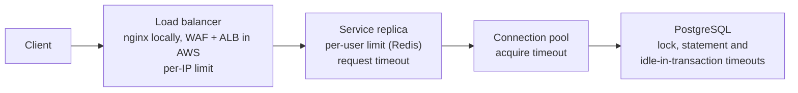

# 007 · Security hardening and operability

- **Status:** Approved
- **ID prefix:** SEC
- **Related ADRs:** [ADR-0001](../../docs/adr/0001-spec-driven-development-with-adrs-and-ai-agents.md), [ADR-0003](../../docs/adr/0003-hexagonal-architecture-with-tactical-ddd.md), [ADR-0004](../../docs/adr/0004-typescript-with-fastify.md), [ADR-0005](../../docs/adr/0005-postgresql-as-the-only-source-of-truth.md), [ADR-0008](../../docs/adr/0008-read-committed-with-ordered-pessimistic-row-locks.md), [ADR-0009](../../docs/adr/0009-idempotency-inside-the-movements-transaction.md), [ADR-0010](../../docs/adr/0010-kysely-and-pg-instead-of-an-orm.md), [ADR-0012](../../docs/adr/0012-simulated-authentication-with-jwt-and-two-roles.md), [ADR-0013](../../docs/adr/0013-rate-limiting-at-the-edge-and-in-redis.md), [ADR-0014](../../docs/adr/0014-aws-deployment-on-ecs-fargate-with-rds-postgresql.md), [ADR-0016](../../docs/adr/0016-error-model.md), [ADR-0017](../../docs/adr/0017-keyset-pagination-with-signed-cursors.md), [ADR-0018](../../docs/adr/0018-two-database-roles.md), [ADR-0019](../../docs/adr/0019-timeout-layers-and-rds-proxy.md), [ADR-0020](../../docs/adr/0020-expand-then-contract-migrations.md), [ADR-0021](../../docs/adr/0021-statement-timeout-function-for-maintenance-scripts.md), [ADR-0022](../../docs/adr/0022-request-timeout-answer-first-then-roll-back.md)
- **Depends on specs:** 000-overview, 001-accounts, 002-ledger, 003-money-movements, 004-reversals, 005-idempotency, 006-auth, 008-deployment

## 1. Context and goal

The service holds customer money, runs as several replicas behind a load balancer, and must stay correct and responsive when clients misbehave, when a dependency fails and while it is being deployed. This spec covers the layers around the business logic: rate limits, limits on request bodies, security headers, trusted proxies, correlation ids and logs, health checks, graceful shutdown, timeouts, the database connection pool, configuration, metrics and the API documentation. It fixes the values that specs 000, 003 and 005 leave to it (SYS-R34, SYS-R35, MOV-R19, IDM-R11).

Locally the load balancer is nginx in Docker Compose; in AWS it is an Application Load Balancer with AWS WAF in front (phase 12-infra). PostgreSQL is the only source of truth (SYS-R16); Redis holds only the per-user rate-limit counters, so money correctness never depends on it. Terms have the meanings in the glossary of spec 000.

### 1.1 Layers and timeouts

Each layer gives up before the layer outside it, so a request is always answered by the innermost layer that knows why it failed (SYS-R35).

| Layer, innermost first      | Setting                                          | Where it is set                                              | Default                  |
| --------------------------- | ------------------------------------------------ | ------------------------------------------------------------ | ------------------------ |
| Account row lock            | `ACCOUNT_LOCK_TIMEOUT_MS` (spec 003)             | per transaction, through the lock-timeout function (SEC-R31) | 2000 ms                  |
| Idempotency key wait        | `IDEMPOTENCY_WAIT_TIMEOUT_MS` (spec 005)         | per transaction, through the lock-timeout function (SEC-R31) | 2000 ms                  |
| Database statement          | `statement_timeout`                              | on the runtime database role (`ALTER ROLE ... SET`)          | 5 s                      |
| Idle in transaction         | `idle_in_transaction_session_timeout`            | on the runtime database role (`ALTER ROLE ... SET`)          | 10 s                     |
| Connection pool acquire     | `DB_POOL_ACQUIRE_TIMEOUT_MS`                     | service configuration                                        | 2000 ms                  |
| RDS Proxy borrow, in AWS    | `connection_borrow_timeout`                      | RDS Proxy's target group (Terraform)                         | 5 s                      |
| Redis command               | `REDIS_COMMAND_TIMEOUT_MS`                       | service configuration                                        | 100 ms                   |
| Service request             | `REQUEST_TIMEOUT_MS`                             | service configuration                                        | 25000 ms                 |
| Load balancer               | `proxy_read_timeout` (nginx); idle timeout (ALB) | load balancer configuration                                  | 30 s (nginx), 60 s (ALB) |
| Shutdown drain and deadline | `SHUTDOWN_DRAIN_DELAY_MS`, `SHUTDOWN_TIMEOUT_MS` | service configuration                                        | 2000 ms, 30000 ms        |

The worst case SYS-R35 sums is bounded with these defaults: pool acquire 2000 ms + Redis command 100 ms + 3 attempts × (key wait 2000 ms + 2 account locks × 2000 ms) + backoff 10 ms + 20 ms = 20130 ms, under the 25000 ms request timeout. The time spent running statements is bounded by the request timeout itself (SEC-R33), not added to the sum: summing `statement_timeout` over every statement of every attempt would force a request timeout of minutes. In AWS, RDS Proxy waits at most `connection_borrow_timeout`, 5 s, for a database connection before it answers SQLSTATE 08000 "Timed-out waiting to acquire database connection", which the service answers 503 like an exhausted pool (SEC-R49); that wait, too, is bounded by the request timeout rather than added to the sum.

### 1.2 Configuration

Every setting comes from an environment variable and is validated at startup (SEC-R39). Integer values are strings of decimal digits without sign or leading zero, as in IDM-R23. Variables of other specs keep the rules of those specs: `ACCOUNT_LOCK_TIMEOUT_MS` (spec 003), `IDEMPOTENCY_WAIT_TIMEOUT_MS` and `IDEMPOTENCY_KEY_TTL_SECONDS` (spec 005), `MAX_AMOUNT_MINOR` (spec 002), `JWT_SECRET`, `JWT_ISSUER` and `JWT_AUDIENCE` (spec 006). This spec adds:

| Variable                     | Rule                                                                                                                                                                     | Default        |
| ---------------------------- | ------------------------------------------------------------------------------------------------------------------------------------------------------------------------ | -------------- |
| `NODE_ENV`                   | `development`, `test` or `production`                                                                                                                                    | `development`  |
| `PORT`                       | integer from 1 to 65535                                                                                                                                                  | 3000           |
| `METRICS_PORT`               | integer from 1 to 65535, different from `PORT`                                                                                                                           | 9464           |
| `LOG_LEVEL`                  | `fatal`, `error`, `warn`, `info`, `debug` or `trace`                                                                                                                     | `info`         |
| `DATABASE_URL`               | a `postgres://` or `postgresql://` URL whose only query parameters are `sslmode`, `sslrootcert`, `application_name` and `connect_timeout`                                | none, required |
| `PGOPTIONS`                  | unset: `pg` would send it as the connection's `options` (SEC-R29, SEC-R30)                                                                                               | unset          |
| `PGPASSWORD`                 | unset, or a non-empty value: the password `pg` uses for a database URL that holds none, as the tasks in AWS receive it (section 1.7 of spec 008); never logged (SEC-R22) | unset          |
| `REDIS_URL`                  | a `redis://` or `rediss://` URL                                                                                                                                          | none, required |
| `CURSOR_SECRET`              | at least 32 bytes in UTF-8, different from `JWT_SECRET` (section 1.5 of spec 001)                                                                                        | none, required |
| `DB_POOL_MAX`                | integer from 1 to 100                                                                                                                                                    | 10             |
| `DB_POOL_ACQUIRE_TIMEOUT_MS` | integer from 1 to 60000                                                                                                                                                  | 2000           |
| `REDIS_COMMAND_TIMEOUT_MS`   | integer from 1 to 5000                                                                                                                                                   | 100            |
| `REQUEST_TIMEOUT_MS`         | integer from 1 to 120000, greater than the sum of section 1.1 (SEC-R35)                                                                                                  | 25000          |
| `SHUTDOWN_DRAIN_DELAY_MS`    | integer from 0 to 60000                                                                                                                                                  | 2000           |
| `SHUTDOWN_TIMEOUT_MS`        | integer from 1 to 120000, not less than `REQUEST_TIMEOUT_MS`                                                                                                             | 30000          |
| `RATE_LIMIT_USER_MAX`        | integer from 1 to 1000000                                                                                                                                                | 300            |
| `RATE_LIMIT_USER_WINDOW_S`   | integer from 1 to 3600                                                                                                                                                   | 10             |
| `TRUSTED_PROXY_CIDRS`        | comma-separated IPv4 or IPv6 CIDR blocks, or empty                                                                                                                       | empty          |
| `CORS_ORIGINS`               | comma-separated origins (`https://host[:port]`, or `http://` when `NODE_ENV` is not `production`), or empty                                                              | empty          |

The load balancer reads its own variables: `RATE_LIMIT_IP_RPS` (default 500) and `RATE_LIMIT_IP_BURST` (default 1000). `METRICS_PORT` defaults to 9464, the port Prometheus exporters conventionally use. The ranges are wide enough for tests and production and narrow enough to catch typos, such as a pool of 1000 or a timeout of hours.

### 1.3 Order of checks

The load balancer applies the per-IP limit before a request reaches a replica. Within a replica, this spec places its checks in the order of SYS-R31 as follows: route (404), authentication (401), **per-user rate limit (429)**, role (403), **media type (415)**, **body size (413)**, malformed request (400), and then the steps of SYS-R31 from the idempotency step on. None of the checks of this spec stores anything for idempotent replay (spec 005, section 1.3). The per-user limit comes right after authentication because it needs the user id, and so that it also counts the requests the role check refuses, which a scripted client would otherwise send for free. The media type and body size come after the role check and before the malformed-request check, which is where the framework parses the body.

### 1.4 Metrics

Served in the Prometheus text format at `/metrics` on `METRICS_PORT` (SYS-R30), with the prefix `scf_`. Every label has a fixed set of values, so the number of series stays bounded:

| Metric                                    | Type      | Labels                                                                                                | Counts or measures                                                                                      |
| ----------------------------------------- | --------- | ----------------------------------------------------------------------------------------------------- | ------------------------------------------------------------------------------------------------------- |
| `scf_http_request_duration_seconds`       | histogram | `method`, `route` (the route template, for example `/v1/accounts/:id`), `status_code`                 | Time from receiving a request to sending its response.                                                  |
| `scf_money_movements_total`               | counter   | `kind` (`deposit`, `withdrawal`, `transfer`, `reversal`), `outcome` (`applied`, `rejected`, `failed`) | Movements that reached the idempotency step: 201, a stored 4xx, or a 5xx. Replays are not counted here. |
| `scf_idempotent_replays_total`            | counter   | `kind` (the four movement kinds and `account_creation`)                                               | Responses answered from a stored key row (IDM-R07).                                                     |
| `scf_lock_timeouts_total`                 | counter   | `lock` (`account`, `idempotency`)                                                                     | SQLSTATE 55P03 at an account row lock (503) or at the key insert (409).                                 |
| `scf_transaction_retries_total`           | counter   | `sqlstate` (`40P01`, `40001`)                                                                         | Attempts retried by SYS-R18.                                                                            |
| `scf_transaction_retries_exhausted_total` | counter   | none                                                                                                  | Requests that ended with 503 after the last attempt (SYS-R19).                                          |
| `scf_db_pool_connections`                 | gauge     | `state` (`total`, `idle`, `waiting`)                                                                  | Connections of the request pool, and requests waiting for one.                                          |
| `scf_db_pool_acquire_timeouts_total`      | counter   | none                                                                                                  | Requests answered 503 because no connection was free in time (SEC-R37).                                 |
| `scf_rate_limited_total`                  | counter   | none                                                                                                  | Requests answered 429 by the per-user limit.                                                            |
| `scf_rate_limit_store_errors_total`       | counter   | none                                                                                                  | Per-user limit checks that failed open because Redis did not answer.                                    |

The default Node.js process metrics (memory, event loop lag, garbage collection) are also exposed.

### 1.5 Security headers

Every response of the service carries these headers, set through helmet with its defaults and the values below:

| Header                         | Value                                                                                                                                                                                                                                 |
| ------------------------------ | ------------------------------------------------------------------------------------------------------------------------------------------------------------------------------------------------------------------------------------- |
| `Content-Security-Policy`      | `default-src 'none'; frame-ancestors 'none'`, except on `/docs`, which gets `default-src 'self'; img-src 'self' data:; style-src 'self' 'unsafe-inline'; frame-ancestors 'none'`, because Swagger UI loads its own scripts and styles |
| `Strict-Transport-Security`    | `max-age=31536000; includeSubDomains`                                                                                                                                                                                                 |
| `X-Content-Type-Options`       | `nosniff`                                                                                                                                                                                                                             |
| `X-Frame-Options`              | `DENY`                                                                                                                                                                                                                                |
| `Referrer-Policy`              | `no-referrer`                                                                                                                                                                                                                         |
| `Cross-Origin-Opener-Policy`   | `same-origin`                                                                                                                                                                                                                         |
| `Cross-Origin-Resource-Policy` | `same-origin`                                                                                                                                                                                                                         |
| `Cache-Control`                | `no-store`, on every response under `/v1`, so that no shared or browser cache keeps a balance or a history                                                                                                                            |

CORS is handled by `@fastify/cors`, approved by the owner and recorded in `docs/dependencies.md`, first used in phase 09-hardening. It allows only the exact origins of `CORS_ORIGINS` and the methods and headers of SEC-R17, refuses `*`, and never allows credentials, because tokens travel in `Authorization`, not in cookies.

### 1.6 Rate limits

- **Per IP, locally.** nginx applies `limit_req` on a zone keyed by `$binary_remote_addr` with `rate=${RATE_LIMIT_IP_RPS}r/s burst=${RATE_LIMIT_IP_BURST} nodelay` and `limit_req_status 429`: requests within the burst pass at once and the excess is refused at once, not queued, so a client gets a prompt 429 instead of latency. The nginx configuration template is rendered from the environment by the `envsubst` step of the nginx image. The 429 is answered by an `error_page 429` location that returns the problem details of SEC-R01, with `requestId` set to nginx's request id and `add_header Retry-After 1 always`, so a client sees the same shape from nginx as from the service.
- **Per IP, in AWS.** An AWS WAF rate-based rule aggregated by client IP (SEC-R45). WAF counts over fixed evaluation windows of 1 to 10 minutes and allows no burst, so the rule uses a 1-minute window with a limit of 60 × `RATE_LIMIT_IP_RPS`; nginx's per-second limit with a burst stays the local stand-in. The rule's block action answers as close to SEC-R01 as WAF allows: status 429, the header `Retry-After: 60`, the rule's window, and a custom response body of content type `APPLICATION_JSON` holding the `type` `/problems/rate-limited`, the `title`, the `status` 429 and the `detail` of the nginx answer. WAF cannot add a `requestId` or an `X-Request-Id` header, nor send the media type `application/problem+json`, so that body is `application/json` without `requestId`. The managed rule groups of section 1.7 of spec 008 still answer a blocked request with a plain 403. The rule is checked by the CI step `npm run infra:validate`, added in phase 12-infra, which runs `terraform validate` and a policy check of the plan (SEC-AC35).
- **Per user.** A fixed window per user that starts with the user's first request: a Redis counter created with a TTL of `RATE_LIMIT_USER_WINDOW_S` and incremented atomically, one round trip per request and one count across replicas. `Retry-After` is the counter's remaining TTL rounded up to whole seconds, at least 1 (SEC-R03).
- **Redis failure.** The per-user limit fails open (SEC-R06): each command has a timeout of `REDIS_COMMAND_TIMEOUT_MS`, a failed check lets the request through, and the service logs one `warn` line on the transition to unavailable and one `info` line on recovery instead of one line per request. The service starts while Redis is down and readiness ignores Redis, so a Redis outage never takes the API down.
- **Test suites.** Integration tests of the other specs build the app with `RATE_LIMIT_USER_MAX` "1000000"; the ACs of this spec use the values they name and the defaults of section 1.2 otherwise. The e2e suite uses the defaults: SEC-AC04 uses its own user C9, SEC-AC01 runs alone and after every other e2e AC, and the load test (SYS-AC17) spreads its deposits over 10 operator identities, about 7 requests per second each, and its customer requests over the 1000 customers of its account pairs (SEC-R09).

### 1.7 Load balancer

- **Body size.** nginx's `client_max_body_size` is 32k, so a body up to 32 KB reaches the service, which answers a body above 16384 bytes with the problem details of SEC-R10. A body above 32 KB gets nginx's own 413, rendered as problem details with type `/problems/payload-too-large` by an `error_page 413` location, as for 429.
- **Timeouts.** nginx `proxy_connect_timeout` is 2 s: inside the compose network a connection is established in milliseconds, and a stopped container drops packets instead of refusing them, so a longer wait would only delay passing the request to the other replica (DEP-R15). nginx `proxy_read_timeout` and `proxy_send_timeout` are 30 s and its upstream `keepalive_timeout` is 60 s; in AWS the ALB idle timeout is 60 s. The service's keep-alive timeout is 65 s, longer than both, so the service never closes a connection that the load balancer is about to reuse, which would show up as random 502s (SEC-R34).
- **X-Forwarded-For in AWS.** nginx replaces the client's `X-Forwarded-For` (SEC-R19); the ALB of spec 008 appends the client's address to it instead, its default. The client address stays right: SEC-R18 takes the rightmost address that is not a trusted proxy, and `TRUSTED_PROXY_CIDRS` names only the ALB's subnets, so the address the ALB appended is the one taken and any value the client sent is ignored.

### 1.8 Health and shutdown

- **Readiness.** `SELECT 1` runs with a 1000 ms timeout on a dedicated connection outside the request pool, so a busy pool never marks a healthy replica unready. Every migration in the code's `migrations/` folder must be present in node-pg-migrate's table; migrations the database holds beyond those are accepted, so a replica of the previous version stays ready while a newer one rolls out. Migrations are therefore written expand-then-contract, recorded in [ADR-0020](../../docs/adr/0020-expand-then-contract-migrations.md) (SEC-R24).
- **Shutdown exit code.** A shutdown that reaches `SHUTDOWN_TIMEOUT_MS` with requests still in flight exits with code 1, so the orchestrator records that requests were cut off; it exits 0 only when every request finished (SEC-R27, SEC-R28). A request answered 503 at its request timeout stays in flight for the shutdown until its clean-up ends: the statement in flight, bounded by `statement_timeout`, then the rollback, or the commit already sent (SEC-R33). Since `SHUTDOWN_TIMEOUT_MS` is at least `REQUEST_TIMEOUT_MS` (SEC-R35), exit code 1 happens only if a request outlives its own timeout, or if such a clean-up is still running when `SHUTDOWN_TIMEOUT_MS` ends and is cut off. In AWS the ECS `stopTimeout` must exceed `SHUTDOWN_DRAIN_DELAY_MS` + `SHUTDOWN_TIMEOUT_MS` (phase 12-infra).

### 1.9 Database sessions and connections

- **Role settings.** A migration run by the owner role sets `statement_timeout` and `idle_in_transaction_session_timeout` with `ALTER ROLE <runtime role> SET ...`, so local, CI and AWS get the same values; the owner role is granted the right to alter the runtime role. `statement_timeout` (5 s) is above both lock waits, so a lock wait always ends as SQLSTATE 55P03, never 57014; `idle_in_transaction_session_timeout` (10 s) ends a transaction left open by a defect. The reconcile and cleanup scripts raise `statement_timeout` to 600000 ms (10 minutes) for their own transaction by calling `app.set_statement_timeout(ms integer)`, a function of the same kind as the lock-timeout function that accepts 1 to 3600000 ms (SEC-R29).
- **Lock-timeout function.** `app.set_lock_timeout(ms integer)`, `SECURITY INVOKER`, checks 1 ≤ ms ≤ 60000 and runs `set_config('lock_timeout', ms || 'ms', true)`; only the runtime role may execute it (SEC-R31). That RDS Proxy pins a connection on `SET` and `set_config` statements but not on function calls is taken from its documentation and recorded in [ADR-0019](../../docs/adr/0019-timeout-layers-and-rds-proxy.md), to be re-checked when RDS Proxy is introduced in phase 12-infra.
- **Statement timeout.** A statement cancelled by `statement_timeout` is a transient overload like a lock timeout, and the request has already used most of its time, so it is answered 503 and not retried in process (SEC-R32). At the request timeout the 503 is answered first; the service starts no further statement, and the statement in flight runs until it ends, at most until `statement_timeout`, before the transaction is rolled back (SEC-R33). The service never cancels a statement from another connection.
- **Pool size.** Each replica holds `DB_POOL_MAX` (default 10) request connections plus one readiness connection, and 10 connections are kept in reserve for migrations, the reconcile and cleanup scripts and manual sessions (SEC-R36). Locally that is 2 × 11 + 10 = 32 of PostgreSQL's 97 usable connections; in AWS the same rule applies to RDS Proxy's connection budget and the task count, a deployment's surge included: the autoscaling maximum × the ECS service's `deployment_maximum_percent` / 100, 6 × 200 / 100 = 12 tasks, so 12 × 11 + 10 = 142 of the 197 usable connections that the parameter group's `max_connections` of 200 leaves.

## 2. Requirements

| ID      | Requirement (EARS)                                                                                                                                                                                                                                                                                                                                                                                                                                                                                                                                                                                                                                     |
| ------- | ------------------------------------------------------------------------------------------------------------------------------------------------------------------------------------------------------------------------------------------------------------------------------------------------------------------------------------------------------------------------------------------------------------------------------------------------------------------------------------------------------------------------------------------------------------------------------------------------------------------------------------------------------ |
| SEC-R01 | IF one client IP sends requests through the load balancer faster than `RATE_LIMIT_IP_RPS` per second beyond a burst of `RATE_LIMIT_IP_BURST` THEN THE SYSTEM SHALL answer the excess at the load balancer, without forwarding it to a replica, with 429, never 503, the header `Retry-After: 1`, the header `X-Request-Id` and an `application/problem+json` body with type `/problems/rate-limited` and `requestId` equal to that header (section 1.6).                                                                                                                                                                                               |
| SEC-R02 | THE SYSTEM SHALL key the per-IP limit on the address of the TCP peer of the load balancer, never on an `X-Forwarded-For` header sent by the client.                                                                                                                                                                                                                                                                                                                                                                                                                                                                                                    |
| SEC-R03 | IF an authenticated user sends more than `RATE_LIMIT_USER_MAX` requests within one window of `RATE_LIMIT_USER_WINDOW_S` seconds, the window starting at the user's first request after the previous window ended, THEN THE SYSTEM SHALL answer every further request in that window with 429 and problem type `/problems/rate-limited`, with a `Retry-After` header of the whole seconds left in the window, at least 1, and change nothing (section 1.6).                                                                                                                                                                                             |
| SEC-R04 | THE SYSTEM SHALL count the per-user limit in Redis, keyed by the user id of the token (AUT-R07), so that every replica shares one count per user, and keep no count in process memory (SYS-R16).                                                                                                                                                                                                                                                                                                                                                                                                                                                       |
| SEC-R05 | THE SYSTEM SHALL check the per-user limit right after authentication and before the role check (section 1.3), and count every authenticated request, including requests answered 403, 4xx and idempotent replays.                                                                                                                                                                                                                                                                                                                                                                                                                                      |
| SEC-R06 | IF Redis is unreachable or does not answer a rate-limit command within `REDIS_COMMAND_TIMEOUT_MS` THEN THE SYSTEM SHALL process the request as if it were under the limit, add 1 to `scf_rate_limit_store_errors_total`, write one `warn` log line when Redis becomes unavailable and one `info` line when it answers again, and start and stay ready while Redis is down (section 1.6).                                                                                                                                                                                                                                                               |
| SEC-R07 | THE SYSTEM SHALL use Redis for nothing but the per-user rate-limit counters, so that money movements, idempotent replays, account locks, balances, the ledger and readiness are the same whether Redis is available or not.                                                                                                                                                                                                                                                                                                                                                                                                                            |
| SEC-R08 | THE SYSTEM SHALL read the per-IP limits from `RATE_LIMIT_IP_RPS` and `RATE_LIMIT_IP_BURST` (defaults 500 and 1000) in the load balancer, and the per-user limits from `RATE_LIMIT_USER_MAX` and `RATE_LIMIT_USER_WINDOW_S` (defaults 300 and 10) in the service.                                                                                                                                                                                                                                                                                                                                                                                       |
| SEC-R09 | WHILE the e2e and load suites run with the default limits THE SYSTEM SHALL answer none of their requests with 429, except the requests of the rate-limit tests, which exceed the limits on purpose, each with a user of its own (section 1.6).                                                                                                                                                                                                                                                                                                                                                                                                         |
| SEC-R10 | IF a request body is larger than 16384 bytes, by its `Content-Length` or by the bytes received, THEN THE SYSTEM SHALL answer 413 with problem type `/problems/payload-too-large`, stop reading the body, and change nothing.                                                                                                                                                                                                                                                                                                                                                                                                                           |
| SEC-R11 | IF a request has a body and its `Content-Type` is missing or is not `application/json` in any letter case, alone or with the single parameter `charset=utf-8`, THEN THE SYSTEM SHALL answer 415 with problem type `/problems/unsupported-media-type` and change nothing, so that any other charset is refused because the service parses UTF-8 only; a request without a body needs no `Content-Type`.                                                                                                                                                                                                                                                 |
| SEC-R12 | THE SYSTEM SHALL check the media type and then the body size after the role check and before the malformed-request check of SYS-R31 (section 1.3).                                                                                                                                                                                                                                                                                                                                                                                                                                                                                                     |
| SEC-R13 | THE SYSTEM SHALL let the load balancer pass request bodies of up to 32 KB, so that a body above 16384 bytes is answered by the service with the problem details of SEC-R10, not by the load balancer (section 1.7).                                                                                                                                                                                                                                                                                                                                                                                                                                    |
| SEC-R14 | THE SYSTEM SHALL set the headers of table 1.5 on every response of the service through helmet.                                                                                                                                                                                                                                                                                                                                                                                                                                                                                                                                                         |
| SEC-R15 | THE SYSTEM SHALL send no `X-Powered-By` header, and the load balancer SHALL send no version in its `Server` header.                                                                                                                                                                                                                                                                                                                                                                                                                                                                                                                                    |
| SEC-R16 | WHILE `CORS_ORIGINS` is empty THE SYSTEM SHALL send no `Access-Control-*` header on any response, whatever `Origin` a request carries, and answer an `OPTIONS` preflight as a path that is not a defined route (SYS-R32).                                                                                                                                                                                                                                                                                                                                                                                                                              |
| SEC-R17 | WHERE `CORS_ORIGINS` lists origins THE SYSTEM SHALL answer a request or preflight whose `Origin` equals one of them exactly with `Access-Control-Allow-Origin` set to that origin and `Vary: Origin`, allow on a preflight the methods `GET` and `POST` and the request headers `Authorization`, `Content-Type`, `Idempotency-Key` and `X-Request-Id`, expose `X-Request-Id`, `Location`, `Retry-After` and `Idempotent-Replayed`, never allow credentials, and send no `Access-Control-*` header for any other origin (section 1.5).                                                                                                                  |
| SEC-R18 | THE SYSTEM SHALL take the client address from `X-Forwarded-For` only when the TCP peer is in `TRUSTED_PROXY_CIDRS`, using the rightmost address of that header that is not itself in those blocks, and otherwise use the TCP peer's address; with `TRUSTED_PROXY_CIDRS` empty it trusts no proxy.                                                                                                                                                                                                                                                                                                                                                      |
| SEC-R19 | THE SYSTEM SHALL make nginx, the local load balancer, replace any `X-Forwarded-For` header sent by the client with the client's TCP address before forwarding the request (section 1.7).                                                                                                                                                                                                                                                                                                                                                                                                                                                               |
| SEC-R20 | WHEN the load balancer forwards a request THE SYSTEM SHALL pass the client's `X-Request-Id` unchanged if it is present and not empty, and the load balancer's own 32-hex-character request id otherwise, and write in the load balancer's access log the id it forwarded and the `X-Request-Id` of the response; the service then applies SYS-R21.                                                                                                                                                                                                                                                                                                     |
| SEC-R21 | THE SYSTEM SHALL write every log line as one JSON object on one line, with at least `level`, `time` and `msg`, and with `reqId` holding the correlation id on every line written while handling a request (SYS-R22). The lines the database pool writes about a connection, such as "database connection lost", carry no `reqId`, because the pool belongs to no request.                                                                                                                                                                                                                                                                              |
| SEC-R22 | THE SYSTEM SHALL redact from every log line the values of the `Authorization`, `Cookie` and `Idempotency-Key` headers, every token, `JWT_SECRET`, `CURSOR_SECRET`, `PGPASSWORD` and the passwords of `DATABASE_URL` and `REDIS_URL`, writing `[Redacted]` in their place where the field is kept (AUT-R19).                                                                                                                                                                                                                                                                                                                                            |
| SEC-R23 | WHEN `/health/live` is requested THE SYSTEM SHALL answer 200 with `{"status": "ok"}` while the process runs, checking nothing else, also while the database or Redis is down and during shutdown.                                                                                                                                                                                                                                                                                                                                                                                                                                                      |
| SEC-R24 | WHEN `/health/ready` is requested THE SYSTEM SHALL answer 200 with `{"status": "ready"}` only if `SELECT 1` completes within 1000 ms on a connection kept apart from the request pool and every migration the code ships is applied, and otherwise 503 with problem type `/problems/service-unavailable`, a body that names no host, error or check, and a `warn` log line naming the failed check; migrations applied beyond those the code ships do not make it unready (section 1.8).                                                                                                                                                               |
| SEC-R25 | WHEN the process receives SIGTERM or SIGINT THE SYSTEM SHALL keep serving for `SHUTDOWN_DRAIN_DELAY_MS`, then stop accepting new connections, close idle keep-alive connections, and let the requests in flight finish within `SHUTDOWN_TIMEOUT_MS`.                                                                                                                                                                                                                                                                                                                                                                                                   |
| SEC-R26 | WHILE the process is shutting down THE SYSTEM SHALL answer `/health/ready` with 503 and `/health/live` with 200.                                                                                                                                                                                                                                                                                                                                                                                                                                                                                                                                       |
| SEC-R27 | WHEN every request in flight has finished during shutdown THE SYSTEM SHALL close the database pool, the readiness connection and the Redis connection, and exit with code 0.                                                                                                                                                                                                                                                                                                                                                                                                                                                                           |
| SEC-R28 | IF requests are still in flight when `SHUTDOWN_TIMEOUT_MS` ends THEN THE SYSTEM SHALL destroy their connections, roll back their database transactions, close the database pool, the readiness connection and Redis, and exit with code 1 (section 1.8).                                                                                                                                                                                                                                                                                                                                                                                               |
| SEC-R29 | THE SYSTEM SHALL set `statement_timeout` (5 s) and `idle_in_transaction_session_timeout` (10 s) on the runtime database role (LED-R17) with `ALTER ROLE ... SET`, from a migration run by the owner role, so that every new session of that role starts with them (section 1.9).                                                                                                                                                                                                                                                                                                                                                                       |
| SEC-R30 | THE SYSTEM SHALL never send a `SET`, `SET LOCAL`, `RESET` or `DISCARD` statement, a direct call of `set_config`, or a connection `options` parameter from the service, so that no session-level setting pins a connection behind RDS Proxy.                                                                                                                                                                                                                                                                                                                                                                                                            |
| SEC-R31 | THE SYSTEM SHALL set the lock timeouts of specs 001, 003, 004 and 005 (`ACCOUNT_LOCK_TIMEOUT_MS`, `IDEMPOTENCY_WAIT_TIMEOUT_MS`) by calling a SQL function that runs `set_config('lock_timeout', <value>, true)`, so that the value lasts only until the database transaction ends and never reaches another request on a pooled connection (section 1.9).                                                                                                                                                                                                                                                                                             |
| SEC-R32 | IF a statement is cancelled by `statement_timeout` (SQLSTATE 57014) THEN THE SYSTEM SHALL roll back the database transaction without retrying it and answer 503 with problem type `/problems/service-unavailable` and `Retry-After: 1`, never 500 (section 1.9).                                                                                                                                                                                                                                                                                                                                                                                       |
| SEC-R33 | IF a request is still being handled `REQUEST_TIMEOUT_MS` after it was received THEN THE SYSTEM SHALL answer 503 with problem type `/problems/service-unavailable` and `Retry-After: 1` at once, start no further statement for it, and roll back its database transaction as soon as the statement in flight ends, which `statement_timeout` bounds; IF its `COMMIT` was already sent THEN the commit finishes and the outcome is unknown to the client, as for the load balancer's gateway errors (DEP-R16), and a retry with the same `Idempotency-Key` gets the stored response. THE SYSTEM SHALL never cancel a statement from another connection. |
| SEC-R34 | THE SYSTEM SHALL keep `statement_timeout` greater than `ACCOUNT_LOCK_TIMEOUT_MS` and `IDEMPOTENCY_WAIT_TIMEOUT_MS`, whose ranges end at 4999 ms for that reason (MOV-R31, IDM-R23), `REQUEST_TIMEOUT_MS` greater than `statement_timeout`, and the load balancer's upstream timeout greater than `REQUEST_TIMEOUT_MS`, with the defaults of table 1.1, and keep the service's keep-alive timeout (65 s) longer than the load balancer's upstream keep-alive timeout (60 s) (section 1.7).                                                                                                                                                              |
| SEC-R35 | IF `REQUEST_TIMEOUT_MS` is not greater than `DB_POOL_ACQUIRE_TIMEOUT_MS` + `REDIS_COMMAND_TIMEOUT_MS` + 3 × (`IDEMPOTENCY_WAIT_TIMEOUT_MS` + 2 × `ACCOUNT_LOCK_TIMEOUT_MS`) + 30, or `SHUTDOWN_TIMEOUT_MS` is less than `REQUEST_TIMEOUT_MS`, THEN THE SYSTEM SHALL refuse to start, with an error that names the variables involved (SYS-R35).                                                                                                                                                                                                                                                                                                        |
| SEC-R36 | THE SYSTEM SHALL open at most `DB_POOL_MAX` request connections plus one readiness connection per replica, and every deployment definition in the repository SHALL keep replicas × (`DB_POOL_MAX` + 1) + 10 below the database's `max_connections` minus its `superuser_reserved_connections` (section 1.9).                                                                                                                                                                                                                                                                                                                                           |
| SEC-R37 | IF no pool connection becomes free within `DB_POOL_ACQUIRE_TIMEOUT_MS` THEN THE SYSTEM SHALL answer 503 with problem type `/problems/service-unavailable` and `Retry-After: 1`, write nothing, and add 1 to `scf_db_pool_acquire_timeouts_total`.                                                                                                                                                                                                                                                                                                                                                                                                      |
| SEC-R38 | WHILE requests wait for a pool connection THE SYSTEM SHALL serve them in arrival order, so that a burst queues and gets no 5xx as long as it drains within `DB_POOL_ACQUIRE_TIMEOUT_MS`: a burst of 100 short movements with the default pool settings (SEC-AC28, MOV-AC13), and the longer bursts of MOV-AC14 and REV-AC23 with the acquire timeout those ACs set.                                                                                                                                                                                                                                                                                    |
| SEC-R39 | THE SYSTEM SHALL read its configuration only from environment variables and validate every variable of section 1.2 and of specs 002, 003, 005 and 006, `REPLICA_ID` and, where it is set, `MIGRATION_DATABASE_URL` (spec 008) at startup, before connecting to anything or listening on a port.                                                                                                                                                                                                                                                                                                                                                        |
| SEC-R40 | IF any variable is invalid THEN THE SYSTEM SHALL write one error that lists every invalid variable by name with the rule it breaks, never its value, and exit with code 1 without listening on any port.                                                                                                                                                                                                                                                                                                                                                                                                                                               |
| SEC-R41 | THE SYSTEM SHALL expose the metrics of table 1.4 at `/metrics` on `METRICS_PORT` (SYS-R30).                                                                                                                                                                                                                                                                                                                                                                                                                                                                                                                                                            |
| SEC-R42 | THE SYSTEM SHALL label request metrics with the route template, never the path as received, and label requests to undefined paths with the route `unmatched`, so that ids never become label values.                                                                                                                                                                                                                                                                                                                                                                                                                                                   |
| SEC-R43 | THE SYSTEM SHALL never route a request from the load balancer to `METRICS_PORT`, and no deployment definition in the repository SHALL publish `METRICS_PORT` to a host or public network.                                                                                                                                                                                                                                                                                                                                                                                                                                                              |
| SEC-R44 | THE SYSTEM SHALL serve Swagger UI at `/docs` and the OpenAPI document at `/docs/json`, outside `/v1` and without credentials (SYS-R43), in every environment, production included, behind the load balancer's per-IP limit, with every endpoint of specs 001, 003 and 004 listed under its `/v1` path.                                                                                                                                                                                                                                                                                                                                                 |
| SEC-R45 | WHERE the service is deployed to AWS THE SYSTEM SHALL limit requests per client IP with an AWS WAF rate-based rule attached to the load balancer (section 1.6).                                                                                                                                                                                                                                                                                                                                                                                                                                                                                        |
| SEC-R46 | THE SYSTEM SHALL write in every log line of the service, and the load balancer in its access log, a request's route template or path without its query string, never the query string, so that a token or any other value sent in a query string never reaches a log (AUT-R19, AUT-R01).                                                                                                                                                                                                                                                                                                                                                               |
| SEC-R47 | THE SYSTEM SHALL keep `REQUEST_TIMEOUT_MS` below the load balancer's upstream timeout in every deployment definition in the repository: `compose.yaml` with the nginx configuration template and, from phase 12-infra, the Terraform of the ALB, so that the order of SEC-R34 holds whatever value a deployment sets within the range of section 1.2.                                                                                                                                                                                                                                                                                                  |
| SEC-R48 | THE SYSTEM SHALL provide `app.set_statement_timeout(ms integer)`, a SQL function that refuses a value outside 1 to 3600000 and otherwise runs `set_config('statement_timeout', <ms>ms, true)`, so that the value lasts only until the database transaction ends, and that only the runtime role may execute; and only the reconcile and cleanup scripts SHALL call it, with 600000, inside each of their database transactions (section 1.9).                                                                                                                                                                                                          |
| SEC-R49 | IF a statement fails with SQLSTATE 08000, which RDS Proxy answers when no database connection becomes free within its `connection_borrow_timeout` (section 1.1) THEN THE SYSTEM SHALL answer 503 with problem type `/problems/service-unavailable` and `Retry-After: 1`, never 500, without retrying the transaction, send no further statement on that connection, `ROLLBACK` included, and destroy the connection instead of returning it to the pool.                                                                                                                                                                                               |

## 3. Acceptance criteria

Unless stated otherwise: customer user C1 owns account A1 (EUR) and customer user C2 owns account B1 (EUR), operator user O1 is an operator, balances are set up by deposits from O1, and every deposit, withdrawal, transfer and reversal carries a fresh Idempotency-Key. Integration ACs build the production app through the composition root, with the variables they name and the defaults of section 1.2 otherwise. "Replicas P1 and P2" are two instances of the app against the same database and Redis, as in spec 005. "The stack" is the Docker Compose stack with nginx and two replicas, used by every e2e AC. "Captured logs" are every line the app writes to standard output during the AC.

### SEC-AC01 · The load balancer limits each client IP and answers 429

- **Level:** e2e
- **Covers:** SEC-R01, SEC-R02, SEC-R08
- **Given** the stack with `RATE_LIMIT_IP_RPS` and `RATE_LIMIT_IP_BURST` unset; this AC runs alone, after every other e2e AC (section 1.6)
- **When** one client sends 3000 `GET /health/live` requests through the load balancer at the same time, each with a different `X-Forwarded-For` value; then waits 3 seconds and sends one more
- **Then** at least 1000 answer 200 and at least one answers 429; no response is a 503; every 429 has `Retry-After: 1`, content type `application/problem+json`, a body with type `/problems/rate-limited`, `status` 429 and a `requestId` equal to its `X-Request-Id` header; the replicas' captured logs hold no line for any request answered 429; and the last request answers 200

### SEC-AC02 · Each user is limited per window

- **Level:** integration
- **Covers:** SEC-R03, SEC-R05, SYS-R34
- **Given** the app with `RATE_LIMIT_USER_MAX` "5" and `RATE_LIMIT_USER_WINDOW_S` "10", and A1 with "1000" EUR
- **When** C1 reads A1 three times, deposits "100" EUR into A1 (answered 403), and withdraws "100" EUR from A1 with Idempotency-Key k1, one after the other; then C1 sends the withdrawal with k1 again; C2 reads B1; a request without credentials reads A1 six times; and, once C1's counter is observed to have expired in Redis, C1 reads A1 again
- **Then** C1's first five requests answer as without a limit (200, 200, 200, 403, 201); C1's sixth answers 429 with type `/problems/rate-limited` and a `Retry-After` from 1 to 10, and A1 stays "900" EUR; C2's read answers 200; the six requests without credentials answer 401; and C1's last read answers 200

### SEC-AC03 · The per-user count is shared by every replica

- **Level:** integration
- **Covers:** SEC-R04
- **Given** replicas P1 and P2 with `RATE_LIMIT_USER_MAX` "4" and `RATE_LIMIT_USER_WINDOW_S` "60", and A1 owned by C1
- **When** C1 reads A1 twice on P1 and twice on P2, and then once on each
- **Then** the first four answer 200 and the last two answer 429 with type `/problems/rate-limited`; and Redis holds exactly one rate-limit counter for C1

### SEC-AC04 · A dedicated user exceeds the default per-user limit

- **Level:** e2e
- **Covers:** SEC-R03, SEC-R08
- **Given** the stack with the per-user limits unset, and customer user C9, used by no other test, owning account A9
- **When** C9 sends 301 reads of A9 through the load balancer as fast as possible, all within 10 seconds of the first, while C1 reads A1
- **Then** the first 300 of C9's requests answer 200 and the 301st answers 429 with type `/problems/rate-limited` and a `Retry-After` from 1 to 10; and C1's read answers 200

### SEC-AC05 · The e2e and load suites stay under the default limits

- **Level:** e2e
- **Covers:** SEC-R09
- **Given** the stack with every limit unset
- **When** the e2e suite and the load test of SYS-AC17 run, with the load test spreading its deposits over 10 operator identities and its withdrawals and transfers over the 1000 customers of its account pairs (section 1.6)
- **Then** no response is a 429, except in SEC-AC01 and SEC-AC04

### SEC-AC06 · Without Redis, requests are served and money stays correct

- **Level:** integration
- **Covers:** SEC-R06, SEC-R07
- **Given** the app started with `REDIS_URL` pointing to a port where nothing listens and `RATE_LIMIT_USER_MAX` "1"; A1 with "1000" EUR
- **When** C1 reads A1 three times; C1 sends 10 withdrawals of "300" EUR from A1 at the same time, each with its own Idempotency-Key; C1 sends one of them again with its key; `/health/ready` is requested; and then a Redis server starts on that port and, once the app has logged that Redis is available, C1 reads A1 twice
- **Then** the app started and the three reads answer 200; exactly 3 withdrawals answer 201 and 7 answer 422 with type `/problems/insufficient-funds`; the repeated one is replayed with `Idempotent-Replayed: true`; A1 is "100" EUR; `/health/ready` answers 200; the captured logs hold exactly one `warn` line saying Redis is unavailable before Redis started and one `info` line saying it is available after; `scf_rate_limit_store_errors_total` is at least 14; and of the last two reads the first answers 200 and the second 429

### SEC-AC07 · Bodies above 16 KB answer 413

- **Level:** integration
- **Covers:** SEC-R10
- **Given** A1 with "1000" EUR
- **When** C1 withdraws `{"amount": "100", "currency": "EUR"}` from A1 padded with spaces to exactly 16384 bytes; the same body padded to 16385 bytes; and a body of 20000 bytes sent with chunked transfer encoding and no `Content-Length`
- **Then** the first answers 201; the other two answer 413 with type `/problems/payload-too-large`; A1 is "900" EUR with one withdrawal transaction; and no key row exists for the last two keys

### SEC-AC08 · Only JSON bodies are accepted

- **Level:** integration
- **Covers:** SEC-R11
- **Given** A1, `active` with "1000" EUR
- **When** C1 withdraws `{"amount": "100", "currency": "EUR"}` from A1 with `Content-Type` `text/plain`, `application/x-www-form-urlencoded`, `application/xml`, `application/json; charset=latin1` and with no `Content-Type`; then with `application/json; charset=utf-8` and with `Application/JSON`; and O1 freezes A1 with no body and no `Content-Type`
- **Then** the first five answer 415 with type `/problems/unsupported-media-type`; the two JSON withdrawals answer 201; the freeze answers 200; and A1 is "800" EUR and `frozen`

### SEC-AC09 · Media type and size are checked after the role and before parsing

- **Level:** integration
- **Covers:** SEC-R12
- **Given** A1 with "1000" EUR
- **When** a withdrawal from A1 with a 20000-byte body is sent without credentials; C1 deposits into A1 with a 20000-byte body; C1 withdraws from A1 with `Content-Type` `text/plain` and the body `not json`; C1 withdraws from A1 with `Content-Type` `text/plain` and a 20000-byte body; and C1 withdraws from A1 with `Content-Type` `application/json`, a 20000-byte body and no Idempotency-Key
- **Then** they answer, in that order, 401 `/problems/unauthenticated`, 403 `/problems/forbidden`, 415 `/problems/unsupported-media-type`, 415 `/problems/unsupported-media-type` and 413 `/problems/payload-too-large`; and A1 stays "1000" EUR

### SEC-AC10 · The load balancer's edge

- **Level:** e2e
- **Covers:** SEC-R13, SEC-R15, SEC-R19, SEC-R43
- **Given** the stack, and A1 owned by C1
- **When** C1 withdraws from A1 through the load balancer with a 20000-byte JSON body; C1 reads A1 with `X-Forwarded-For: 6.6.6.6`; `/metrics` is requested through the load balancer; and every port the stack publishes on the host is listed
- **Then** the withdrawal answers 413 with content type `application/problem+json` and type `/problems/payload-too-large` from the service; the read answers 200, and the service's log line for it records as client address the address of the load balancer's peer, not 6.6.6.6; `/metrics` answers 404; the `Server` header of every response is `nginx` with no version; and no published port is `METRICS_PORT`

### SEC-AC11 · Security headers, and no X-Powered-By

- **Level:** integration
- **Covers:** SEC-R14, SEC-R15
- **Given** A1 owned by C1, and U an account id that does not exist
- **When** C1 reads A1 and U; `/health/live` is requested; and `/docs` is requested
- **Then** the read of A1, the 404 for U and the health check carry every header of table 1.5 with its value, `Cache-Control: no-store` on the two reads; `/docs` carries every header of table 1.5 except that its `Content-Security-Policy` is the `/docs` policy of table 1.5; and no response has an `X-Powered-By` header

### SEC-AC12 · CORS is off unless configured

- **Level:** integration
- **Covers:** SEC-R16
- **Given** the app with `CORS_ORIGINS` unset, and A1 owned by C1
- **When** C1 reads A1 with `Origin: https://evil.example`; and an `OPTIONS` request for `/v1/accounts/<A1>/withdrawals` is sent with `Origin: https://evil.example` and `Access-Control-Request-Method: POST`
- **Then** the read answers 200 with no `Access-Control-*` header; and the preflight answers 404 with type `/problems/not-found` and no `Access-Control-*` header

### SEC-AC13 · CORS for configured origins only

- **Level:** integration
- **Covers:** SEC-R17
- **Given** the app with `CORS_ORIGINS` "https://app.example", and A1 owned by C1
- **When** an `OPTIONS` request for `/v1/accounts/<A1>/withdrawals` is sent with `Origin: https://app.example`, `Access-Control-Request-Method: POST` and `Access-Control-Request-Headers: authorization, content-type, idempotency-key`; C1 reads A1 with `Origin: https://app.example`; and the same two requests are sent with `Origin: https://app.example.evil` and with `Origin: http://app.example`
- **Then** the first preflight answers 204 with `Access-Control-Allow-Origin: https://app.example`, `Vary: Origin`, allowed methods `GET` and `POST`, allowed headers `Authorization`, `Content-Type`, `Idempotency-Key` and `X-Request-Id`, and no `Access-Control-Allow-Credentials`; the first read answers 200 with `Access-Control-Allow-Origin: https://app.example` and `Access-Control-Expose-Headers` listing `X-Request-Id`, `Location`, `Retry-After` and `Idempotent-Replayed`; and the requests from the other two origins carry no `Access-Control-*` header

### SEC-AC14 · X-Forwarded-For is trusted only from the configured proxies

- **Level:** integration
- **Covers:** SEC-R18
- **Given** A1 owned by C1, and the captured logs
- **When** with `TRUSTED_PROXY_CIDRS` unset, C1 reads A1 from TCP peer 10.0.0.5 with `X-Forwarded-For: 1.2.3.4`; and with `TRUSTED_PROXY_CIDRS` "10.0.0.0/8", C1 reads A1 from 10.0.0.5 with `X-Forwarded-For: 1.2.3.4`, from 10.0.0.5 with `X-Forwarded-For: 6.6.6.6, 1.2.3.4`, from 10.0.0.5 with `X-Forwarded-For: 1.2.3.4, 10.0.0.9`, and from 192.168.1.9 with `X-Forwarded-For: 1.2.3.4`
- **Then** the client addresses logged are, in order, 10.0.0.5, 1.2.3.4, 1.2.3.4, 1.2.3.4 and 192.168.1.9

### SEC-AC15 · One correlation id from the load balancer to the logs

- **Level:** e2e
- **Covers:** SEC-R20, SEC-R46
- **Given** the stack, A1 owned by C1, and the logs of nginx and of both replicas
- **When** C1 reads A1 through the load balancer without `X-Request-Id`; with `X-Request-Id: e2e-corr-1`; with `X-Request-Id: bad id!`; and with no `Authorization` header and the query string `?access_token=<V2>`, V2 being a valid token of C1
- **Then** the first response carries an `X-Request-Id` of 32 lowercase hex characters, which is also in the nginx access log line of the request and in every replica log line of the request; the second carries `e2e-corr-1`, also found in the nginx and replica logs; and the third carries a generated id other than `bad id!`, which the nginx access log line records as the response's `X-Request-Id`; and the nginx access log line of the last request holds the path `/v1/accounts/<A1>` without a query string and no part of V2

### SEC-AC16 · Logs are JSON lines with the correlation id

- **Level:** integration
- **Covers:** SEC-R21
- **Given** A1 owned by C1, and the captured logs
- **When** C1 withdraws "100" EUR from A1 with `X-Request-Id: log-1`, and C1 reads the account U that does not exist with `X-Request-Id: log-2`
- **Then** every captured line parses as one JSON object with `level`, `time` and `msg`; at least two lines have `reqId` "log-1" and at least two `reqId` "log-2"; and every line written between receiving and answering each request has its `reqId`

### SEC-AC17 · Credentials and keys are redacted from the logs

- **Level:** integration
- **Covers:** SEC-R22, SEC-R46
- **Given** the app with `LOG_LEVEL` "trace", `JWT_SECRET` J, `CURSOR_SECRET` K, a `DATABASE_URL` with password "db-pw-7781" and a `REDIS_URL` with password "redis-pw-5512"; A1 with "1000" EUR; and the captured logs from startup on
- **When** C1, with token V, withdraws "100" EUR from A1 with `Idempotency-Key: k-secret-777` and `Cookie: session=abc123`; C1 reads A1 with an expired token E; C1 reads A1 with no `Authorization` header and the query string `?access_token=<V2>`, where V2 is another valid token of C1 (answered 401); C1 reads A1 with token V and the unknown query parameter `?note=q-secret-991` (answered 422); the app is then started again with `DATABASE_URL` pointing to a port where nothing listens, using the same password; and it is started a third time with a `DATABASE_URL` without a password and `PGPASSWORD` "pg-pw-4417", pointing to a port where nothing listens, and C1 reads A1
- **Then** no captured line contains V, E, V2, "access_token", "q-secret-991", "k-secret-777", "abc123", J, K, "db-pw-7781", "redis-pw-5512" or "pg-pw-4417"; the request log lines of the two requests with a query string show the path `/v1/accounts/<A1>` with no query string; and the request log line of the withdrawal shows its `authorization`, `cookie` and `idempotency-key` headers as `[Redacted]`

### SEC-AC18 · Liveness checks only the process

- **Level:** integration
- **Covers:** SEC-R23
- **Given** the app started with `DATABASE_URL` and `REDIS_URL` pointing to ports where nothing listens
- **When** `/health/live` is requested without credentials, and `/v1/health/live` too
- **Then** `/health/live` answers 200 with exactly `{"status": "ok"}`, and `/v1/health/live` answers 404

### SEC-AC19 · Readiness checks the database and the migrations

- **Level:** integration
- **Covers:** SEC-R24
- **Given** four databases: D1 with every migration applied; D2 with every migration except the last one the code ships; D3 with every migration plus one the code does not ship; and D4, a port where nothing listens
- **When** an app is started against each and `/health/ready` is requested; and, against D1 with `DB_POOL_MAX` "1", while a separate database session holds `SELECT ... FOR UPDATE` on A1's row and C1's withdrawal from A1 waits for it, holding the only pool connection, `/health/ready` is requested again
- **Then** D1 and D3 answer 200 with exactly `{"status": "ready"}`; D2 and D4 answer 503 with type `/problems/service-unavailable` in less than 5 seconds, with bodies equal except for `requestId` and containing no host name, port, SQLSTATE, error message or migration name, and each writes a `warn` log line naming the failed check (`migrations` for D2, `database` for D4); and the request during the waiting withdrawal answers 200

### SEC-AC20 · Shutdown drains, finishes the work in flight and exits 0

- **Level:** integration
- **Covers:** SEC-R25, SEC-R26, SEC-R27
- **Given** the production build running as a child process on a TCP port with `ACCOUNT_LOCK_TIMEOUT_MS` "4000", `SHUTDOWN_DRAIN_DELAY_MS` "1000", `REQUEST_TIMEOUT_MS` "40000" and `SHUTDOWN_TIMEOUT_MS` "40000", and its log output captured; A1 with "1000" EUR; and a separate database session that holds `SELECT ... FOR UPDATE` on A1's row
- **When** C1 withdraws "100" EUR from A1 (request R1); once R1's database session is observed waiting on A1's row lock in `pg_stat_activity`, SIGTERM is sent to the process; `/health/ready` is polled on new connections until it answers 503, and `/health/live` is then requested once; once the process logs that it has stopped accepting connections, a new connection is attempted; and then the session releases its lock
- **Then** `/health/ready` answers 503 with type `/problems/service-unavailable` and `/health/live` answers 200 while the drain lasts; the connection attempted after the stop line is refused; R1 answers 201 with `balance` "900"; the process exits with code 0 after R1 has answered; and afterwards `pg_stat_activity` shows no session of the process and Redis lists no client of it

### SEC-AC21 · Work still in flight at the shutdown deadline is rolled back, with exit 1

- **Level:** unit
- **Covers:** SEC-R28
- **Given** the shutdown coordinator with an injected clock, `SHUTDOWN_DRAIN_DELAY_MS` 0 and `SHUTDOWN_TIMEOUT_MS` 1000, a fake server holding one request in flight that never finishes, and fakes of the database pool, the readiness connection and Redis that record their calls
- **When** SIGTERM is delivered and the injected clock advances to 999 ms and then to 1000 ms
- **Then** at 999 ms the request's connection is still open and nothing is closed; at 1000 ms the request's connection is destroyed, its database transaction is rolled back, the pool, the readiness connection and Redis are closed in that order, and the process exit code is 1

### SEC-AC22 · Database timeouts live on the role, and the service sends no SET

- **Level:** integration
- **Covers:** SEC-R29, SEC-R30
- **Given** the runtime database role (LED-R17) and the app with every SQL statement it sends captured at the driver
- **When** a new session of that role runs `SHOW statement_timeout` and `SHOW idle_in_transaction_session_timeout`, and `pg_db_role_setting` is read for the role; and the app serves an account creation, a deposit, a withdrawal, a transfer, a reversal, a replay, a freeze, a read of an account, a history list and `/health/ready`
- **Then** the session shows `5s` and `10s`, and `pg_db_role_setting` holds both settings for the role; no captured statement starts with `SET`, `RESET` or `DISCARD` in any letter case or contains `set_config(`; and the connection parameters of the pool hold no `options`

### SEC-AC23 · Lock timeouts last only until the transaction ends

- **Level:** integration
- **Covers:** SEC-R31
- **Given** the runtime database role, the lock-timeout function, and the app with `DB_POOL_MAX` "1" and `ACCOUNT_LOCK_TIMEOUT_MS` "300"
- **When** a session of the runtime role begins a transaction, calls the function with 300 and runs `SHOW lock_timeout`, then commits and runs `SHOW lock_timeout`; does the same ending with a rollback; and the app serves C1's withdrawal of "100" EUR from A1 and then runs `SHOW lock_timeout` on its only pool connection
- **Then** inside each transaction `lock_timeout` is `300ms`; after the commit, after the rollback and after the withdrawal it is the role's default; and the captured statements of the withdrawal call the function twice (key wait, then account lock) and contain no `set_config(`

### SEC-AC24 · A statement cancelled by statement_timeout answers 503

- **Level:** integration
- **Covers:** SEC-R32, SYS-R34
- **Given** the app against a database created for this AC with every migration applied, A1 owned by C1 in it, and a separate database session that holds an `ACCESS EXCLUSIVE` lock on its accounts table
- **When** C1 reads A1, and the session releases its lock once the read has answered
- **Then** the read answers 503 with type `/problems/service-unavailable` and `Retry-After: 1`, not 500, at least 5 seconds after it was sent; its log line records SQLSTATE 57014, not the request timeout of SEC-R33; the captured logs show one attempt, not a retry; and C1 reading A1 after the release answers 200

### SEC-AC25 · The request timeout answers at once and rolls back after the statement in flight

- **Level:** unit
- **Covers:** SEC-R33, SYS-R34
- **Given** the request runner with an injected clock, `REQUEST_TIMEOUT_MS` 1000, and a fake unit of work whose five statements each take 400 ms of injected time, recording every statement it receives
- **When** the unit of work runs through the runner for a withdrawal
- **Then** at 1000 ms the runner ends with the typed error that the HTTP error handler maps to 503 with type `/problems/service-unavailable` and `Retry-After: 1`; the third statement, in flight at 1000 ms, runs to its end at 1200 ms; the fourth and fifth never run; then the unit of work is rolled back; and no statement is sent to cancel another

### SEC-AC26 · Timeouts are ordered, and a configuration that breaks the budget is refused

- **Level:** unit
- **Covers:** SEC-R34, SEC-R35, SYS-R35
- **Given** the configuration loader with defaults, the SQL that sets the runtime role's timeouts, and the load balancer's configuration template
- **When** the defaults are loaded and the timeouts are read from the SQL and the template; then the loader runs with `REQUEST_TIMEOUT_MS` "20130"; with `REQUEST_TIMEOUT_MS` "20131" and `SHUTDOWN_TIMEOUT_MS` "20131"; with `SHUTDOWN_TIMEOUT_MS` "24999"; with `ACCOUNT_LOCK_TIMEOUT_MS` "3000" and nothing else changed; with `REDIS_COMMAND_TIMEOUT_MS` "5000" and nothing else changed; with `ACCOUNT_LOCK_TIMEOUT_MS` "5000"; with `IDEMPOTENCY_WAIT_TIMEOUT_MS` "5000"; and with both lock timeouts "4999" and `REQUEST_TIMEOUT_MS` and `SHUTDOWN_TIMEOUT_MS` "50000"
- **Then** the lock waits (2000 ms each) are below `statement_timeout` (5000 ms), which is below `REQUEST_TIMEOUT_MS` (25000 ms), which is below the load balancer's `proxy_read_timeout` (30 s); the service's keep-alive timeout (65 s) is above the load balancer's upstream `keepalive_timeout` (60 s); `idle_in_transaction_session_timeout` is set; the load with 20130 fails naming `REQUEST_TIMEOUT_MS`; the load with 20131 succeeds; the load with `SHUTDOWN_TIMEOUT_MS` 24999 fails naming `SHUTDOWN_TIMEOUT_MS` and `REQUEST_TIMEOUT_MS`; the load with `ACCOUNT_LOCK_TIMEOUT_MS` 3000 (sum 26130) fails naming `REQUEST_TIMEOUT_MS` and `ACCOUNT_LOCK_TIMEOUT_MS`; the load with `REDIS_COMMAND_TIMEOUT_MS` 5000 (sum 25030) fails naming `REQUEST_TIMEOUT_MS` and `REDIS_COMMAND_TIMEOUT_MS`; the loads with a lock timeout of 5000 fail naming that variable and its range of 1 to 4999; and the load with both lock timeouts at 4999 (sum 47121) succeeds

### SEC-AC27 · An exhausted pool answers 503 in bounded time

- **Level:** integration
- **Covers:** SEC-R37, SYS-R34
- **Given** the app with `DB_POOL_MAX` "2", `DB_POOL_ACQUIRE_TIMEOUT_MS` "200", `ACCOUNT_LOCK_TIMEOUT_MS` "4000", `IDEMPOTENCY_WAIT_TIMEOUT_MS` "300", `REQUEST_TIMEOUT_MS` "60000" and `SHUTDOWN_TIMEOUT_MS` "60000"; A1 with "1000" EUR and B1 with "1000" EUR; and a separate database session that holds `SELECT ... FOR UPDATE` on A1's row
- **When** C1 sends two withdrawals of "100" EUR from A1; once both are observed waiting on A1's row lock in `pg_stat_activity`, holding both pool connections, C2 reads B1 and withdraws "100" EUR from B1 with Idempotency-Key k2; once both of C2's requests have answered, the session releases its lock; and C2 repeats both requests
- **Then** C2's first read and withdrawal each answer 503 with type `/problems/service-unavailable` and `Retry-After: 1`, at least 200 ms after being sent and while C1's withdrawals are still waiting; no key row of (C2, k2) exists after them; `scf_db_pool_acquire_timeouts_total` rose by 2; both of C1's withdrawals answer 201; and C2's repeated read answers 200 and the repeated withdrawal 201 without `Idempotent-Replayed`

### SEC-AC28 · A burst queues for the pool and gets no 5xx

- **Level:** integration
- **Covers:** SEC-R38
- **Given** the app with the default pool settings and `RATE_LIMIT_USER_MAX` "1000000"; A1 with "10000" EUR and B1 with "0" EUR
- **When** at the same time, C1 sends 100 withdrawals of "300" EUR from A1, each with its own Idempotency-Key, and C2 sends 100 reads of B1
- **Then** no response is a 5xx; exactly 33 withdrawals answer 201 and 67 answer 422 with type `/problems/insufficient-funds`; every read answers 200; and `scf_db_pool_acquire_timeouts_total` did not rise

### SEC-AC29 · Pool sizes fit the database's connection limit

- **Level:** unit
- **Covers:** SEC-R36
- **Given** every deployment definition in the repository: `compose.yaml` and, once phase 12-infra adds them, the Terraform variables for the number of tasks, a deployment's surge included, `DB_POOL_MAX` and the database parameter group
- **When** for each, the replica count, `DB_POOL_MAX` (its default when unset) and the database's `max_connections` and `superuser_reserved_connections` (PostgreSQL's 100 and 3 when unset) are read
- **Then** for each, replicas × (`DB_POOL_MAX` + 1) + 10 is less than `max_connections` − `superuser_reserved_connections`; for `compose.yaml` that is 2 × 11 + 10 = 32 < 97

### SEC-AC30 · Configuration is validated at startup

- **Level:** unit
- **Covers:** SEC-R39, SEC-R40
- **Given** the configuration loader and an otherwise valid environment
- **When** it loads the defaults; then, one at a time, `PORT` "0" and "65536", `METRICS_PORT` equal to `PORT`, `LOG_LEVEL` "verbose", `NODE_ENV` "staging", `DATABASE_URL` unset and "mysql://x", `DATABASE_URL` with `?options=-c%20statement_timeout%3D0`, `DATABASE_URL` with `?statement_timeout=0`, `PGOPTIONS` set, `PGPASSWORD` "", `REDIS_URL` "http://x", `CURSOR_SECRET` of 31 bytes and equal to `JWT_SECRET`, `DB_POOL_MAX` "0" and "101", `RATE_LIMIT_USER_MAX` "0", `RATE_LIMIT_USER_WINDOW_S` "3601", `TRUSTED_PROXY_CIDRS` "10.0.0.0/33", `CORS_ORIGINS` "*" and, with `NODE_ENV` "production", "http://app.example", `REPLICA_ID` "", 65 × "a", "api 1" and "api/1", and `MIGRATION_DATABASE_URL` "mysql://x"; then `REPLICA_ID` "api-1" and `MIGRATION_DATABASE_URL` unset; then `DATABASE_URL` and `MIGRATION_DATABASE_URL` without a password and `PGPASSWORD` "pg-pw-4417"; and finally `PORT` "0" and `DB_POOL_MAX` "abc" together
- **Then** the defaults load with the values of section 1.2; the load with `REPLICA_ID` "api-1" and no `MIGRATION_DATABASE_URL` and the load with URLs without a password and `PGPASSWORD` succeed; each other load fails with a configuration error naming the variable and its rule; the last names both `PORT` and `DB_POOL_MAX` in one error; and no error contains the value of `DATABASE_URL`, `REDIS_URL`, `CURSOR_SECRET`, `JWT_SECRET` or `PGPASSWORD`

### SEC-AC31 · Invalid configuration stops the process before it listens

- **Level:** integration
- **Covers:** SEC-R40
- **Given** the production build
- **When** it is started as a child process with `METRICS_PORT` equal to `PORT` and `DB_POOL_MAX` "0"
- **Then** it exits with code 1 within 5 seconds; its output names `METRICS_PORT` and `DB_POOL_MAX`; and nothing listened on `PORT` or `METRICS_PORT` while it ran

### SEC-AC32 · Metrics count requests and movements

- **Level:** integration
- **Covers:** SEC-R41, SEC-R42
- **Given** the test app (SYS-R37) with `ACCOUNT_LOCK_TIMEOUT_MS` "200", A1 with "1000" EUR, B1 with "0" EUR, U an account id that does not exist, and the metrics read from `/metrics` on `METRICS_PORT` before and after the requests
- **When** O1 deposits "100" EUR into A1 with k1 and repeats it with k1; C1 withdraws "5000" EUR from A1; C1 withdraws "100" EUR from U; C1 transfers "100" EUR from A1 to B1 with the fault-injection hook raising SQLSTATE 40001 on every attempt (SYS-R37); a separate session locks A1's row and C1 withdraws "100" EUR from A1, then the session releases it; and `GET /no-such-path` is sent
- **Then** the differences are: `scf_money_movements_total` +1 for `deposit`/`applied`, +2 for `withdrawal`/`rejected` (insufficient funds and not found), +1 for `transfer`/`failed`, +1 for `withdrawal`/`failed`; `scf_idempotent_replays_total{kind="deposit"}` +1; `scf_lock_timeouts_total{lock="account"}` +1; `scf_transaction_retries_total{sqlstate="40001"}` +2; `scf_transaction_retries_exhausted_total` +1; `scf_http_request_duration_seconds_count` has series for route `/v1/accounts/:id/deposits` with status 201 and for route `unmatched` with status 404; no label value contains A1, B1 or U; `scf_db_pool_connections` has the states `total`, `idle` and `waiting`; and `/metrics` on `PORT` answers 404

### SEC-AC33 · The metrics port is never routed or published

- **Level:** unit
- **Covers:** SEC-R43
- **Given** the load balancer's configuration template and `compose.yaml`
- **When** every upstream and `proxy_pass` target of the template and every published port of `compose.yaml` are read
- **Then** every upstream targets the replicas' `PORT`, none targets `METRICS_PORT`, and no service publishes `METRICS_PORT`

### SEC-AC34 · API documentation is served outside /v1 without credentials

- **Level:** integration
- **Covers:** SEC-R44
- **Given** the production app
- **When** `/docs`, `/docs/json` and `/v1/docs` are requested without credentials
- **Then** `/docs` answers 200 with content type `text/html`; `/docs/json` answers 200 with an OpenAPI 3 document whose paths include `/v1/accounts`, `/v1/accounts/{id}`, `/v1/accounts/{id}/entries`, `/v1/accounts/{id}/freeze`, `/v1/accounts/{id}/unfreeze`, `/v1/accounts/{id}/close`, `/v1/accounts/{id}/deposits`, `/v1/accounts/{id}/withdrawals`, `/v1/accounts/{id}/transfers`, `/v1/transactions/{id}` and `/v1/transactions/{id}/reversals`, and every path starts with `/v1/`; and `/v1/docs` answers 404

### SEC-AC35 · AWS WAF limits each client IP in production

- **Level:** ci
- **Covers:** SEC-R45
- **Verified by:** CI job `ci`, step `npm run infra:validate`, which runs `terraform validate` and a policy check that the load balancer has an AWS WAF web ACL with a rate-based rule keyed on the client IP that answers 429 (phase 12-infra, section 1.6)
- **Given** the Terraform of `infra/terraform/`
- **When** CI runs the step above
- **Then** it fails unless the load balancer is associated with a web ACL holding a rate-based rule aggregated by IP whose limit corresponds to `RATE_LIMIT_IP_RPS` as section 1.6 defines, and whose block action answers 429 with the header `Retry-After: 60` and a custom response body of content type `APPLICATION_JSON` with `type` `/problems/rate-limited`, `title` and `status` 429

### SEC-AC36 · Every deployment keeps the request timeout below the load balancer's

- **Level:** unit
- **Covers:** SEC-R34, SEC-R47
- **Given** every deployment definition in the repository: `compose.yaml` with the nginx configuration template and, once phase 12-infra adds them, the Terraform variables for `REQUEST_TIMEOUT_MS` and the ALB idle timeout; and a copy of `compose.yaml` that sets `REQUEST_TIMEOUT_MS` to "30000"
- **When** for each, `REQUEST_TIMEOUT_MS` (its default when unset) and the load balancer's upstream timeout (nginx `proxy_read_timeout`, the ALB idle timeout) are read and compared
- **Then** for each definition of the repository `REQUEST_TIMEOUT_MS` is less than the load balancer's timeout, for `compose.yaml` 25000 ms < 30 s; and the check fails on the copy, naming `REQUEST_TIMEOUT_MS`

### SEC-AC37 · The statement-timeout function is bounded, transaction-local and runtime-only

- **Level:** integration
- **Covers:** SEC-R48
- **Given** the runtime database role, the function `app.set_statement_timeout`, and a role R created for this AC with no grant on it
- **When** a session of the runtime role begins a transaction, calls the function with 600000 and runs `SHOW statement_timeout`, then commits and runs `SHOW statement_timeout` again; calls it with 3600000, with 0 and with 3600001, each in its own transaction; and a session of R calls it with 600000
- **Then** inside the first transaction `statement_timeout` is `10min` and after the commit it is the role's `5s`; the call with 3600000 succeeds; the calls with 0 and 3600001 fail; and R's call fails with a permission error

### SEC-AC38 · A commit already sent at the request timeout finishes after the 503

- **Level:** unit
- **Covers:** SEC-R33
- **Given** the request runner with an injected clock, `REQUEST_TIMEOUT_MS` 1000, and a fake unit of work whose `COMMIT` is sent at 900 ms of injected time and completes at 1400 ms, recording every statement it receives
- **When** the unit of work runs through the runner for a withdrawal with Idempotency-Key k1
- **Then** at 1000 ms the runner ends with the typed error that the HTTP error handler maps to 503 with type `/problems/service-unavailable` and `Retry-After: 1`; no cancel and no `ROLLBACK` is sent; and the commit completes at 1400 ms, after which the connection is released

### SEC-AC39 · RDS Proxy's borrow timeout is a 503 and destroys the connection

- **Level:** unit
- **Covers:** SEC-R49
- **Given** the transaction runner and the read pool over fake connections, and RDS Proxy's error SQLSTATE 08000 "Timed-out waiting to acquire database connection"
- **When** a money movement's `BEGIN` fails with it; a money movement's first statement after `BEGIN` fails with it; and a read fails with it
- **Then** each ends with the typed error that the HTTP error handler maps to 503 with type `/problems/service-unavailable` and `Retry-After: 1`; the movement runs its unit of work at most once and waits no backoff; no statement, `ROLLBACK` included, is sent on the connection after the failed one; and each connection is released with an error, so the pool destroys it

## 4. Error catalogue

Errors shared by every capability are in spec 000. This spec adds or fixes:

| Condition                                                                                                                 | HTTP | Problem type                     | Stored for idempotent replay                                                                                                                                                                                                                     |
| ------------------------------------------------------------------------------------------------------------------------- | ---- | -------------------------------- | ------------------------------------------------------------------------------------------------------------------------------------------------------------------------------------------------------------------------------------------------ |
| A client IP exceeds the per-IP limit at the load balancer, with `Retry-After: 1`                                          | 429  | /problems/rate-limited           | no: never reaches a replica                                                                                                                                                                                                                      |
| An authenticated user exceeds the per-user limit, with `Retry-After` of the seconds left in the window                    | 429  | /problems/rate-limited           | no: answered before the key step                                                                                                                                                                                                                 |
| A request body above 16384 bytes                                                                                          | 413  | /problems/payload-too-large      | no: answered before the key step                                                                                                                                                                                                                 |
| A request body above 32 KB, answered by the load balancer (section 1.7)                                                   | 413  | /problems/payload-too-large      | no: never reaches a replica                                                                                                                                                                                                                      |
| A request body whose `Content-Type` is missing or not `application/json`                                                  | 415  | /problems/unsupported-media-type | no: answered before the key step                                                                                                                                                                                                                 |
| No pool connection free within `DB_POOL_ACQUIRE_TIMEOUT_MS`, with `Retry-After: 1`                                        | 503  | /problems/service-unavailable    | no                                                                                                                                                                                                                                               |
| A statement cancelled by `statement_timeout` (SQLSTATE 57014), with `Retry-After: 1`                                      | 503  | /problems/service-unavailable    | no: the transaction rolls back                                                                                                                                                                                                                   |
| In AWS, RDS Proxy finds no database connection within `connection_borrow_timeout` (SQLSTATE 08000), with `Retry-After: 1` | 503  | /problems/service-unavailable    | no: nothing more is sent on the connection, which is destroyed                                                                                                                                                                                   |
| A request still in progress after `REQUEST_TIMEOUT_MS`, with `Retry-After: 1`                                             | 503  | /problems/service-unavailable    | no: the transaction rolls back once the statement in flight ends; if its `COMMIT` was already sent, the commit finishes and the outcome is unknown to the client, as for a gateway error, and a retry with the same key gets the stored response |
| `/health/ready` while the database is unreachable, a shipped migration is missing, or the process is shutting down        | 503  | /problems/service-unavailable    | n/a: takes no key                                                                                                                                                                                                                                |
| A configuration variable is invalid, or the timeouts break the budget of SEC-R35                                          | n/a  | none: the service does not start | n/a                                                                                                                                                                                                                                              |

## 5. Invariants

- No result of a request depends on Redis, except whether the per-user limit answers 429; with Redis down every request is served as if under the limit (SEC-AC06).
- Every layer gives up before the layer outside it: lock waits before `statement_timeout`, the answer at the latest at `REQUEST_TIMEOUT_MS`, the service before the load balancer; `statement_timeout` bounds the clean-up after a request-timeout answer (SEC-AC26, SEC-R33).
- No session setting outlives the database transaction that set it, and no connection is pinned by a session-level setting (SEC-AC22, SEC-AC23).
- No transient overload (rate limit, exhausted pool, timeout) is answered with 500, and none leaves a committed effect, except a request whose `COMMIT` was already sent when its request timeout was reached: that commit finishes after the 503, the outcome is unknown to the client, as for a gateway error, and a retry with the same key gets the stored response (SEC-AC01, SEC-AC02, SEC-AC24, SEC-AC27, SEC-AC38).
- No log line holds a credential, token, secret or Idempotency-Key value (SEC-AC17).
- `METRICS_PORT` is reachable only from inside the deployment network (SEC-AC10, SEC-AC33).
- The invariants of specs 000 to 006 hold before and after every operation of this spec.

## 6. Out of scope

- The AWS deployment itself (ALB, WAF, RDS, RDS Proxy, ECS, secrets): phase 12-infra. This spec fixes only what the service and its configuration must guarantee there.
- Alerting rules, dashboards and log shipping; the metrics and JSON logs are their inputs.
- Distributed tracing (OpenTelemetry); the correlation id is the only cross-layer identifier.
- Rate limits per endpoint, per account or per amount, and quotas over days.
- TLS termination: done by the load balancer in AWS; local traffic is plain HTTP.
- mTLS or authentication between the load balancer and the replicas.
- Protection against volumetric DDoS beyond the per-IP limit (AWS Shield).
- Hot reload of configuration: a change takes effect on restart.

## 7. Open questions

None. Every question raised while writing this spec was decided by the owner on 2026-10-07 and is stated above as a rule.
