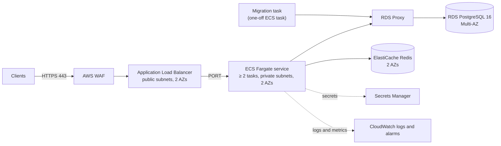

# 008 · Deployment

- **Status:** Approved
- **ID prefix:** DEP
- **Related ADRs:** none yet (phase 03-adrs)
- **Depends on specs:** 000-overview, 002-ledger, 005-idempotency, 006-auth, 007-security-ops

## 1. Context and goal

The challenge asks for a service that is simple to run locally and an explanation, with infrastructure as code, of how it would run in a cloud (docs/challenge.md). This spec covers both. Locally, one Docker Compose command builds the image and starts the whole stack: PostgreSQL, Redis, a one-shot migration job, two replicas of the service and nginx as the load balancer, with demo defaults so that no `.env` file is needed. The same image runs in AWS, where the target architecture is expressed in Terraform under `infra/terraform/`. That Terraform is checked in CI and never applied from this repository.

The stack is also the environment of the e2e and load suites (SYS-AC14, SYS-AC17, AUT-AC16, spec 007), and this spec proves the property that two replicas exist for: losing one of them never loses or duplicates money. Terms have the meanings in the glossary of spec 000.

### 1.1 Local stack

Defined in `compose.yaml`:

| Service          | Image                            | Role                                                                                                                | Starts after                                          | Published on the host              |
| ---------------- | -------------------------------- | ------------------------------------------------------------------------------------------------------------------- | ----------------------------------------------------- | ---------------------------------- |
| `postgres`       | `postgres:16` (pinned)           | The database. Its init script creates the owner role, the runtime role and the databases (section 1.3 of spec 002). | —                                                     | `127.0.0.1:55432`                  |
| `redis`          | `redis:7` (pinned)               | Per-user rate-limit counters (spec 007).                                                                            | —                                                     | `127.0.0.1:6379`                   |
| `migrate`        | the service image, runtime stage | One-shot job: applies every migration with the owner role, then exits.                                              | `postgres` healthy                                    | nothing                            |
| `api-1`, `api-2` | the service image, runtime stage | The two replicas, connected with the runtime role, `REPLICA_ID` `api-1` and `api-2`, and `stop_grace_period: 40s`.  | `migrate` completed with exit code 0, `redis` started | `127.0.0.1:3001`, `127.0.0.1:3002` |
| `nginx`          | `nginx:1` (pinned)               | Load balancer: per-IP limit, request ids, proxy to both replicas (spec 007).                                        | `api-1` and `api-2` healthy                           | `127.0.0.1:8080`                   |
| `tools`          | the service image, build stage   | Runs the seed and token scripts and other npm scripts on demand. Not started by `up`.                               | `nginx` started                                       | nothing                            |

`api-1` and `api-2` are two named services that share one YAML anchor, not one service with `deploy.replicas`, so that each has its own `REPLICA_ID` and host port and can be stopped or killed by name (DEP-AC11).

Every port is published on `127.0.0.1` only, never on every interface (DEP-R08): nginx on 8080 is the demo URL; the replicas' own ports let the e2e suite and a developer address one replica directly (SYS-AC14); PostgreSQL and Redis serve `npm run test:integration` on the host. `METRICS_PORT` is never published (SEC-R43).

### 1.2 Demo data

`npm run seed` creates, through the API, these users and accounts. User ids are fixed so that the token script can mint tokens for them; account ids are generated by the service and printed by the seed.

| User              | Id                                     | Role       | Accounts and initial deposits        |
| ----------------- | -------------------------------------- | ---------- | ------------------------------------ |
| `demo-operator`   | `0192f0a0-0000-7000-8000-00000000d0f1` | `operator` | none                                 |
| `demo-customer-1` | `0192f0a0-0000-7000-8000-00000000d0c1` | `customer` | EUR with "250000"; USD with "100000" |
| `demo-customer-2` | `0192f0a0-0000-7000-8000-00000000d0c2` | `customer` | EUR with "50000"                     |
| `demo-customer-3` | `0192f0a0-0000-7000-8000-00000000d0c3` | `customer` | JPY with "150000"                    |

The data covers two currencies with exponent 2 and JPY, whose exponent is 0, so that a demo shows minor units: the amounts are 2500.00 EUR, 1000.00 USD, 500.00 EUR and 150000 JPY.

The seed calls the API at `http://nginx:8080` with tokens it mints itself for the users of table 1.2 and never prints, so every deposit is a real movement with ledger entries and an audit record. It reads each customer's accounts first, creates only an account whose currency is missing, and deposits only into an account it created in the same run or whose history is empty. Every request also carries a fixed Idempotency-Key, so a retry within the key's TTL is replayed. Running it again, even after the keys have expired, changes nothing (DEP-R11).

### 1.3 AWS target architecture

| Component     | Terraform module | What it holds                                                                                                                                                                                                                             |
| ------------- | ---------------- | ----------------------------------------------------------------------------------------------------------------------------------------------------------------------------------------------------------------------------------------- |
| Network       | `network`        | A VPC over two availability zones with public subnets (ALB only), private subnets (tasks) and isolated subnets (database, cache), and VPC endpoints for ECR, Secrets Manager, CloudWatch Logs and S3 (section 1.7).                       |
| Edge          | `edge`           | The ALB with an HTTPS listener and an HTTP-to-HTTPS redirect, its target group, and the AWS WAF web ACL (SEC-R45, section 1.7).                                                                                                           |
| Service       | `service`        | The ECR repository, the ECS cluster, the task definitions of the service, of the migration task and of the cleanup task, the ECS service, and the EventBridge Scheduler schedule that runs the cleanup every hour (DEP-R37, section 1.7). |
| Database      | `database`       | RDS PostgreSQL 16 Multi-AZ and RDS Proxy (section 1.7).                                                                                                                                                                                   |
| Cache         | `cache`          | An ElastiCache Redis 7 replication group.                                                                                                                                                                                                 |
| Secrets       | `secrets`        | The Secrets Manager secrets of the service and the KMS key that encrypts them (section 1.7).                                                                                                                                              |
| Observability | `observability`  | CloudWatch log groups, alarms and the SNS topic they notify (section 1.8).                                                                                                                                                                |

### 1.4 Demo configuration

The values of `compose.yaml` are literals, not interpolated from the environment, so that a stray `.env` cannot change the demo; only tunables such as the rate limits use `${VAR:-default}`. The demo `JWT_SECRET` and `CURSOR_SECRET` are the visibly fake 48-byte values of DEP-R35: long enough for AUT-R18, and not flagged by gitleaks. The configuration loader holds the same two values and refuses them when `NODE_ENV` is `production` (DEP-R07); a unit test checks that its list equals the values of `compose.yaml` (DEP-AC05).

| Variable                 | Database role | Used by                                                                                                                                                |
| ------------------------ | ------------- | ------------------------------------------------------------------------------------------------------------------------------------------------------ |
| `DATABASE_URL`           | runtime role  | the replicas and every script other than the migrations                                                                                                |
| `MIGRATION_DATABASE_URL` | owner role    | only `npm run migrate:up` and `migrate:down`, in the `migrate` and `tools` services; validated by SEC-R39 where it is set; never given to the replicas |

In AWS the credentials of each URL come from their own secret (DEP-R31).

The `tools` service is the build stage of the image (every dependency, the sources and `tsx`) in the Compose profile `tools`, so that `up` never starts it. It runs on the stack's network with the replicas' demo variables plus `MIGRATION_DATABASE_URL`, as `docker compose run --rm tools npm run <script>`.

### 1.5 Load balancer and client retries

nginx balances round robin over `api-1:3000` and `api-2:3000`, with upstream keep-alive. It tries the other replica with `proxy_next_upstream error timeout` and `proxy_next_upstream_tries 2`, which nginx applies to a POST only before the request was sent (DEP-R15): only the client's retry with the same Idempotency-Key is safe for a POST that reached a replica. A GET, which is safe to repeat, may be re-sent after an error or a timeout.

nginx's own 502, 503 and 504 are rendered by an `error_page` location as problem details of type `/problems/upstream-unavailable` (DEP-R16), as its 429 and 413 are (section 1.6 of spec 007). The separate type tells the client that the outcome of a POST is unknown until it is retried with the same key.

The API documentation recommends this retry policy, and the client of DEP-AC11 uses it: retry with the same Idempotency-Key on a connection error, a 502, 503 or 504, or a 409 `/problems/request-in-progress`, waiting the `Retry-After` of the response when it has one and 200 ms otherwise, up to 60 times; never retry any other 4xx. With the `Retry-After: 1` that nginx and the service send, that bound covers a replica restart.

### 1.6 Image

The container healthcheck is `HEALTHCHECK --interval=10s --timeout=3s --start-period=10s --retries=3 CMD ["node", "dist/healthcheck.js"]`, which requests `http://127.0.0.1:${PORT}/health/live` (DEP-R21). It checks liveness, not readiness, so that a database outage never makes Docker or ECS replace every container; the ALB target group checks `/health/ready` instead (DEP-R27).

Every image is pinned by version tag and `@sha256` digest, for example `node:24.x-alpine@sha256:...`, and likewise `postgres`, `redis` and `nginx` (DEP-R22). Dependabot updates the pins, so a rebuild months later uses the same bits.

### 1.7 AWS settings

| Component  | Settings                                                                                                                                                                                                                                                                                                                                                                                                                                                                                                 |
| ---------- | -------------------------------------------------------------------------------------------------------------------------------------------------------------------------------------------------------------------------------------------------------------------------------------------------------------------------------------------------------------------------------------------------------------------------------------------------------------------------------------------------------- |
| Network    | No NAT gateway: interface endpoints for the ECR API, ECR Docker, Secrets Manager and CloudWatch Logs, and a gateway endpoint for S3, give the private tasks the AWS services they need with no outbound internet path. A future call to the internet adds a NAT gateway with an egress allow-list.                                                                                                                                                                                                       |
| Edge       | An ACM certificate for a domain given as a Terraform variable; the ALB security policy `ELBSecurityPolicy-TLS13-1-2-2021-06`; HTTP on 80 answered with a 301 to HTTPS; `drop_invalid_header_fields` on. The WAF web ACL holds the rate-based rule of SEC-R45 (section 1.6 of spec 007) and the AWS managed rule groups `AWSManagedRulesCommonRuleSet` and `AWSManagedRulesKnownBadInputsRuleSet`, and sends its logs to CloudWatch Logs. Traffic from the ALB to the tasks is plain HTTP inside the VPC. |
| Service    | 0.5 vCPU and 1 GB per task; desired count 2, autoscaling from 2 to 6 tasks on 60% average CPU; `stopTimeout` 40 seconds, above 2 + 30 seconds (section 1.8 of spec 007); ALB deregistration delay 35 seconds; health check grace period 30 seconds. With `DB_POOL_MAX` 10, 6 tasks hold at most 66 connections to RDS Proxy (SEC-R36).                                                                                                                                                                   |
| Database   | `db.t4g.medium`, 20 GB of gp3 storage autoscaling to 100 GB, one Multi-AZ instance (not Aurora, so that PostgreSQL stays identical to the local one), automated backups for 7 days with point-in-time recovery, deletion protection, Performance Insights, and a parameter group with `rds.force_ssl` 1. RDS Proxy authenticates with the Secrets Manager credentials of both roles.                                                                                                                     |
| Secrets    | Terraform creates the secrets and their KMS key but no secret version; the values are set out of band, by an operator or the pipeline, with `aws secretsmanager put-secret-value`. RDS manages its master password in Secrets Manager (`manage_master_user_password`). No secret value enters the Terraform state.                                                                                                                                                                                       |
| Migrations | The pipeline runs the migration task with `aws ecs run-task` and waits for exit code 0 before it updates the service, as `depends_on` does locally. Migrations are expand-then-contract, so the running version keeps working while the next one rolls out (section 1.8 of spec 007).                                                                                                                                                                                                                    |
| Validation | `npm run infra:validate` runs `terraform fmt -check`, `terraform init -backend=false`, `terraform validate`, `tflint` with the AWS ruleset and `checkov` with the custom policies of `infra/policies/`, YAML files for DEP-AC16 to DEP-AC23, each tool from a pinned Docker image, so it needs only Docker locally. CI runs it in the `ci` job from phase 12-infra on (DEP-R33).                                                                                                                         |

### 1.8 Alarms

Every alarm uses a metric AWS publishes and notifies the one SNS topic of the `observability` module (DEP-R32).

| Alarm                    | Fires when                                    |
| ------------------------ | --------------------------------------------- |
| ALB 5xx                  | above 1% of requests over 5 minutes           |
| ALB target response time | p99 above 300 ms over 5 minutes (SYS-R20)     |
| ALB healthy targets      | fewer than 2                                  |
| ECS CPU, ECS memory      | above 80%                                     |
| RDS CPU                  | above 80%                                     |
| RDS free storage         | below 10%                                     |
| RDS connections          | above 80% of the RDS Proxy's connection limit |
| ElastiCache memory       | above 80%                                     |
| WAF blocked requests     | above 1000 in 5 minutes                       |

## 2. Requirements

| ID      | Requirement (EARS)                                                                                                                                                                                                                                                                                                                                                                                                                                     |
| ------- | ------------------------------------------------------------------------------------------------------------------------------------------------------------------------------------------------------------------------------------------------------------------------------------------------------------------------------------------------------------------------------------------------------------------------------------------------------ |
| DEP-R01 | WHEN `docker compose up --build` runs in a fresh clone on a host whose only prerequisite is Docker Engine 24 or later with Compose v2.20 or later, the versions that support `depends_on` with `service_completed_successfully` and `up --wait`, as the README states, THE SYSTEM SHALL build the service image and start the services of table 1.1 except `tools`, and serve the API through nginx on `http://localhost:8080`.                        |
| DEP-R02 | THE SYSTEM SHALL start `migrate` only after `postgres` is healthy, `api-1` and `api-2` only after `migrate` has exited with code 0, and `nginx` only after both replicas are healthy.                                                                                                                                                                                                                                                                  |
| DEP-R03 | IF the `migrate` job exits with a non-zero code THEN THE SYSTEM SHALL start neither replica nor `nginx`, and `docker compose up` SHALL exit with a non-zero code.                                                                                                                                                                                                                                                                                      |
| DEP-R04 | WHEN `migrate` runs against a database where every migration is already applied THE SYSTEM SHALL apply nothing and exit with code 0, so that `docker compose up` can be repeated on the same volume.                                                                                                                                                                                                                                                   |
| DEP-R05 | THE SYSTEM SHALL run migrations with the owner role and the replicas with the runtime role (section 1.3 of spec 002, LED-R17), each from its own connection URL: `MIGRATION_DATABASE_URL` for the owner role and `DATABASE_URL` for the runtime role (section 1.4).                                                                                                                                                                                    |
| DEP-R06 | THE SYSTEM SHALL run the local stack without a `.env` file: every variable the services need has a demo default in `compose.yaml`, and no service reads an `env_file` (section 1.4).                                                                                                                                                                                                                                                                   |
| DEP-R07 | IF `NODE_ENV` is `production` and `JWT_SECRET` or `CURSOR_SECRET` equals one of the demo values committed in `compose.yaml` THEN THE SYSTEM SHALL refuse to start, with an error that names the variable and never its value.                                                                                                                                                                                                                          |
| DEP-R08 | THE SYSTEM SHALL publish on the host only the ports of table 1.1, all on `127.0.0.1`, and never `METRICS_PORT` (SEC-R43).                                                                                                                                                                                                                                                                                                                              |
| DEP-R09 | THE SYSTEM SHALL provide a `tools` service, built from the build stage of the service image and started only on demand, that runs `npm run seed`, `npm run token` and the other npm scripts against the stack with only Docker on the host (section 1.4).                                                                                                                                                                                              |
| DEP-R10 | WHEN `npm run seed` runs THE SYSTEM SHALL create, through the API, the users' accounts and initial deposits of table 1.2 that do not exist yet, print the users with their account ids, currencies and balances as JSON on standard output, and exit with code 0 (section 1.2).                                                                                                                                                                        |
| DEP-R11 | WHEN `npm run seed` runs against a stack where it has already run THE SYSTEM SHALL create no account and move no money, whatever time has passed, and print the same users and accounts.                                                                                                                                                                                                                                                               |
| DEP-R12 | IF `npm run seed` runs with `NODE_ENV` `production`, or the API does not answer `/health/ready` with 200 within 60 seconds, THEN THE SYSTEM SHALL exit with a non-zero code without moving money, and print a message naming the reason on standard error.                                                                                                                                                                                             |
| DEP-R13 | WHEN `docker compose run --rm tools npm run --silent token -- --sub <id> --role <role>` runs THE SYSTEM SHALL print a token that the stack accepts (AUT-R16).                                                                                                                                                                                                                                                                                          |
| DEP-R14 | THE SYSTEM SHALL write, in every log line of a replica, the member `replicaId` with the value of `REPLICA_ID`, 1 to 64 characters from `A-Z a-z 0-9 . _ -` validated at startup (SEC-R39), or the host name when it is unset, which in ECS is the task's; and never send it in a response, which would expose the topology.                                                                                                                            |
| DEP-R15 | THE SYSTEM SHALL make nginx distribute requests across both replicas in turn, and pass a non-idempotent request (POST) to the other replica only when the connection to the first could not be established, never after any part of it was sent (section 1.5).                                                                                                                                                                                         |
| DEP-R16 | IF nginx cannot get a response from any replica, or gets a broken one, THEN THE SYSTEM SHALL answer with the gateway status (502, 503 or 504), the header `Retry-After: 1`, the header `X-Request-Id`, and an `application/problem+json` body with type `/problems/upstream-unavailable` and `requestId` equal to that header (section 1.5).                                                                                                           |
| DEP-R17 | WHEN a replica is stopped with SIGTERM or killed with SIGKILL while money movements run THE SYSTEM SHALL apply each movement at most once, keep every invariant of spec 000, and answer every retry of a request with the same Idempotency-Key with the result of the one execution, so that a client that retries until it gets a final answer sees one consistent result per key (IDM-R10, IDM-R19).                                                 |
| DEP-R18 | THE SYSTEM SHALL build the service image in two stages: a build stage with every dependency that compiles the code, and a runtime stage with only the production dependencies and the compiled code, without sources, tests or development dependencies.                                                                                                                                                                                               |
| DEP-R19 | THE SYSTEM SHALL run the runtime stage as the non-root user `node` (uid 1000), owning no file of the application, so that the container also runs with a read-only root file system.                                                                                                                                                                                                                                                                   |
| DEP-R20 | THE SYSTEM SHALL start the service with an exec-form entrypoint that runs `node` directly as process 1, without a shell or npm in between, so that SIGTERM reaches Node and triggers the shutdown of SEC-R25; and SHALL give `api-1` and `api-2` a `stop_grace_period` of 40s in `compose.yaml`, longer than `SHUTDOWN_DRAIN_DELAY_MS` + `SHUTDOWN_TIMEOUT_MS` (32 s), so that Docker never kills a replica before its shutdown deadline.              |
| DEP-R21 | THE SYSTEM SHALL declare a container healthcheck that requests `/health/live` with Node, without a shell or extra binaries (section 1.6).                                                                                                                                                                                                                                                                                                              |
| DEP-R22 | THE SYSTEM SHALL pin every base image of the Dockerfile and every image of `compose.yaml` by version and digest (section 1.6).                                                                                                                                                                                                                                                                                                                         |
| DEP-R23 | THE SYSTEM SHALL document the AWS target architecture in `docs/deployment/aws.md`, with the diagram of section 1.3 and one section per component of table 1.3 that names the Terraform module implementing it, and sections on the request path, the deployment and migration steps, the failure modes (loss of a task, of an availability zone, database failover, loss of Redis) and a cost estimate.                                                |
| DEP-R24 | THE SYSTEM SHALL express the AWS target architecture in Terraform under `infra/terraform/`, as one root configuration that uses the modules of table 1.3.                                                                                                                                                                                                                                                                                              |
| DEP-R25 | THE SYSTEM SHALL allow inbound traffic from the internet only to the ALB, on ports 443 and 80; ECS tasks, RDS, RDS Proxy and ElastiCache SHALL have no public IP and accept traffic only from the security group of the layer in front of them.                                                                                                                                                                                                        |
| DEP-R26 | THE SYSTEM SHALL terminate TLS at the ALB with an ACM certificate and a TLS 1.2 or later policy, redirect HTTP to HTTPS, and attach an AWS WAF web ACL with the rate-based rule of SEC-R45 and the managed rule groups of section 1.7.                                                                                                                                                                                                                 |
| DEP-R27 | THE SYSTEM SHALL run the service on ECS Fargate with a desired count of at least 2 tasks spread across two availability zones, a deployment that keeps 100% of the desired count healthy, the ALB health check on `/health/ready`, a read-only root file system, the non-root user, `NODE_ENV` set to `production` (DEP-R07), and a stop timeout longer than `SHUTDOWN_DRAIN_DELAY_MS` + `SHUTDOWN_TIMEOUT_MS` (section 1.8 of spec 007, section 1.7). |
| DEP-R28 | THE SYSTEM SHALL define the migration as a one-off ECS task, separate from the service, that runs the migrations with the owner role's credentials and is run before each deployment of the service (section 1.7).                                                                                                                                                                                                                                     |
| DEP-R29 | THE SYSTEM SHALL run RDS PostgreSQL 16 in Multi-AZ, encrypted at rest with KMS, not publicly accessible, with deletion protection, automated backups kept 7 days and TLS required, behind an RDS Proxy that requires TLS and through which alone the service connects (section 1.7).                                                                                                                                                                   |
| DEP-R30 | THE SYSTEM SHALL run ElastiCache Redis 7 as a replication group with automatic failover across two availability zones, encryption in transit and at rest, and an AUTH token read from Secrets Manager.                                                                                                                                                                                                                                                 |
| DEP-R31 | THE SYSTEM SHALL keep `JWT_SECRET`, `CURSOR_SECRET`, the database credentials of both roles and the Redis AUTH token in Secrets Manager, inject them into the tasks as secrets, and keep no secret value in the Terraform code or state (section 1.7).                                                                                                                                                                                                 |
| DEP-R32 | THE SYSTEM SHALL send the logs of every task to CloudWatch Logs with a retention of 30 days, and define the CloudWatch alarms of section 1.8, each notifying one SNS topic.                                                                                                                                                                                                                                                                            |
| DEP-R33 | THE SYSTEM SHALL check the Terraform in CI with `terraform fmt -check`, `terraform validate`, `tflint` and `checkov`, including the policies of this spec, and fail the build on any finding (section 1.7).                                                                                                                                                                                                                                            |
| DEP-R34 | THE SYSTEM SHALL never apply the Terraform from this repository: no CI step, npm script or other file of the repository runs `terraform apply`, `plan`, `destroy` or `import`, or holds AWS credentials or the name of a real state bucket.                                                                                                                                                                                                            |
| DEP-R35 | THE SYSTEM SHALL commit in `compose.yaml`, as the demo `JWT_SECRET` and `CURSOR_SECRET`, only the visibly fake 48-byte values `demo-only-jwt-secret-for-docker-compose-00000000` and `demo-only-cursor-secret-for-docker-compose-00000`, so that gitleaks, run with the repository's configuration, reports no finding on `compose.yaml`.                                                                                                              |
| DEP-R36 | WHERE gitleaks would flag a demo value of `compose.yaml` THE SYSTEM SHALL allowlist in `.gitleaks.toml` exactly that value, as a regular expression anchored to the whole value, and never a path, a file, a commit or a rule.                                                                                                                                                                                                                         |
| DEP-R37 | THE SYSTEM SHALL run the idempotency cleanup of IDM-R22 in AWS every hour, as a one-off ECS Fargate task of the service image started by an EventBridge Scheduler schedule `rate(1 hour)`, with the runtime role's database credentials, in the private subnets without a public IP.                                                                                                                                                                   |

## 3. Acceptance criteria

Unless stated otherwise: "the stack" is started with `docker compose up --build --wait` from the repository root with no `.env` file and no override file; requests go to `http://localhost:8080`; tokens are minted with `docker compose run --rm tools npm run --silent token`; the demo users are those of table 1.2; and "reconciliation" is `npm run reconcile` (LED-R21) run in the `tools` service. The ACs of level `ci` are verified by `npm run infra:validate` (section 1.7).

### DEP-AC01 · One command starts the stack from a fresh clone

- **Level:** e2e
- **Covers:** DEP-R01, DEP-R06, DEP-R08
- **Given** a fresh `git clone` of the commit into an empty directory, with no `.env` file, no `node_modules` and no Docker image or volume of the project
- **When** `docker compose up --build --wait` runs there, without any command that runs `node` or `npm` on the host; then `/health/ready` is requested through `http://localhost:8080`; and `docker compose config` and `docker compose ps --all` are read
- **Then** the command exits with code 0; `postgres`, `redis`, `api-1`, `api-2` and `nginx` are running and healthy, `migrate` has exited with code 0, and `tools` was not started; `/health/ready` answers 200; the configuration holds no `env_file`; and the ports published on the host are exactly `127.0.0.1:55432`, `127.0.0.1:6379`, `127.0.0.1:3001`, `127.0.0.1:3002` and `127.0.0.1:8080`

### DEP-AC02 · Services start in dependency order

- **Level:** e2e
- **Covers:** DEP-R02
- **Given** the stack started from empty volumes
- **When** the state timestamps of every container are read with `docker inspect`
- **Then** `migrate` started after `postgres` became healthy; `api-1` and `api-2` started after `migrate` finished with exit code 0; and `nginx` started after both replicas became healthy

### DEP-AC03 · A failed migration keeps the replicas down

- **Level:** e2e
- **Covers:** DEP-R03
- **Given** empty volumes and a Compose override file, used only by this AC, that adds to the `migrate` service a migration whose SQL fails
- **When** `docker compose -f compose.yaml -f <override> up --build --wait` runs
- **Then** it exits with a non-zero code; `migrate` exited with a non-zero code; and no container of `api-1`, `api-2` or `nginx` was started

### DEP-AC04 · Migrations are repeatable and use their own role

- **Level:** e2e
- **Covers:** DEP-R04, DEP-R05
- **Given** the stack running
- **When** `docker compose run --rm migrate` runs again; and `pg_stat_activity` is read while C1, the demo customer `demo-customer-1`, reads one of their accounts
- **Then** the second migration run exits with code 0 and applies no migration; the sessions of `api-1` and `api-2` belong to the runtime role; and node-pg-migrate's table and every table the migrations create are owned by the owner role

### DEP-AC05 · The demo JWT and cursor secrets are refused in production

- **Level:** unit
- **Covers:** DEP-R07
- **Given** the configuration loader and the demo values of `JWT_SECRET` and `CURSOR_SECRET` read from `compose.yaml`
- **When** it loads with `NODE_ENV` `production` and the demo `JWT_SECRET`; with `NODE_ENV` `production` and the demo `CURSOR_SECRET`; with `NODE_ENV` `development` and both demo values; and with `NODE_ENV` `production` and two other 48-byte values
- **Then** the first two fail with a configuration error that names `JWT_SECRET` and `CURSOR_SECRET` respectively and contains neither demo value; and the last two succeed

### DEP-AC06 · The seed creates the demo data once, through the API

- **Level:** e2e
- **Covers:** DEP-R09, DEP-R10, DEP-R11
- **Given** the stack started from empty volumes
- **When** `docker compose run --rm tools npm run seed` runs; every key row is then expired directly in the database (IDM-R21); and the same command runs again
- **Then** the first run exits with code 0 and prints JSON listing the four users of table 1.2 with their roles, and for each customer the accounts of the table with their ids, currencies and balances ("250000" EUR and "100000" USD, "50000" EUR, "150000" JPY); every deposit appears in the account history with kind `deposit` and an audit record with actor `demo-operator`; the reconciliation reports no discrepancy; and the second run exits with code 0, prints the same users, account ids and balances, and adds no account, transaction or audit record

### DEP-AC07 · The seed refuses production and an unreachable API

- **Level:** unit
- **Covers:** DEP-R12
- **Given** the seed script with an injected HTTP client and clock
- **When** it runs with `NODE_ENV` `production`; and with `NODE_ENV` `development` and an API whose `/health/ready` answers 503 for 60 seconds of injected time
- **Then** both runs exit with a non-zero code, send no request other than `/health/ready`, and print on standard error a message naming the reason (`production`, `API not ready`)

### DEP-AC08 · A token minted with Docker only is accepted by the stack

- **Level:** e2e
- **Covers:** DEP-R13
- **Given** the stack running and seeded
- **When** `docker compose run --rm tools npm run --silent token -- --sub 0192f0a0-0000-7000-8000-00000000d0c1 --role customer` runs, and the printed token is used to list accounts through `http://localhost:8080/v1/accounts`
- **Then** the command exits with code 0 and prints one line; and the list answers 200 with the EUR account holding "250000" and the USD account holding "100000"

### DEP-AC09 · Requests reach both replicas, visible by replica id

- **Level:** e2e
- **Covers:** DEP-R14, DEP-R15
- **Given** the stack running and seeded, and a token for `demo-customer-1`
- **When** 20 reads of the customer's EUR account are sent through `http://localhost:8080` one after the other, with `X-Request-Id` `rr-1` to `rr-20`; and the logs of `api-1` and `api-2` are read
- **Then** every log line of both replicas parses as JSON with a `replicaId` of `api-1` or `api-2` matching its container; each of `rr-1` to `rr-20` appears in the logs of exactly one replica; each replica served at least 5 of them; and no response has a header or body member named `replicaId`, and none contains `api-1` or `api-2`

### DEP-AC10 · Gateway errors are problem details

- **Level:** e2e
- **Covers:** DEP-R16
- **Given** the stack running, with `api-1` and `api-2` then stopped with `docker compose stop api-1 api-2`
- **When** `/health/live` is requested through `http://localhost:8080` with `X-Request-Id: gw-1`; and the replicas are started again
- **Then** the request answers 502 with `Retry-After: 1`, `X-Request-Id: gw-1`, content type `application/problem+json` and a body with type `/problems/upstream-unavailable`, `status` 502 and `requestId` "gw-1"; and after the restart `/health/ready` answers 200

### DEP-AC11 · Losing a replica during traffic never loses or duplicates money

- **Level:** e2e
- **Covers:** DEP-R15, DEP-R17
- **Given** the stack running; 20 customer users, each owning two EUR accounts funded with "100000" EUR each by an operator; and a client that sends each logical request with its own Idempotency-Key and, on a connection error, a 502, 503 or 504, or a 409 `/problems/request-in-progress`, sends the same request with the same key again after the response's `Retry-After`, or after 200 ms when there is none, up to 60 times (section 1.5)
- **When** 8 workers send 400 logical requests in all, each a withdrawal of "100" EUR or a transfer of "100" EUR between two accounts of the same customer; once 50 logical requests have a final answer, `docker compose stop api-2` runs, and once `api-2` has exited it is started again; once `api-2` is healthy and 200 logical requests have a final answer, `docker compose kill -s SIGKILL api-1` runs, and once `api-1` has exited it is started again; the workers keep sending throughout
- **Then** every logical request ends with a final answer of 201 or 422; every 201 answer for one key has a byte-for-byte identical body; each key has exactly one transaction if its final answer is 201, and none otherwise; every balance equals its initial "100000" EUR changed by the final 201s that involve it; the number of audit records equals the number of transactions; and the reconciliation reports no discrepancy

### DEP-AC12 · The Dockerfile is multi-stage, pinned, non-root, exec-form and healthchecked

- **Level:** unit
- **Covers:** DEP-R18, DEP-R19, DEP-R20, DEP-R21, DEP-R22
- **Given** the `Dockerfile` and `compose.yaml`
- **When** they are parsed
- **Then** the Dockerfile has a build stage and a final runtime stage; every `FROM` line and every `image:` of `compose.yaml` names a version and an `@sha256:` digest; the runtime stage copies only `package.json`, `package-lock.json`, the production `node_modules` and the compiled `dist/`; its last `USER` is `node`; its `ENTRYPOINT` is a JSON array whose first element is `node`, with no `CMD` that starts a shell; its `HEALTHCHECK` runs `node` on a script that requests `/health/live`; and in `compose.yaml` both `api-1` and `api-2` have `stop_grace_period` `40s`

### DEP-AC13 · The running container is non-root, signal-aware and healthy

- **Level:** e2e
- **Covers:** DEP-R18, DEP-R19, DEP-R20, DEP-R21
- **Given** the stack running
- **When** `docker inspect` and `docker exec` are run on `api-1` (process list, user id, files present), and then `docker compose stop api-1` is timed
- **Then** the health status is `healthy`; process 1 is `node`; the process runs as uid 1000; the image holds no `src/`, `test/`, `typescript` or `vitest`; the user `node` owns no file under the application directory; and `api-1` exits with code 0 in less than `SHUTDOWN_DRAIN_DELAY_MS` + 5 seconds, its last log lines recording the shutdown of SEC-R25, not exit code 137

### DEP-AC14 · The AWS architecture is documented module by module

- **Level:** unit
- **Covers:** DEP-R23
- **Given** `docs/deployment/aws.md` and the folders under `infra/terraform/modules/`
- **When** the document is parsed
- **Then** it holds a Mermaid diagram and one section per component of table 1.3; each section names its module; every module folder is named by exactly one section; no section names a module that does not exist; and it holds sections on the request path, the deployment and migration steps, the failure modes (loss of a task, of an availability zone, database failover, loss of Redis) and a cost estimate

### DEP-AC15 · The Terraform is well-formed and passes the linters

- **Level:** ci
- **Covers:** DEP-R24, DEP-R33
- **Verified by:** CI job `ci`, step `npm run infra:validate` (phase 12-infra)
- **Given** the root configuration in `infra/terraform/` and the modules of table 1.3
- **When** CI runs `npm run infra:validate`
- **Then** it fails unless `terraform fmt -check` reports no file, `terraform validate` succeeds, `tflint` reports no issue and `checkov` reports no failed check, a check being skipped only by an inline comment that gives the reason

### DEP-AC16 · Only the ALB is reachable from the internet

- **Level:** ci
- **Covers:** DEP-R25
- **Verified by:** CI job `ci`, step `npm run infra:validate` (phase 12-infra)
- **Given** the Terraform and the custom checkov policies of `infra/policies/`
- **When** CI runs `npm run infra:validate`
- **Then** it fails unless: the only security group rules open to `0.0.0.0/0` or `::/0` are the ALB's on ports 443 and 80; the ECS service has no public IP; RDS has `publicly_accessible` false; the tasks' security group admits `PORT` only from the ALB's and `METRICS_PORT` from no group outside the VPC; RDS Proxy admits 5432 only from the tasks' group, RDS only from the proxy's, and ElastiCache 6379 only from the tasks' group; and the database and cache subnets have no route to an internet gateway

### DEP-AC17 · The edge terminates TLS and runs WAF

- **Level:** ci
- **Covers:** DEP-R26
- **Verified by:** CI job `ci`, step `npm run infra:validate` (phase 12-infra)
- **Given** the `edge` module
- **When** CI runs `npm run infra:validate`
- **Then** it fails unless the ALB has an HTTPS listener on 443 with an ACM certificate and a TLS 1.2 or later security policy, its HTTP listener on 80 only redirects to HTTPS, it drops invalid header fields, and a WAF web ACL is associated with it holding a rate-based rule aggregated by IP and the managed rule groups of section 1.7

### DEP-AC18 · The service runs on at least two Fargate tasks across two zones

- **Level:** ci
- **Covers:** DEP-R27
- **Verified by:** CI job `ci`, step `npm run infra:validate` (phase 12-infra)
- **Given** the `service` module
- **When** CI runs `npm run infra:validate`
- **Then** it fails unless the ECS service uses Fargate with a desired count and autoscaling minimum of at least 2, subnets in two availability zones, a minimum healthy percent of 100, the ALB target group health check on `/health/ready`, and a task definition whose container has `readonlyRootFilesystem` true, user `1000`, an environment `NODE_ENV` of `production`, and a `stopTimeout` of at least 40 seconds

### DEP-AC19 · Migrations run as a one-off task with the owner role

- **Level:** ci
- **Covers:** DEP-R28
- **Verified by:** CI job `ci`, step `npm run infra:validate` (phase 12-infra)
- **Given** the `service` module and `docs/deployment/aws.md`
- **When** CI runs `npm run infra:validate`
- **Then** it fails unless a task definition separate from the service's runs the migration command with the owner role's secret, no ECS service uses that task definition, and the service's task definition references only the runtime role's secret

### DEP-AC20 · The database is Multi-AZ, encrypted and behind RDS Proxy

- **Level:** ci
- **Covers:** DEP-R29
- **Verified by:** CI job `ci`, step `npm run infra:validate` (phase 12-infra)
- **Given** the `database` and `service` modules
- **When** CI runs `npm run infra:validate`
- **Then** it fails unless the RDS instance runs PostgreSQL 16 with `multi_az`, `storage_encrypted` with a KMS key, `publicly_accessible` false, `deletion_protection`, a backup retention of 7 days and `rds.force_ssl` set to 1; an RDS Proxy fronts it with `require_tls`; and the service's database host is the proxy's endpoint, never the instance's

### DEP-AC21 · Redis is replicated across zones and encrypted

- **Level:** ci
- **Covers:** DEP-R30
- **Verified by:** CI job `ci`, step `npm run infra:validate` (phase 12-infra)
- **Given** the `cache` module
- **When** CI runs `npm run infra:validate`
- **Then** it fails unless the ElastiCache replication group runs Redis 7 with at least 2 nodes in two availability zones, automatic failover, encryption in transit and at rest, and an AUTH token taken from Secrets Manager

### DEP-AC22 · Secrets live in Secrets Manager, never in Terraform

- **Level:** ci
- **Covers:** DEP-R31
- **Verified by:** CI job `ci`, step `npm run infra:validate` (phase 12-infra)
- **Given** the Terraform
- **When** CI runs `npm run infra:validate`
- **Then** it fails unless Secrets Manager secrets exist for `JWT_SECRET`, `CURSOR_SECRET`, the owner and runtime database credentials and the Redis AUTH token, encrypted with the module's KMS key; the task definitions read them through `secrets`, never `environment`; and no `aws_secretsmanager_secret_version`, `random_password` or literal secret value appears in the Terraform

### DEP-AC23 · Logs and alarms in CloudWatch

- **Level:** ci
- **Covers:** DEP-R32
- **Verified by:** CI job `ci`, step `npm run infra:validate` (phase 12-infra)
- **Given** the `observability` and `service` modules
- **When** CI runs `npm run infra:validate`
- **Then** it fails unless every task definition logs to a CloudWatch log group with a retention of 30 days and a KMS key, and every alarm of section 1.8 exists and notifies the module's SNS topic

### DEP-AC24 · Nothing in the repository applies the Terraform

- **Level:** unit
- **Covers:** DEP-R34
- **Given** every file of the repository except `docs/` and `specs/`
- **When** they are searched
- **Then** no file runs `terraform apply`, `terraform plan`, `terraform destroy` or `terraform import`; no file holds an AWS access key id, secret access key or session token; the Terraform `backend` block holds no bucket, key or table name; and no `provider "aws"` block sets credentials

### DEP-AC25 · gitleaks finds nothing in compose.yaml, and only the demo values are allowlisted

- **Level:** integration
- **Covers:** DEP-R35, DEP-R36
- **Given** the gitleaks version that the CI job `secret-scan` installs, run from its Docker image pinned by digest, with the repository's `.gitleaks.toml` when it exists; and a temporary directory holding a copy of `compose.yaml`, also named `compose.yaml`, in which the demo `JWT_SECRET` is replaced by a value the test generates at run time in the format of an AWS access key id, so that no such value is ever committed
- **When** gitleaks scans `compose.yaml` of the repository with `gitleaks dir`, then scans the copy the same way; and `.gitleaks.toml`, if present, is parsed
- **Then** the first scan exits with code 0 and reports no finding; the second exits with a non-zero code and reports exactly one finding, on the line of `JWT_SECRET`; `compose.yaml` holds `demo-only-jwt-secret-for-docker-compose-00000000` and `demo-only-cursor-secret-for-docker-compose-00000`, each 48 bytes; and the allowlist of `.gitleaks.toml`, if any, has no `paths`, `commits` or disabled rules, and only regular expressions, each anchored with `^` and `$` and matching exactly one of the two demo values

### DEP-AC26 · The idempotency cleanup runs every hour in AWS

- **Level:** ci
- **Covers:** DEP-R37
- **Verified by:** CI job `ci`, step `npm run infra:validate` (phase 12-infra)
- **Given** the `service` module
- **When** CI runs `npm run infra:validate`
- **Then** it fails unless an EventBridge Scheduler schedule with the expression `rate(1 hour)` targets ECS `RunTask` on Fargate with a task definition, used by no ECS service, whose command runs the idempotency cleanup and which reads only the runtime role's database secret; the target uses the private subnets with no public IP; and the schedule's IAM role may only run that task definition and pass its roles

## 4. Error catalogue

Errors shared by every capability are in spec 000, and the load balancer's 429 and 413 in spec 007. This spec adds:

| Condition                                                                                               | HTTP          | Problem type                     | Stored for idempotent replay                                                                                             |
| ------------------------------------------------------------------------------------------------------- | ------------- | -------------------------------- | ------------------------------------------------------------------------------------------------------------------------ |
| nginx gets no response from a replica, or a broken one, or none in time; answered with `Retry-After: 1` | 502, 503, 504 | /problems/upstream-unavailable   | no: answered by the load balancer; the movement may or may not have committed, and a retry with the same key tells which |
| `NODE_ENV` is `production` and `JWT_SECRET` or `CURSOR_SECRET` is a demo value                          | n/a           | none: the service does not start | n/a                                                                                                                      |

## 5. Invariants

- The local stack and AWS run the same image; only configuration differs (DEP-AC12, DEP-AC18).
- No replica serves requests before every migration has been applied (DEP-AC02, DEP-AC03).
- Losing a replica, gracefully or not, never loses or duplicates money (DEP-AC11).
- Only the load balancer is reachable from outside the deployment network (DEP-AC01, DEP-AC16).
- No secret value is committed except the visibly fake local demo values, which gitleaks does not flag and production refuses (DEP-AC05, DEP-AC22, DEP-AC25).
- The invariants of specs 000 to 007 hold before and after every operation of this spec.

## 6. Out of scope

- Applying the Terraform, the AWS account, its state bucket and the CI/CD pipeline that builds, pushes and deploys the image and runs the migration task: documented in `docs/deployment/aws.md`, not automated here.
- Kubernetes, and container orchestrators other than Docker Compose and ECS.
- Scraping the Prometheus metrics in AWS: an ADOT collector and Amazon Managed Service for Prometheus are documented in `docs/deployment/aws.md` as the next step; the alarms of section 1.8 use the metrics AWS publishes, and `METRICS_PORT` stays closed to everything outside the VPC.
- Multi-region deployment and disaster recovery beyond Multi-AZ and RDS backups (spec 000).
- A custom domain and its DNS records; the certificate's domain is a Terraform variable.
- Hot reload and source mounts for development inside Compose; development runs on the host with `npm run dev`.

## 7. Open questions

None. Every question raised while writing this spec was decided by the owner on 2026-10-07 and is stated above as a rule.
